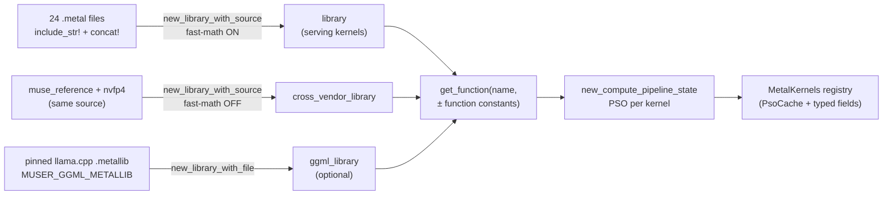

# Chapter 4 — Pipeline state objects and the three kernel sources
> **status:** polished  ·  **path:** Muse Glimmer, pinned Muser tree
>
> *Prerequisites: [Ch 2](02-metal-compute-model.md) and
> [Ch 3](03-unified-memory-and-buffers.md). You know what `MetalContext`'s
> `library`, `cross_vendor_library`, and `ggml_library` fields are for, and
> what a `dispatch_thread_groups` call looks like.*

---

## 4.1 Three stages between text and machine code

In [Ch 2](02-metal-compute-model.md) we said the host API gives you "a
bundle of compiled kernel functions, addressable by name," and deferred
*how* a `.metal` text file becomes that bundle. There are **three** stages
between "text a human wrote" and "a kernel the GPU can run":

1. **`.metal` source text** — a C++ dialect a human writes. Pure text.
2. **`MTLLibrary`** — a bundle of compiled functions: the text has been
   parsed, type-checked, and lowered to an intermediate representation.
   No machine code for any specific GPU exists yet. A `.metallib` file is
   exactly this stage serialized to disk — a library you can load without
   ever running the frontend compiler.
3. **`MTLComputePipelineState` — the PSO** — one function taken from the
   library and lowered all the way to machine code for *this specific
   GPU*. This [PSO](../glossary.md#pso) is the handle you hand to
   `set_compute_pipeline_state` on an encoder.

Figure 4.1 shows how Muser's three kernel sources feed that last stage.


*Figure 4.1: Muser's kernel pipeline. Three sources feed one PSO-building
path; every kernel lands in the `MetalKernels` registry before any dispatch
happens.*

Why split source-to-runnable into *two* compiles? The library stage is
frontend work, identical for every GPU model, done once for all kernels
together. The PSO stage is backend work, specific to this device's
instruction set, done once per kernel `[Metal-PG, "Functions"]`. Splitting
them lets you pay each at a different time — and lets a prebuilt
`.metallib` skip the frontend entirely on the user's machine.

One design fact up front, because it shapes everything below: **Muser has
no build-time shader-compilation step.** The engine's module doc is
explicit — the substrate keeps "runtime shader compile (`include_str!` the
`.metal` sources in `shaders/`, `newLibraryWithSource` on first use, cache
PSOs — no Xcode step, pure-source checkout)"
(`[crates/muser-engine/src/lib.rs:163-171]`). The ancestor Ferrite engine
precompiled a `.metallib` in `build.rs` and kept an on-disk
`MTLBinaryArchive` PSO cache `[ferrite-book Ch 4]`; Muser deliberately
dropped both machines' worth of build plumbing — cold-start compile is
paid at engine init, once, and the PSO cache is in-process. The tradeoffs
section (§4.9) costs this out.

## 4.2 Source 1: the concatenated fast-math library

The main library is one giant source string built from 24 `.metal` files
with `include_str!` and `concat!`, compiled once at `MetalContext::new()`:

```rust
// crates/muser-engine/src/metal/context.rs:48
let options = CompileOptions::new();
// Ferrite's accepted production kernels and llama.cpp both compile
// with fast math enabled. Exact Muse parity is guarded at the token
// boundary; disabling this here materially slows attention, FFN, and
// the norm/tiny-op stack without changing the imported GGML PSOs.
options.set_fast_math_enabled(true);
options.set_language_version(MTLLanguageVersion::V3_1);
// The fixed Muse driver is local, while the operation kernels below
// are clean extractions from Ferrite at a85048a90. Keeping the exact
// source files separate makes their provenance and future diffing
// auditable without bringing over Ferrite's runtime or route VM.
let source = concat!(
    include_str!("../shaders/muse_reference.metal"),
    "\n",
    include_str!("../shaders/nvfp4.metal"),
    "\n",
    include_str!("../shaders/ferrite/sigmoid_gate.metal"),
    "\n",
    // … (twenty more ferrite/ files elided, in dependency order —
    //     see context.rs:66-106) …
    include_str!("../shaders/ferrite/flash_attn_decode_reduce_v2.metal"),
);
let library = device
    .new_library_with_source(source, &options)
    .map_err(MetalError::ShaderCompile)?;
```

*(the elided lines are consecutive `include_str!` entries; nothing else is
removed.)*

Three knobs deserve a sentence each.

**Fast math ON for the serving library.** `set_fast_math_enabled(true)`
lets the compiler assume NaN/Inf never happen and reorder or fuse
floating-point operations. The comment records both the justification
(llama.cpp compiles the imported kernels with fast math; turning it off
"materially slows attention, FFN, and the norm/tiny-op stack") and the
safety argument — "exact Muse parity is guarded at the token boundary,"
i.e., the exactness contract is enforced by comparing generated tokens
against the pinned comparator, not by hoping the arithmetic is bit-stable.
The one thing fast-math must never touch in this engine — trigonometry at
large angles in RoPE — was a real accuracy lesson in the ancestor
(`precise::cos`/`precise::sin`, `[ferrite-book Ch 4 §10]`); Muser's RoPE
kernels precompute the frequency table on the CPU at load
(`[crates/muser-engine/src/decode.rs:1256-1263]`), which removes the
in-kernel `powf`/trig hazard entirely.

**MSL V3.1, pinned.** `set_language_version(V3_1)` fixes the dialect the
compiler accepts. A shader using a newer feature fails loudly at
library-build time instead of silently miscompiling.

**Concatenation order is load-bearing.** The `.metal` fragments share
types and helpers across files (the Q4_K block structs in `matmul.metal`,
the shared MAC helpers in `_q4k_helpers.metal`), and MSL here has no
`#include` resolution — the files are one translation unit precisely
because they are concatenated in dependency order. The provenance comment
is part of the design: which files are Muser-authored
(`muse_reference.metal`, `nvfp4.metal`) versus clean extractions from
Ferrite at `a85048a90` is readable straight from the concat
(`[crates/muser-engine/src/metal/context.rs:55-58]`), backed by the
per-file SHA-256 manifest in `[docs/extraction-manifest.md]`.

## 4.3 Source 2: the strict-f32 cross-vendor library

The second library is the *same two source files*, recompiled with fast
math **off**:

```rust
// crates/muser-engine/src/metal/context.rs:111
let cross_vendor_options = CompileOptions::new();
cross_vendor_options.set_fast_math_enabled(false);
cross_vendor_options.set_language_version(MTLLanguageVersion::V3_1);
let cross_vendor_source = concat!(
    include_str!("../shaders/muse_reference.metal"),
    "\n",
    include_str!("../shaders/nvfp4.metal"),
);
let cross_vendor_library = device
    .new_library_with_source(cross_vendor_source, &cross_vendor_options)
    .map_err(MetalError::ShaderCompile)?;
```

Why would an engine compile its own kernels twice with different compiler
flags? Because of Part VI. When a remote NVIDIA GB10 producer computes
KV (or a draft) and the Mac must reproduce or verify it, the arithmetic
must match CUDA's *explicit scalar boundaries* — and a fast-math compiler
is free to fuse and reassociate exactly where CUDA's kernel did not. The
struct field's doc comment states the contract:

```rust
// crates/muser-engine/src/metal/context.rs:36
/// Strict-f32 copy of the standalone Muse kernels.  The cross-vendor
/// Q8 projection and integer NVFP4 routes must match CUDA's explicit
/// scalar boundaries, while the ordinary serving kernels retain fast math.
```

The strict copies are selected per route, not globally: dispatch wrappers
check `MUSER_CROSS_VENDOR_QK` and swap in the strict pipeline for exactly
the ops that must match the producer (e.g.
`[crates/muser-engine/src/metal/encode/gate.rs:14-18]`,
`[crates/muser-engine/src/metal/encode/norm.rs:257-260]`). One source, two
compilation contracts, selected at dispatch — the compiler flag becomes
part of the numerical API. [Ch 32](32-precision-across-the-handoff.md) is
where this discipline earns its keep.

## 4.4 Source 3: the pinned llama.cpp metallib

The third source is not Muser source at all. When `MUSER_GGML_METALLIB`
points at a prebuilt llama.cpp `.metallib`, the device loads it as a
library:

```rust
// crates/muser-engine/src/metal/context.rs:122
let ggml_library_path = std::env::var_os("MUSER_GGML_METALLIB").map(PathBuf::from);
let ggml_library = match ggml_library_path.as_ref() {
    Some(path) => Some(device.new_library_with_file(path).map_err(|message| {
        MetalError::GgmlLibrary {
            path: path.clone(),
            message,
        }
    })?),
    None => None,
};
```

This library supplies llama.cpp's own kernels — `kernel_mul_mv_q{4,5,6}_K_f32`
matvecs, `kernel_mul_mm_*` batch matmuls, `kernel_rms_norm_mul_f32_4`,
`kernel_rope_norm_f32`, the whole `flash_attn_ext` family — which Muser
dispatches *instead of re-expressing them*. The reasoning is recorded in
the registry:

```rust
// crates/muser-engine/src/metal/encode.rs:278
ggml_q4k: ggml_matvec_pipeline(context, "kernel_mul_mv_q4_K_f32")?,
ggml_q5k: ggml_matvec_pipeline(context, "kernel_mul_mv_q5_K_f32")?,
ggml_q6k: ggml_matvec_pipeline(context, "kernel_mul_mv_q6_K_f32")?,
// … (matmul / norm / rope / flash-attn families elided — encode.rs:281-293) …

// crates/muser-engine/src/metal/encode.rs:370
pub(crate) fn supports_projection(&self, dtype: crate::gguf::GgmlType) -> bool {
    match dtype {
        // Standalone fallbacks cover Q4_K and Q5_K for both decode and
        // batch prefill. Q6_K intentionally uses the pinned upstream
        // llama kernels so its math and dispatch remain comparator-exact.
        crate::gguf::GgmlType::Q4_K | crate::gguf::GgmlType::Q5_K => true,
        crate::gguf::GgmlType::Q6_K => {
            self.ggml_q6k.is_some()
                && self.ggml_q6k_mm_aligned.is_some()
                && self.ggml_q6k_mm_bounds.is_some()
        }
        // …
    }
}
```

Two different policies live in that one match. Q4_K and Q5_K have
Muser-authored standalone kernels — the metallib versions are *preferred*
(for parity) but the engine can run without them. **Q6_K has no fallback:
it runs on llama's kernels or it does not run.** If a GGUF carries a Q6_K
projection and the metallib is missing, model load aborts with a specific,
actionable error:

```rust
// crates/muser-engine/src/decode.rs:113
#[error(
    "tensor {name} uses {dtype:?}, which requires the pinned llama.cpp Metal library; set MUSER_GGML_METALLIB"
)]
MissingProjectionKernel { name: String, dtype: GgmlType },
```

raised per-tensor at load (`[crates/muser-engine/src/decode.rs:1294-1310]`).
This is a fail-closed no-fallback policy: the engine refuses to
silently substitute *different arithmetic* for a dtype whose exactness is
contractual.

The metallib itself is built by
`[scripts/compile_llama_metallib.sh]`, and the script is almost a
manifesto of provenance discipline: it refuses to run unless the llama.cpp
checkout's HEAD equals the requested revision and the three Metal source
files are clean in index and working tree (`:57-69`); it refuses to
replace an existing output or receipt, making artifacts append-only
(`:78-85`); and it writes a `muser.llama_metallib.source_receipt.v1` JSON
binding the binary's SHA-256 and size to the source commit, the source
tree hash, per-file SHA-256s, the merged-source hash, the SDK version,
the Metal compiler, and the Xcode version (`:129-180`).

## 4.5 From functions to PSOs: the registry and the cache

Once the libraries exist, every kernel is compiled to a PSO exactly once,
at `MetalKernels::new`. The fixed serving set is a compile-time-checked
list of 66 names:

```rust
// crates/muser-engine/src/metal/encode.rs:21
const PIPELINES: [&str; 66] = [
    "rms_norm_batch",
    "fused_rms_norm_residual_add_batch",
    "muser_fused_norm_residual_rms_norm_batch_dual_eps",
    "muser_fused_norm_residual_rms_norm_32sg",
    "sigmoid_gate_inplace",
    // … (61 more names elided — encode.rs:27-88) …
    "muser_embedding_f16",
];
```

and the cache that builds them is 40 lines:

```rust
// crates/muser-engine/src/metal/pso_cache.rs:9
pub struct PsoCache {
    states: HashMap<&'static str, ComputePipelineState>,
}

impl PsoCache {
    pub fn new(
        context: &MetalContext,
        names: impl IntoIterator<Item = &'static str>,
    ) -> Result<Self, MetalError> {
        let mut states = HashMap::new();
        for name in names {
            // Metal requires functions that declare function constants to be
            // obtained through the constant-values API even when every value
            // intentionally remains undefined and the shader uses its default
            // branch. This mirrors Ferrite's `make_fc_default` constructor.
            let constants =
                matches!(name, "ffn_q4k_gate_up_silu_4r2s").then(FunctionConstantValues::new);
            let function = context
                .library
                .get_function(name, constants)
                // … (error mapping elided) …
            let state = context
                .device
                .new_compute_pipeline_state_with_function(&function)
                // … (error mapping elided) …
            states.insert(name, state);
        }
        Ok(Self { states })
    }

    pub fn get(&self, name: &'static str) -> &ComputePipelineStateRef {
        self.states
            .get(name)
            .unwrap_or_else(|| panic!("unregistered Muse Metal pipeline {name}"))
    }
}
```

Three things to notice. First, this cache is **in-process only** — there
is no on-disk `MTLBinaryArchive`; every process start recompiles all 66
PSOs plus the specialized families below. Second, the panic on a miss is
the policy: a typo'd kernel name crashes at first use, loudly, instead of
dispatching something else. Third, the comment about function constants
teases the next section.

Beyond the 66, `MetalKernels` holds *typed fields* for everything optional
or specialized: the cross-vendor PSOs (one field each,
`[crates/muser-engine/src/metal/encode.rs:92-116]`), the `Option<...>`
ggml/llama families (`:117-132`), and the Ferrite f16 attention
specializations (`:135-138`). Optionality is visible in the type — an
absent metallib is `None`, not a missing string in a map.

## 4.6 Function constants: one source, many specialized kernels

A **[function constant](../glossary.md#function-constant)** is a value a
shader declares with `[[ function_constant(N) ]]` and the host supplies at
PSO-build time. The compiler then *specializes*: with the value known, it
unrolls loops, eliminates dead branches, and folds the constant into
machine code. Muser uses this everywhere the imported llama.cpp kernels
demand it, because llama.cpp's own kernels are written as one source with
dozens of specialization points.

The pattern, on the Ferrite f16 attention family:

```rust
// crates/muser-engine/src/metal/encode.rs:798
fn ferrite_f16_pipeline(
    context: &MetalContext,
    name: &str,
    nsg: u32,
) -> Result<ComputePipelineState, MetalError> {
    let constants = FunctionConstantValues::new();
    let head_dim = 128u32;
    let decode_params = false;
    constants.set_constant_value_at_index(
        &head_dim as *const u32 as *const std::ffi::c_void,
        MTLDataType::UInt,
        40,
    );
    constants.set_constant_value_at_index(
        &decode_params as *const bool as *const std::ffi::c_void,
        MTLDataType::Bool,
        92,
    );
    constants.set_constant_value_at_index(
        &nsg as *const u32 as *const std::ffi::c_void,
        MTLDataType::UInt,
        98,
    );
    let function = context
        .library
        .get_function(name, Some(constants))
        // …
```

Call it three times with `nsg = 1, 2, 4` and you get three PSOs of the
same source — which is exactly what `MetalKernels::new` does
(`[crates/muser-engine/src/metal/encode.rs:298-313]`), mirroring llama.cpp's
own "launch 32 workgroups and grow simdgroups" dispatch table noted at
`[crates/muser-engine/src/decode.rs:41-46]`.

The llama kernels go further. The matvec constructor pins four slots:

```rust
// crates/muser-engine/src/metal/encode.rs:844
let constants = FunctionConstantValues::new();
for (value, index) in [(2i16, 600u64), (1, 602), (1, 603), (1, 604)] {
    constants.set_constant_value_at_index(
        &value as *const i16 as *const std::ffi::c_void,
        MTLDataType::Short,
        index,
    );
}
```

and every specialized constructor carries a *label that states the
specialization*, which becomes the error string if the function is absent
from the metallib:

```text
kernel_flash_attn_ext_vec_f16_dk128_dv128[ns=128,nsg=1,kvpad=false,mask=true]
kernel_flash_attn_ext_f16_dk128_dv128[mask=true,kvpad=false,ns=128,nsg=4]
kernel_flash_attn_ext_blk[nqptg=8,ncpsg=32]
kernel_mul_mv_ext_q4_K_f32_r1_2[nsg=2,nxpsg=8,ne12=1,r2=1,r3=1]
```
*(the four labels as constructed at
`[crates/muser-engine/src/metal/encode.rs:985, 1116, 1123, 1192]`)*

That label convention is doing double duty: it is a debug message, and it
is a *fingerprint* — §4.7 makes that load-bearing. The slot numbers are
llama.cpp's own function-constant indices (600+ for `mul_mv`, 700+ for
`mul_mm`, 800+ for RoPE, 1000+ for the flash-attn family), so the Rust
side reads as a table of the upstream kernel ABI. The `mul_mv_ext` group
even documents *why* it exists: "llama.cpp's source-pinned small-batch
K-quant projection pipelines… Upstream changes from repeated `mul_mv` to
these `mul_mv_ext` kernels at batch size four. Keeping that dispatch
boundary is required for numerical API parity as well as performance
parity" (`[crates/muser-engine/src/metal/encode.rs:169-178]`).

One lazy sibling: the multi-column matvec family
(`matvec_multicol.metal`) is compiled by its own
`new_library_with_source` call rather than living in the main concat —
its constructor is called unconditionally for the always-on exact
multi-sequence decode route, with the experimental DFlash verify route
still gated by `MUSER_MULTI_COL_VERIFY`
(`[crates/muser-engine/src/metal/encode.rs:294-297]`,
`[crates/muser-engine/src/metal/encode/multicol.rs:90-132]`). (The
module doc at `multicol.rs:12-14` still says "nothing here is compiled
unless `MUSER_MULTI_COL_VERIFY` is set" — stale relative to the
constructor; the code wins, as ever in this book.)

## 4.7 Fingerprinted selection: making a silent fallback impossible

Here is the chapter's real subject. An engine with three kernel sources
has three ways to *not* use the kernel you think it is using: the env var
is unset, the metallib failed to load, the flag is inert, the fallback
route took over. Each of those silently changes the arithmetic — and
therefore the numbers — of every benchmark that follows. Muser's answer
is layered.

**Layer 1 — absence is loud where absence matters.** The Q6_K
no-fallback policy of §4.4 (load aborts with
`MissingProjectionKernel`). For kernels where a fallback *is* allowed,
the tests that need the pinned kernels say so and skip honestly:
`"skipping: MUSER_GGML_METALLIB is unset"`
(`[crates/muser-engine/src/metal/encode/multicol.rs:462]`).

**Layer 2 — the record states what ran, by hashing it.** The benchmark
harness resolves its *actual* route and records a SHA-256 of the metallib
that actually loaded — a resolved signal, not an echo of the environment:

```rust
// crates/muser-bench/src/main.rs:317
let Some(path) = std::env::var_os("MUSER_GGML_METALLIB").map(PathBuf::from) else {
    return Ok(RouteIdentity {
        matvec_route: "muser-local-q4k-q5k",
        // … (other route fields elided) …
        ggml_metallib_sha256: None,
    });
};
let bytes = std::fs::read(&path).map_err(|error| {
    format!(
        "cannot fingerprint GGML metallib {}: {error}",
        path.display()
    )
})?;
let digest = Sha256::digest(bytes);
Ok(RouteIdentity {
    matvec_route: "llama-ggml-metallib",
    // …
```

`matvec_route` is derived from whether the library *loaded*, and
`ggml_metallib_sha256` binds the run to the exact artifact bytes. A
qualifier binary goes further and *refuses ambiguity*: if
`MUSER_GGML_METALLIB` is already set but differs from the `--ggml-metallib`
argument, it errors out rather than running with either
(`[crates/muser-bench/src/composite_dflash.rs:246-251]`).

**Layer 3 — artifacts are append-only and receipted.** The metallib build
script of §4.4 (refuses to overwrite; source receipt binding commit, tree,
per-file hashes, toolchain). The receipt path can be threaded through the
node-onboarding orchestrator via `MUSER_GGML_METALLIB_RECEIPT`
(`[crates/muser-server/src/node/mod.rs:80-83]`), so even the remote-lane
qualification knows which provenance it measured.

> **Lineage — the hole that made this discipline necessary.** The
> ancestor Ferrite engine had an optional llama.cpp metallib bridge, and
> when the env var was unset it "falls back to JIT with a warning"
> `[ferrite-book Ch 4 §4.4]` — a *silent* fallback in practice, because
> nothing in the benchmark record said which path had run. Its correction
> register records the confirmed defect: "silent metallib fallback can
> time the ~12 %-slower native path unknowingly" (D06-3, this book's
> `_research/ferrite-port-map-2.md` digest of the ancestor's CORRECTIONS
> register; the ~12 % figure is a Ferrite-source-comment number,
> Ferrite-lineage). The fix there was a fingerprint line printing
> *resolved* signals (`lib=metallib+ggml-bridge`), and the same fix
> caught a second hole — an inert flag that changed nothing while
> appearing to `[ferrite-book Ch 4 §4.4.4]`. Muser's Layer-2 hashing and
> Layer-1 refusals are that lesson, built in from day one: **a benchmark
> that cannot state which kernels ran is not evidence.**

## 4.8 What it costs to start the engine

Adding up the chapter in wall-clock terms. At `MetalMuseModel` load, the
engine compiles: the 24-file fast-math library, the 2-file strict-f32
library, optionally loads the metallib, then builds **159 PSOs** — 66
registry PSOs, 25 cross-vendor PSOs, 55 ggml/llama family PSOs (matvecs,
matmuls, `mul_mv_ext`, and the flash-attention specializations), 9
multicol PSOs, and 4 Ferrite f16 PSOs, counted from the constructor at
`[crates/muser-engine/src/metal/encode.rs:202-315]` — before any weight
page is touched ([Ch 3](03-unified-memory-and-buffers.md)'s mmap is
demand-paged behind this). No Muser document measures the total
cold-start compile time [unverified]; the design bet is that one-time
compile at init is simpler than shipping and versioning a build artifact,
and that bet is recorded in the module doc's "no Xcode step, pure-source
checkout" (`[crates/muser-engine/src/lib.rs:163-171]`).

## 4.9 Tradeoffs

**Runtime JIT vs prebuilt metallib (vs the ancestor's binary archive).**
Muser compiles its own kernels at every start; the ancestor precompiled at
build time and cached PSOs on disk `[ferrite-book Ch 4]`. Muser's win is
provenance simplicity: the kernel source *is* the shipped artifact, and
there is no `.metalbin` to go stale or drift from the binary. The cost is
the per-start compile of the 159 PSOs counted in §4.8 — unmeasured in any
Muser doc [unverified], paid once per process. Note the asymmetry with the *llama* kernels: for
those, Muser does ship a prebuilt metallib — because there the goal is
not convenience but *bit-parity with a pinned upstream build*, which a
local recompile could not guarantee (the source-receipt toolchain of
§4.4 exists to make that guarantee auditable).

**Fast-math and strict-f32 side by side.** Compiling
`muse_reference` + `nvfp4` twice doubles the frontend work for those two
files and splits the kernel namespace across two libraries. The payoff is
that numerical parity with the CUDA producer becomes a *compilation flag
selected per dispatch*, not a rewrite. The alternative — one strict
library everywhere — was measured by implication in the source comment:
disabling fast math "materially slows attention, FFN, and the
norm/tiny-op stack" (`[crates/muser-engine/src/metal/context.rs:49-52]`);
the exact percentage is not recorded [unverified]. The deeper alternative
— trust fast-math everywhere and rely on token-level tolerance for
cross-vendor checks — is exactly what [Ch 32](32-precision-across-the-handoff.md)
shows this program cannot accept: one f16 ULP in a layer-1 V tile was
enough to cascade into 51.7 M differing logits during the wizard's
arithmetic-ABI chase `[ledger §2b, attempts 10–31]`.

**Pinning llama's kernels vs re-expressing them.** Muser could have
rewritten the Q6_K matvec or the flash-attention family in its own source
and dropped the metallib dependency. The registry comment gives the
reason it did not: Q6_K "intentionally uses the pinned upstream llama
kernels so its math and dispatch remain comparator-exact"
(`[crates/muser-engine/src/metal/encode.rs:370-375]`). Re-expressed
kernels agree only to ULP — the multi-column family documents its own
Q6_K case, where the separately compiled body "differs by a few ULP" and
is therefore excluded from the bitwise-exact route
(`[crates/muser-engine/src/metal/encode/multicol.rs:208-211]`). When your
correctness gate is "same logits as the comparator," ULP is not a detail;
it is the whole game — so the engine pins the comparator's own machine
code.

## 4.10 What comes next

You now know the complete Metal substrate: how work is submitted
([Ch 2](02-metal-compute-model.md)), where memory lives
([Ch 3](03-unified-memory-and-buffers.md)), and how source text becomes
the three kernel libraries whose selection is fingerprinted and fail-closed
(this chapter). Part I is done — you can now read every shader and every
dispatch in this book.

Kernels are language. The thing they read is the problem: 27.85 billion
parameters that must fit in 16,756,681,056 bytes and still produce exact
arithmetic. How four-ish bits per weight can carry a 30B model, what a
block scale buys, and why NVFP4 and kquant land at parity — that is
Part II, and it starts with
[Ch 5](05-quantization-from-scratch.md).

---

## References

- `[crates/muser-engine/src/metal/context.rs:32-42]` — `MetalContext` with
  the three libraries; `:46-110` device/queue + the 24-file fast-math
  concat; `:111-121` the strict-f32 recompile; `:122-131` metallib loading;
  `:149-211` the deadline-bounded wait (Ch 2).
- `[crates/muser-engine/src/lib.rs:163-171]` — the "no Xcode step,
  pure-source checkout" substrate design note.
- `[crates/muser-engine/src/metal/encode.rs:21-88]` — the 66-name
  `PIPELINES` registry; `:90-139` `MetalKernels`' typed fields;
  `:202-315` the constructor wiring all three sources;
  `:278-293` ggml pipeline construction; `:370-385` `supports_projection`
  (the Q6_K no-fallback policy); `:798-835` `ferrite_f16_pipeline`
  (function-constant slots 40/92/98); `:837-866` `ggml_matvec_pipeline`
  (slots 600+); `:957-1003` the `mul_mv_ext` group and `FC_MUL_MV`;
  `:1079-1210` the flash-attn families with labeled specializations.
- `[crates/muser-engine/src/metal/pso_cache.rs:9-50]` — the in-process
  PSO cache and its panic-on-miss accessor.
- `[crates/muser-engine/src/metal/encode/multicol.rs:90-132, 208-211, 458-464]`
  — the lazy multi-column library, the Q6_K ULP note, and the honest skip.
- `[crates/muser-engine/src/decode.rs:41-46]` — llama's nwg=32/nsg-growth
  dispatch note; `:113-116, 1294-1310` — `MissingProjectionKernel`;
  `:1256-1263` — CPU-built RoPE frequency table.
- `[scripts/compile_llama_metallib.sh]` — revision pinning, clean-tree
  checks, append-only outputs, the `source_receipt.v1` schema.
- `[crates/muser-bench/src/main.rs:304-341]` — `route_identity`: resolved
  route + metallib SHA-256 fingerprint.
- `[crates/muser-bench/src/composite_dflash.rs:246-251]` — the
  env-vs-arg ambiguity refusal.
- `[crates/muser-server/src/node/mod.rs:80-83]` — `MUSER_GGML_METALLIB`
  / `MUSER_GGML_METALLIB_RECEIPT` plumbing in node onboarding.
- `[docs/extraction-manifest.md]` — per-file provenance for the
  `ferrite/` shader extractions.
- `[ledger §2b]` — the wizard attempts 10–31 arithmetic-ABI chase (one
  f16 ULP → 51.7 M differing logits; attempts 9/31 verdicts).
- `[ferrite-book Ch 4]` — the ancestor's compilation chapter: the
  build-time metallib + `MTLBinaryArchive` cache Muser dropped, the
  `precise::` fast-math lesson, and the silent-metallib-fallback hole
  (D06-3) whose fix is this chapter's §4.7.
- `[Metal-PG]` — Apple, *Metal Programming Guide*: "Functions," "Pipeline
  State Objects," "Binary Archives."
- `[Metal-SS]` — Apple, *Metal Shading Language Specification*: "Function
  Constants."
- [glossary](../glossary.md) — terms introduced this chapter: PSO,
  MTLLibrary, metallib, JIT compilation, function constant, fast-math,
  cross-vendor library, PsoCache, fingerprint, fail-closed.
