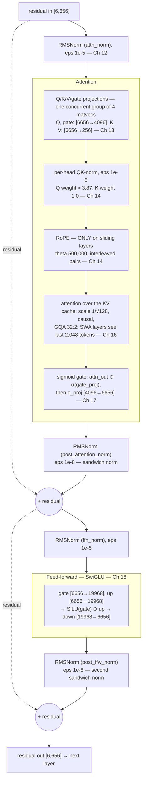
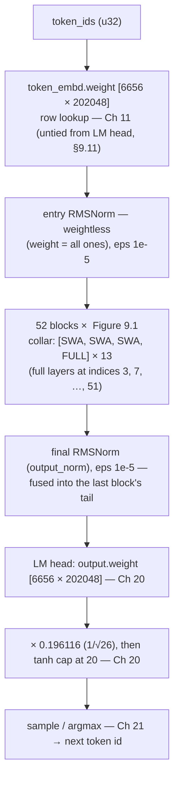

# Chapter 9 — The Muse Glimmer architecture
> **status:** polished  ·  **path:** Muse Glimmer, pinned Muser tree
>
> *Prerequisites: [Part I](01-why-inference-is-a-memory-problem.md) (Metal) and
> [Part II](05-quantization-from-scratch.md) (quantization). No transformer
> paper assumed; every term is defined in place, and the kernel-deep treatment
> starts in [Ch 11](11-token-embedding-lookup.md).*

Chapter 8 left us with a small mystery: the DFlash draft was described
purely by what it must *guarantee* — a 64-row sink context, a matching
sliding window, exact-enough drafting. What it drafts *for* stayed
off-stage. Now the target takes the stage: Muse Glimmer, the 52-layer,
~30-billion-parameter model every lane in this book exists to serve. We
build its architecture from zero — no transformer knowledge assumed — and
verify every number against the pinned Muser tree, because this chapter's
tables are the anchors every kernel chapter in Part IV points back at.

---

## 9.1 What a transformer is (one page, from zero)

A [transformer](../glossary.md#transformer) turns a sequence of **tokens**
(integers, each standing for a word fragment) into a prediction of the next
token. Internally it is a stack of identical blocks — **layers** — wired
one after another. Each layer reads one vector per token, the
[hidden state](../glossary.md#residual-stream-hidden-state) (or **residual stream**), does
two things to it, and writes the updated vector back out:

- **[Attention](../glossary.md#attention)** mixes information *across* tokens:
  each token looks at the tokens before it and pulls in what it needs. It is
  the only operation in the model that moves information between positions.
- A **[feed-forward network](../glossary.md)** (FFN) transforms the vector
  *in place*, one token at a time — a per-token "thinking" step.

Everything else is plumbing: normalizations that keep the vector's magnitude
tame, projections that reshape it, positional machinery that tells attention
what "before" means. Muse Glimmer is exactly this stack, 52 layers deep, with
a handful of unusual choices in the plumbing — the repeating sliding/full
attention pattern, a sigmoid gate on attention output, a dual-epsilon norm
scheme — each taken one at a time below. The name "transformer" is just the
2017 paper's label for the attention-plus-FFN stack [arxiv:1706.03762].
Muser implements one specific transformer, and the contract is one sentence
in the code — the CPU oracle is *"the bit-level spec for every trap in the
architecture (inverted-Gemma RoPE/NoPE split, sigmoid gate placement,
dual-eps sandwich norms, softcap-after-scale ordering, GPT-J RoPE pairing)"*
[crates/muser-engine/src/lib.rs:103-108]. Every trap in that sentence gets a
section.

## 9.2 The exact hyperparameters (verified from source)

Before a single kernel can be written, one question has to be settled: how
wide is this model, exactly? Every kernel chapter in Part IV sizes its
buffers, its threadgroups and its loop bounds from the answer, so one wrong
row here does not fail loudly — it propagates quietly into a dozen chapters
and into an engine that runs and emits plausible text.

So we did not transcribe these values from a model card. Each one is read
twice: once by the live GGUF metadata reader, which fails closed on a
missing key, and once by the release-model gate test, which asserts what the
pinned artifact actually carries. That is the same double-citation discipline
we apply to the pinned SHA-256 identity, and we kept the receipt:
[crates/muser-engine/tests/muse_golden.rs:14-15].

**Table 9.1 — Muse Glimmer hyperparameters (pinned release GGUF)**

| Hyperparameter | Value | Parsed from GGUF key | Release-test assertion |
|---|---:|---|---|
| `n_layers` | 52 | `muse-glimmer.block_count` [crates/muser-engine/src/config.rs:169] | [crates/muser-engine/tests/muse_golden.rs:97] |
| `hidden_dim` | 6,656 | `muse-glimmer.embedding_length` [config.rs:170] | [muse_golden.rs:98] |
| `n_heads` (query) | 32 | `muse-glimmer.attention.head_count` [config.rs:171] | [muse_golden.rs:99] |
| `n_kv_heads` | 2 | `muse-glimmer.attention.head_count_kv` [config.rs:172-173] | [muse_golden.rs:100] |
| `head_dim` | 128 | `muse-glimmer.attention.key_length` (falls back to `hidden/n_heads`) [config.rs:174-176] | [muse_golden.rs:101] |
| `intermediate_dim` (FFN) | 19,968 | `muse-glimmer.feed_forward_length` [config.rs:180] | [muse_golden.rs:102] |
| `vocab_size` | 202,048 | `muse-glimmer.vocab_size` (falls back to the GGUF token list) [config.rs:209-211] | [muse_golden.rs:103] |
| `sliding_window` | 2,048 | `muse-glimmer.attention.sliding_window` [config.rs:189] | [muse_golden.rs:104] |
| `context_length` | 131,072 | `muse-glimmer.context_length` [config.rs:181] | [muse_golden.rs:105] |
| SWA / full layers | 39 / 13 | `muse-glimmer.attention.sliding_window_pattern = 4` [config.rs:347-361] | [muse_golden.rs:109-116] |
| `rms_eps` | 1e-5 | `muse-glimmer.attention.layer_norm_rms_epsilon` (required) [config.rs:184-188] | [crates/muser-engine/src/lib.rs:11-13] |
| `post_norm_eps` | 1e-8 | *not in the GGUF* — llama.cpp graph constant [config.rs:23-28] | [config.rs:28] |
| `rope_base_swa` | 500,000 | `muse-glimmer.rope.freq_base_swa` (falls back to `rope.freq_base`) [config.rs:200-202] | [crates/muser-engine/src/rope_nco.rs:14] |
| `logit_scale` | 0.196116 (= 1/√26) | `muse-glimmer.logit_scale` (required) [config.rs:190-192] | [docs/release-provenance.md:823] |
| `final_logit_softcap` | 20 | `muse-glimmer.final_logit_softcapping` (llama.cpp default 30) [config.rs:195-197] | [crates/muser-engine/src/lib.rs:186] |
| end-of-generation | EOS 200,001 + EOT 200,008 | `tokenizer.ggml.{eos,eot,eom}_token_id` [config.rs:213-226] | [muse_golden.rs:106-108] |

Three properties of this table matter more than the numbers. First,
**nothing is hard-coded**: `MuseConfig::from_gguf` *"fails closed"* on any
missing key, bad shape, or non-constant QK-norm [config.rs:158-162]; the
Rust constants that exist (`MUSE_LAYER_COUNT`, `MUSE_SWA_WINDOW`, …) are
the same values as asserts, not a second source of truth [config.rs:13-21].
Second, **`head_dim` is independent of
`hidden_dim`**: with 32 heads over a 6,656-wide hidden state,
`hidden/n_heads` would be 208, but the GGUF declares `key_length = 128`
and the loader prefers the declared key [config.rs:174-176] — so query
space is `32 × 128 = 4,096` while the residual stream is 6,656, and the Q
projection is *not* square. Third, **one value is famously not in the
file**: the 1e-8 post-norm epsilon is a llama.cpp graph constant, not GGUF
metadata — §9.9 explains why that is a landmine.

Two rows use names you have not met yet: SWA, sliding-window attention, and
NoPE, "no positional embedding." They earn their own section rather than a
parenthesis, because they are the reason this model's memory cost does not
grow the way its depth suggests — that is §9.7, and the `rope_base_swa` key
belongs to the same story. And one last thing before we leave the table: it
describes one specific file and no other — the artifact with SHA-256
`7e9b74b7c8875e9e265695df9613bf6290f2392e479ce740495a129019c488d8`,
**16,756,681,056 bytes** on disk
[crates/muser-server/src/chat_template.rs:237-250]. Every value above was
read out of that artifact; held against a different one, the whole geometry
is a guess.

> **Derived quantities** used everywhere below: `attn_dim = n_heads ×
> head_dim = 4,096`; `kv_dim = n_kv_heads × head_dim = 256`
> [config.rs:268-273]. Q, gate, o_proj live in 4,096 space; K, V in 256.

## 9.3 One Muse Glimmer block — the anatomy

Figure 9.1 is the most important diagram in Part III — every decode kernel
in chapters 11–21 implements one box in it. Read it slowly, then again
after §9.5.



*Figure 9.1: One Muse Glimmer block. Two residual adds (dashed), and — the
signature of the architecture — a **norm on the output of each sub-block
before it is added** rather than on the residual sum. This Gemma-2-style
"sandwich" placement [crates/muser-engine/src/config.rs:51-53] gives both
post-norms the different 1e-8 epsilon (§9.9), and the sigmoid gate (§9.8)
sits between attention and o_proj — nowhere else.*

Three things to internalize. **The residual adds are the spine**: each
sub-block only ever *adds* — nothing overwrites the stream, which is what
lets a 52-layer stack train at all (the skip-connection argument of
[arxiv:1512.03385]). **Attention is the only cross-token mixer**; the FFN
and all the norms are strictly per-position. And **every sub-block reads
the stream through a norm** — four weighted norms per block plus one per
attention head, 209 norm applications per token. Norms are cheap per vector
but everywhere at 52 layers, which is why the *fused* norm tails of
[Ch 12](12-rmsnorm-and-the-dual-eps-sandwich.md) exist.

## 9.4 The full model — 52 blocks in a repeating pattern

Now zoom out one level. If the figure above is the cell, the one below is
the organism: everything that happens to a token id between the moment it
arrives and the moment a successor is chosen. The question this section
answers is where the blocks sit in that path, and what decides which kind of
block a given layer is.



*Figure 9.2: The full Muse Glimmer forward pass. The residual stream is
`[6,656]` between all blocks; the final norm is not a separate dispatch on
the decode path — the last block's fused tail produces the normed output
directly [crates/muser-engine/src/decode.rs:5869-5876].*

The collar in Figure 9.2 follows one rule, and the type documenting it also
records the *inversion* relative to Gemma 3:

```rust
// crates/muser-engine/src/config.rs:51-59, 84-93  (the enum's variant bodies
//   and the rule's bounds-check arm are elided)
/// Per-layer attention kind. Muse Glimmer alternates
/// `[sliding, sliding, sliding, full]`, and — unlike Gemma 3 — it is the
/// *sliding* layers that carry RoPE while the *full* layers are NoPE.
pub enum MuseLayerKind { /* SlidingRope, FullNoPe */ }

pub const fn layer_kind(layer: usize) -> Result<MuseLayerKind, LayerIndexError> {
    // …
    if layer % 4 == 3 {
        Ok(MuseLayerKind::FullNoPe)
    } else {
        Ok(MuseLayerKind::SlidingRope)
    }
}
```

So 52 layers = 13 groups of `[sliding, sliding, sliding, full]`: **39 SWA
layers** and **13 NoPE full layers** at indices 3, 7, …, 51 — exactly the
set the remote-prefill schedule ships as position-free tiles
[crates/muser-cluster/src/schedule.rs:20]. The counts are asserted in code
[config.rs:14-15] and in the release test [muse_golden.rs:109-116].

There was a fork at the resolver, and it is worth naming, because the
tempting branch is the friendly one. If a GGUF arrives without its
sliding-window pattern key, the loader could simply assume every layer is a
full-attention layer. The model would load. It would run. It would emit
fluent English. We took the unfriendly branch instead: a missing pattern key
panics. The comment in the resolver gives the reason in one line — *"an
all-full model runs and emits plausible text while being wrong"*
[config.rs:378-380]. That is the fail-closed posture in miniature, applied
here not to a tensor or a hash but to the shape of the graph itself, and it
rests on a judgement we will keep returning to: an answer that looks right
and is wrong costs more than a refusal.

## 9.5 The components, one short tour each

Before the traps, a quick pass over the parts by name. Nothing in this
section is peculiar to Muse Glimmer; it is the shared vocabulary the rest of
the book leans on, so skim what you already know and slow down where a term
is new.

The **[embedding](../glossary.md#embedding)** is a lookup table — a token id picks
one row of `token_embd.weight [6656 × 202048]`; that row is the initial
residual stream. **[RMSNorm](../glossary.md#rmsnorm)** computes
`x / sqrt(mean(xᵢ²) + ε) ⊙ γ` (⊙ is elementwise multiply) with a learned
per-channel scale `γ` (here `ε = 1e-5`); no mean subtraction, and it rescales the stream to ~unit
magnitude so 52 layers of matrix products neither explode nor vanish. In
**[attention](../glossary.md#attention)**, each token computes a *Query* (what
it looks for) while every past token carries a *Key* (what it offers) and a
*Value* (what it hands over); a query-key score is a dot product over 128
dimensions scaled by `1/√128 ≈ 0.0884` [config.rs:279-281], scores pass
through **[softmax](../glossary.md#softmax)** (`exp(xᵢ)/Σⱼexp(xⱼ)` — positive
weights summing to 1), and the output is the weighted sum of Values under a
**causal mask** that forbids seeing future tokens. The
**[KV cache](../glossary.md#kv-cache)** records every past token's Keys and
Values so token N+1 does not recompute tokens 0..N — one cached row in one
layer costs `2 KV heads × 128 × 2 B × (K + V) = 1,024 bytes`
[docs/memory-footprint.md §KV formula]. The FFN's activation
**[SiLU](../glossary.md#silu)** is `x·σ(x)` (⊙ is elementwise product), giving
the **SwiGLU** shape `down(SiLU(gate·x) ⊙ (up·x))`
[crates/muser-engine/src/reference.rs:493-522].

## 9.6 GQA — 32 query heads, 2 KV heads

The single biggest memory lever in the model's geometry. Attention runs per
**head** — each an independent 128-dimensional attention with its own slice
of the Q projection. In plain multi-head attention every query head would
also have its *own* Key and Value (32 KV heads here); **[Grouped-Query
Attention](../glossary.md)** instead gives the 32 query heads only **2**
KV heads to share (Figure 9.3):

```
query heads:  Q0  Q1 ... Q15   |   Q16 ... Q31        32 heads × 128 = attn_dim 4,096
                 \   ...   /         \   ...   /
KV heads:         K0 , V0               K1 , V1       2 heads  × 128 = kv_dim    256
```

*Figure 9.3: The GQA grouping. Each KV head serves
`heads_per_kv = n_heads / n_kv_heads = 32 / 2 = 16` query heads
[config.rs:274-276].*

Said the other way round, because this is the idea the whole memory story
rests on: the model keeps thirty-two independent ways of asking a question,
but only two distinct sets of answers on file, and every question is served
from one of those two sets. Asking is cheap — it is arithmetic on a vector
the model already has. Answering is expensive, because the answers have to
be fetched from memory. Grouped-Query Attention makes the expensive half
small.

**Why this is a bandwidth win.** During decode, attention must read the K
and V of every visible past token out of the KV cache. With full multi-head
attention one cached row in one layer would cost
`32 × 128 × 2 B × (K+V) = 16,384 B`; with GQA it costs
`2 × 128 × 2 B × (K+V) = 1,024 B` [docs/memory-footprint.md §KV formula] —
a **16× reduction** in both the per-token KV read and the cache size. On a
bandwidth-bound decode path (the argument of
[Ch 1](01-why-inference-is-a-memory-problem.md)) that is enormous; the
quality cost of 16 query heads sharing each KV pair is the trade GQA was
invented to make [arxiv:2305.13245]. Whenever a later chapter says "KV
head," it means one of these 2. GQA also skews the projection widths —
K and V read only `[6656 → 256]`, skinny matrices that get a different
matvec geometry than Q in [Ch 13](13-the-qkv-gate-matvec-family.md) and a
16-way fan-in per KV head in attention [Ch 16](16-attention-decode-kernels.md).

## 9.7 The two attention classes: 39 SWA rings, 13 NoPE planes

This is the section to read twice. Almost everything Part VI does — remote
prefill, warm reuse, the delta handoff — is downstream of a single fact
established here, and the fact is easy to miss because it hides inside a
routine-looking layer schedule. The question: what does a layer of this
model see when it looks backwards, and does the answer depend on *where* the
tokens it sees happened to sit?

Muse Glimmer's most consequential structural choice: its 52 layers do not
all attend the same way (Figure 9.4).

```
layer:   0  1  2  3 | 4  5  6  7 | 8  9 10 11 | ... | 48 49 50 51
kind:    S  S  S  F | S  S  S  F | S  S  S  F | ... |  S  S  S  F

S = SlidingRope : window 2,048 tokens, RoPE applied      (39 layers)
F = FullNoPe    : full causal attention, NO rotation     (13 layers)
```

*Figure 9.4: The repeating collar — 13 copies of `[sliding, sliding,
sliding, full]` (`layer % 4 == 3` is full [config.rs:88]).*

**The 39 sliding layers** use [sliding-window attention](../glossary.md): a
query at position `p1` sees a key at `p0` only if `p1 ≥ p0` **and**
`p1 − p0 < 2,048` — *"Mask follows llama.cpp `LLAMA_SWA_TYPE_STANDARD`"*
[crates/muser-engine/src/reference.rs:577-580]. Their KV caches never need
more than 2,048 rows, so each SWA layer's cache is a fixed **2,048-row
ring** of `min(max_context, sliding_window)` capacity, token-major
[crates/muser-engine/src/decode.rs:1346-1348]. Bounded KV: one SWA layer
holds `2,048 × 1,024 B = 2 MiB` — per layer, *forever*, at any depth.

**The 13 full layers** attend over the entire context — and they carry **no
positional rotation at all**: NoPE means "no positional embedding," not "a
different positional embedding." The code is categorical:

```rust
// crates/muser-engine/src/config.rs:66-70
/// RoPE runs iff the layer is a sliding layer (`muse-glimmer.cpp:93`:
/// `const bool use_rope = hparams.is_swa(il);`).
pub const fn uses_rope(self) -> bool {
    matches!(self, Self::SlidingRope)
}
```

Because a NoPE layer's K/V rows do not encode absolute position, its cache
rows are **relocatable bytes** — a KV tile for positions `[a, b)` can be
planted anywhere in the plane without recomputation: *"the 13 NoPE layers
are position-free (relocate = memcpy) — the whole kvpack free lunch"*
[crates/muser-engine/src/lib.rs:8-10].

Put it side by side with the other class, because the contrast is the whole
point. In a sliding layer, *where* a token sat has been rotated into its
numbers; move its cached row to a new position and the numbers are now lies,
so the row must be recomputed. In a NoPE layer nothing about position was
ever written down; the row means the same thing wherever it lands, so moving
it is a copy and nothing more. One class stores meaning-at-a-place, the
other stores meaning. Only the second can be shipped over a wire.

That single property is what pays for Part VI. It is why remote prefill can
stream 512-token NoPE tiles while the producer is still computing, why warm
reuse restores a 130,815-token prefix in ~1 s instead of ~148 s [ledger,
kvpack ladder stage-5], and why that lane exists in the shape it does.
(Why the authors trained full layers without rotation is a modeling
question this codebase does not answer — `[unverified]`; the code proves
the rotation is absent and the engine exploits that.)

Meanwhile the sliding layers *do* rotate — with the **interleaved (GPT-J)
pairing**: dimension `2i` rotates with `2i+1`, adjacent in memory:

```metal
// crates/muser-engine/src/shaders/ferrite/rope.metal:651-656
// NORM convention: the pair is adjacent, at 2*pi and 2*pi + 1.
const uint i0 = 2u * pi;
// …(v0/v1 loads elided)
base[i0]      = v0 * cos_a - v1 * sin_a;
base[i0 + 1u] = v0 * sin_a + v1 * cos_a;
```

The base frequency is `theta = 500,000` (read from
`muse-glimmer.rope.freq_base_swa` [config.rs:200-202]; baked into the
deterministic trigonometry tables as *"Exact f32 bits for 500000^(-2/128)"*
[crates/muser-engine/src/rope_nco.rs:14]). Larger theta ⇒ angles grow more
slowly with position ⇒ positions stay distinguishable over longer ranges
(the mechanical trade is [Ch 14](14-qk-norm-and-rope.md)'s). The two-class
split also fixes the cache arithmetic for
[Ch 22](22-the-price-of-context.md), derived here once:

```
slot_kv_bytes(C) = (39 × min(C, 2,048) + 13 × C) × 1,024

C = 131,072:  (39 × 2,048 + 13 × 131,072) × 1,024
            = (79,872 + 1,703,936) × 1,024
            = 1,826,619,392 B ≈ 1.827 GB per slot   [docs/memory-footprint.md]
```

The 13 NoPE layers dominate that sum (1,703,936 of 1,783,808 rows ≈ 95 %):
full attention pays for depth, sliding attention does not.

## 9.8 The sigmoid attention gate

Two questions hang over this component, and only one of them has an answer
in this repository. *Where* does the gate sit, exactly? — answerable to the
line, and the answer matters, because getting the placement wrong changes
every logit downstream. *Why* is it there at all? — not answerable from
code, and we will say so plainly rather than fill the gap with a plausible
story.

Take the placement first. Standard attention ends with o_proj; Muse Glimmer
slips a learned gate in ahead of it, and the CPU oracle shows the seam
exactly — after attention, before the output projection:

```rust
// crates/muser-engine/src/reference.rs:446-455  (the trailing o_proj
//   `matmul(&self.w("blk.{il}.attn_output.weight"), &attn_out, t, &mut proj)`
//   at :456-461 is elided)
// ── sigmoid gate, then o_proj ─────────────────────────────────
for g in gate.iter_mut() {
    *g = 1.0 / (1.0 + (-*g).exp());
}
// …(capture recording elided)
for (a, g) in attn_out.iter_mut().zip(gate.iter()) {
    *a *= *g;
}
```

The `gate` vector comes from a fourth attention projection —
`attn_gate.weight [6656 → 4096]`, the same width as Q [config.rs:307] —
computed concurrently with Q/K/V from the same normed input
[crates/muser-engine/src/decode.rs:5569-5598]. After the sigmoid, each of
the 4,096 attention-output channels is multiplied by a learned value in
(0, 1): a per-channel valve that can pass, dampen, or effectively mute what
attention just computed; then o_proj maps the gated result back to 6,656
(`reference.rs:456-461`). The Metal kernel:

```metal
// crates/muser-engine/src/shaders/ferrite/sigmoid_gate.metal:7-16
kernel void sigmoid_gate_inplace(
    device       float* attn_out [[ buffer(0) ]],
    device const float* gate     [[ buffer(1) ]],
    constant     uint&  n        [[ buffer(2) ]],
    uint gid [[ thread_position_in_grid ]])
{
    if (gid < n) {
        attn_out[gid] *= 1.0f / (1.0f + exp(-gate[gid]));
    }
}
```

What the gate buys the *model* — dampening unreliable attention channels —
is the standard reading of gated-attention variants, but this tree contains
no evidence for the authors' intent: `[unverified]`. What the code proves is
the placement (attention output, pre-o_proj), the width (4,096, matching
Q), and the concurrency (the fourth matvec of the QKVG group — the hero
chapter [Ch 13](13-the-qkv-gate-matvec-family.md); kernel in
[Ch 17](17-sigmoid-gate-and-oproj.md)).

## 9.9 The dual-epsilon norm sandwich

Look again at Figure 9.1: the post-attention norm applies to o_proj's
**output**, *then* the result joins the residual — ditto the post-FFN norm.
This Gemma-2-style *sandwich* normalizes each sub-block's contribution on
its way into the stream, not the stream after the add. The oracle's tail:

```rust
// crates/muser-engine/src/reference.rs:466-480
// ── post-attention norm (eps 1e-8) + residual ─────────────────
// …(weight fetch elided)
rms_norm_mul(&mut proj, h_dim, cfg.post_norm_eps, &post_attn_w);
// …(capture recording elided)
for (hv, (p, r)) in hidden.iter_mut().zip(proj.iter().zip(residual.iter())) {
    *hv = *p + *r;
}
```

The second tail, after the FFN, is identical in shape with `post_ffw_norm`
[reference.rs:527-538]. Now the landmine: the two post-norms use a
**different epsilon** than every other norm in the graph — 1e-8 versus the
GGUF's 1e-5 — and that 1e-8 is *not in the checkpoint*:

```rust
// crates/muser-engine/src/config.rs:23-28
/// Post-attention / post-FFN RMSNorm epsilon.
///
/// llama.cpp uses a *different* epsilon for the two "post" norms of the
/// Gemma-2-style sandwich than for every other RMSNorm in the graph, and it is
/// not carried in the GGUF. See `src/models/muse-glimmer.cpp:67`.
pub const MUSE_POST_NORM_EPS: f32 = 1e-8;
```

This is a llama.cpp graph constant, transcribed into Muser so the two
engines compute identical bytes [crates/muser-engine/src/lib.rs:103-108].
Reading one epsilon from the GGUF and using it everywhere — the "obvious"
simplification — would produce logits that differ from the comparator's at
every layer boundary.

We found out how little slack there is here the expensive way. A block's
tail is two norm stages with a device-memory boundary between them, which
reads like an open invitation to fuse: same data, same thread, one kernel
instead of two, and the algebra on paper does not change. So we built it — a
hybrid schedule that fused the tail and retained activations across the two
stages — and we expected a dispatch saving for free, on the reasoning that
arithmetic which is equal on paper is equal in the machine. It was not.
Public logprobs moved past the 1e-4 contract: max normalized-logprob error
3.197e-4, with the first divergence a single f16 ULP in layer-1 V, which
then had the entire rest of the stack to grow in. The lesson is the one to
carry out of this section: an epsilon this small is not a tolerance knob, it
is part of the model's definition — rounding boundaries are the spec, and
"the same algebra" is not "the same bits." The hybrid was rejected rather
than waved through under a widened tolerance, and we retained the
postmortem: [docs/decode-dispatch-gap-20260815.md §Rejected hybrid
postmortem].

The full norm story — including why the fused tail kernel that did ship
reproduces "the two pinned ggml f32x4 norm reductions and their intervening
f32 device-memory boundary" [crates/muser-engine/src/decode.rs:1328-1330] —
is [Ch 12](12-rmsnorm-and-the-dual-eps-sandwich.md).

A related fail-closed check lives at load time: the GGUF's
`attn_q_norm`/`attn_k_norm` tensors are **converter-synthesized constant
broadcasts** — every Q-norm weight the same scalar (`qk_scale_factor ≈
3.87`), every K-norm weight 1.0 — materialized only so llama.cpp's
weighted-RMSNorm op can carry a scalar
[crates/muser-engine/src/lib.rs:74-79]. The loader verifies this
tensor-by-tensor and aborts on a genuinely learned norm
[crates/muser-engine/src/loader.rs:98-138]. The per-head QK-norm itself
(RMS over each 128-wide head vector, eps 1e-5, before RoPE) is
[Ch 14](14-qk-norm-and-rope.md)'s; its measured constant
`3.87 × 0.0883883… ≈ 0.3420623` is asserted in [config.rs:426-430].

## 9.10 Final logits: multiply by 1/√26, then cap at tanh(20)

One question is left before a token can be chosen: what happens to the raw
scores the LM head produces? Muse Glimmer does two unusual things to them,
and the part that catches people is not either step on its own — it is that
their *order* is contract, not taste:

```rust
// crates/muser-engine/src/reference.rs:559-570
let mut logits = vec![0.0f32; t * cfg.vocab_size];
matmul(&self.w("output.weight"), &hidden, t, &mut logits);
for l in logits.iter_mut() {
    *l *= cfg.logit_scale;
}
if cfg.final_logit_softcap > 0.0 {
    let cap_v = cfg.final_logit_softcap;
    let inv = 1.0 / cap_v;
    for l in logits.iter_mut() {
        *l = cap_v * (*l * inv).tanh();
    }
}
```

First, every logit is scaled by `logit_scale` = **0.196116** — 1/√26 to
five decimals (`1/√26 = 0.19611613…`). This is **GGUF metadata, not a code
constant**: `MuseConfig` requires the key `muse-glimmer.logit_scale`
[config.rs:190-192], and the pinned artifact's value is recorded in the
provenance doc (*"…`muse-glimmer.final_logit_softcapping=20` and
`logit_scale=0.196116`"* [docs/release-provenance.md:823]). The literal
`1.0 / 26.0f32.sqrt()` appears in the tree only as a fixed *test* input
[crates/muser-engine/src/metal.rs:68] — cite the metadata read, not the
test. Second, a **soft cap** `l → 20·tanh(l/20)` confines every logit to
(−20, 20) without a cliff; the GPU kernel is one thread per logit:

```metal
// crates/muser-engine/src/shaders/muse_reference.metal:15-27  (the buffer
//   parameter list is elided)
kernel void muser_scale_softcap_inplace( /* … */ ) {
    if (index < count) {
        float value = logits[index] * scale;
        logits[index] = softcap > 0.0f ? softcap * tanh(value / softcap) : value;
    }
}
```

Scale first, cap second — *"softcap-after-scale ordering"* is one of the
named traps the oracle pins down [crates/muser-engine/src/lib.rs:103-108].
Backwards, the cap barely bites (0.196 × 20 ≈ 3.9 effective ceiling instead
of 20). The cap also changes what "comparing logits across engines" means —
differences near the ceiling are compressed non-linearly, one reason the
parity campaign compares *tokens and logprobs*, not raw logit deltas, at
the tail [docs/muser-architecture.md §Model and engine; deep treatment in
[Ch 20](20-final-norm-lm-head-softcap.md)].

## 9.11 The per-layer tensor inventory

What does one layer actually consist of, as bytes on disk? The table below
is the answer, and it is also a promise the loader keeps: the shape checker
asserts that every tensor listed exists with exactly this shape, in every
layer, and fails closed if one is missing or misshapen
[crates/muser-engine/src/config.rs:286-333]. Read the shapes the way GGUF
writes them, `[in, out]`.

**Table 9.2 — Per-layer tensors (×52, `l = 0..51`)**

| Tensor (`blk.{l}.*`) | Shape | Role |
|---|---|---|
| `attn_norm.weight` | `[6656]` | pre-attention norm γ, eps 1e-5 |
| `attn_q.weight` | `[6656, 4096]` | query projection (32 heads × 128) |
| `attn_k.weight` | `[6656, 256]` | key projection (2 KV heads × 128) |
| `attn_v.weight` | `[6656, 256]` | value projection |
| `attn_q_norm.weight` | `[128]` | per-head Q norm — constant ≈ 3.87 (§9.9) |
| `attn_k_norm.weight` | `[128]` | per-head K norm — constant 1.0 |
| `attn_gate.weight` | `[6656, 4096]` | sigmoid-gate projection (§9.8) |
| `attn_output.weight` | `[4096, 6656]` | o_proj |
| `post_attention_norm.weight` | `[6656]` | sandwich post-norm, eps 1e-8 |
| `ffn_norm.weight` | `[6656]` | pre-FFN norm, eps 1e-5 |
| `ffn_gate.weight` | `[6656, 19968]` | SwiGLU gate |
| `ffn_up.weight` | `[6656, 19968]` | SwiGLU up |
| `ffn_down.weight` | `[19968, 6656]` | SwiGLU down |
| `post_ffw_norm.weight` | `[6656]` | second sandwich post-norm, eps 1e-8 |

Three global tensors sit outside the loop [config.rs:294-298]:
`token_embd.weight` and `output.weight`, both `[6656, 202048]`, and
`output_norm.weight [6656]`. The embeddings are **untied**: `output.weight`
(the LM head) is a *required* tensor in the shape contract, not an optional
one — the model carries two independent `[6656 × 202048]` matrices, one to
enter and one to leave. Whether untying buys quality is a modeling claim
this tree cannot support (`[unverified]`); the cost is countable: both
matrices are 2.69 B of the 27.85 B parameters (§9.12).

## 9.12 Parameter accounting — what "~30B" actually is

The model is sold as a thirty-billion-parameter model. Is it? Everything
needed to check now sits in the tables above, so rather than quote the
label, we count — and the counting is worth doing slowly, because the
*shape* of the total tells the kernel chapters where to spend their effort.

Deriving the count from Table 9.2: per layer, the five attention
projections sum to `3 × (6656×4096) + 2 × (6656×256) = 85,196,800`, the
FFN adds `3 × (6656×19968) = 398,721,024`, the norms 26,880 — **483,944,704
per layer × 52 = 25,165,124,608**. The global tables add
`2 × (6656×202048) = 2,689,662,976` plus the output norm, for
**≈ 27,854,794,240 ≈ 27.85 B parameters**. The repo labels the model "Muse
Glimmer-30B" [crates/muser-engine/src/lib.rs:1]; the honest arithmetic
gives ≈ 27.85 B — same class, not the same number, and this book uses the
derived one.

The distribution matters more than the total: **82 % of each layer's
parameters are FFN**, the attention projections 18 %, the two untied vocab
matrices 9.7 % — decode bandwidth is dominated by the FFN matvecs
([Ch 18](18-swiglu-ffn.md)), and the DFlash verify path of
[Ch 33](33-speculation-and-the-distributed-verdict.md) is a batching story.
One more division for [Ch 1](01-why-inference-is-a-memory-problem.md)'s
roofline: the artifact is 16,756,681,056 bytes [muse_golden.rs:15], so the
average weight occupies `16,756,681,056 / 27,854,794,240 ≈ 0.60 B ≈ 4.81
bits` — the q4_k_xl mix of [Ch 6](06-the-kquant-family.md) slightly above
pure Q4_K's ~4.5 bits.

## 9.13 Tokenizer and template identity

Geometry is not the whole of a model's identity. Something with exactly the
right shape, that reads text with a slightly different tokenizer or wraps it
in a slightly different chat template, is a different model in every way a
user would notice — same weights, different answers. So Muser serves one
model with one tokenizer and one template, binding the whole surface by hash
at load time:

- **Tokenizer** — a GGUF BPE tokenizer, merge-order aware: *"BPE tokenizer
  that respects merge priority order from GGUF metadata"*
  [crates/muser-engine/src/tokenizer/bpe.rs:8-10], with GPT-2 byte-mapping
  and byte-fallback paths plus an SPM-style mode selected by
  `tokenizer.ggml.pre` [bpe.rs:33-41; loader.rs:39-40]. The loader fails
  closed on a vocab-length mismatch [loader.rs:41-47], and the whole
  tokenizer metadata surface — vocab, merges, token types — carries one
  SHA-256,
  `61e73226502f8f54455555990c0000852247bbec32b107730ec544bc0b738055`
  [loader.rs:61], asserted against the pinned artifact
  [crates/muser-server/src/chat_template.rs:258-261].
- **Chat template** — a Jinja-style template ships inside the GGUF
  (`tokenizer.chat_template`). The pinned artifact's is exactly **7,167
  bytes**, SHA-256
  `114f55ebdc1804c1af371197b9fdf2d6bb925966c9dfe46b73782a71bc07965e`,
  asserted at load [chat_template.rs:252-257; loader.rs:48-55]. Why hash
  it? Rendering drift changes prompts → tokens → *everything downstream*;
  template identity is bound into durable bundles
  [crates/muser-server/src/session_store.rs:26].
- **End-of-generation** — two control tokens are declared EOG, EOS
  `200,001` and EOT `200,008`, with the `eot`/`eom` metadata keys merged
  into one set [config.rs:213-226; muse_golden.rs:106-108] — "dual EOS" is
  an asserted model fact [crates/muser-engine/src/lib.rs:11-13].

The point of this battery of hashes is the same fail-closed posture as
§9.2: an engine that quietly accepted a different tokenizer or template
would produce plausible text with the wrong identity.

## 9.14 Tradeoffs

The decisions above were made by the model's authors, not by Muser — but
each dictates what the kernels must be good at, and several have *measured*
consequences here.

**GQA 16:1 — the 16× KV lever.** Sharing 2 KV heads across 32 query heads
shrinks the per-token KV read and the cache by 16× (§9.6 arithmetic). At
the 131,072-position limit that is ≈ 1.827 GB versus ≈ 29 GB of KV per slot
[docs/memory-footprint.md] — four full-context slots on 96 GB, or none. The
measured consequence of the NoPE half of that saving is the kvpack delta
handoff: a 32,768-of-65,536 request moved **54.2851 %** of full bytes with
a bit-exact output [ledger stage-6; benchmarks.md §4] — possible only
because NoPE tiles are position-free bytes (§9.7).

**The sandwich norms buy training stability and cost an exactness
contract.** We told this one as a war story a few sections back; here it is
as a ledger entry. Every "obvious" fusion across the 1e-8 post-norms has
been measured to change public logprobs beyond the 1e-4 contract, and the
hybrid retained-activation schedule that reached max normalized-logprob
error 3.197e-4 was removed rather than hidden behind a widened tolerance
[docs/decode-dispatch-gap-20260815.md]. What ships instead is a fusion built
backwards from the requirement: the dual-eps fused tail reproduces the
pinned kernels' rounding boundaries exactly
[decode.rs:1328-1330] — a fusion whose design constraint is *bits*, not
speed ([Ch 12](12-rmsnorm-and-the-dual-eps-sandwich.md),
[Ch 35](35-ordering-hazards-and-the-dispatch-gap.md)).

**The soft cap changes logit comparison rules.** Because `20·tanh(l/20)` is
non-linear, equal logit *differences* near the ceiling are not equal
evidence differences; cross-engine comparisons at the tail must use tokens
and logprobs, not raw logits [docs/muser-architecture.md §Model and engine]
— one reason [Ch 38](38-measuring-against-llama-cpp.md)'s parity gates are
built the way they are.

## 9.15 What comes next

You now hold the complete map: 52 sandwich-norm blocks in a
`[sliding, sliding, sliding, full]` collar, GQA 32:2 at head_dim 128 over a
6,656-wide residual stream, a sigmoid gate before every o_proj, dual-epsilon
norms, and a scale-then-cap logit tail — every number double-cited, every
kernel chapter from here pointing back at a row in Tables 9.1–9.2. The open
question is movement: how does one token *walk* this graph on the Metal
side — which kernels run, in what order, what is fused, where every buffer
lives, and how the DFlash draft and the remote-prefill handoff overlay the
loop? [Ch 10](10-the-forward-pass-at-a-glance.md) answers with one picture.

## References

- `crates/muser-engine/src/config.rs` — :13-28 constants and the 1e-8 post-norm; :51-93 `MuseLayerKind`/`uses_rope`/`layer % 4 == 3`; :158-211 `MuseConfig::from_gguf` (every key of Table 9.1); :268-281 `attn_dim`/`kv_dim`/`heads_per_kv`/`attn_scale`; :286-333 tensor-shape contract; :347-381 SWA-pattern resolver; :390-403 and `loader.rs:98-138` `QkNormProbe`.
- `crates/muser-engine/src/reference.rs:297-580` — the CPU oracle: layer walk, gate placement, sandwich tails, scale-then-softcap, SWA visibility rule.
- `crates/muser-engine/src/lib.rs` — :1-15 asserted model facts; :74-79 QK-norm provenance; :99-109 oracle-as-spec; :126-131 tokenizer scope; :175-188 the graph summary.
- `crates/muser-engine/src/decode.rs` — :5569-5606 QKVG concurrency; :5793-5818 sigmoid gate and fused tail; :5869-5905 final-norm fusion and softcap; :1344-1358 two-class KV allocation.
- `crates/muser-engine/src/loader.rs:28-63` — load-time identity hashing. `crates/muser-engine/src/metal.rs:46-68`, `src/rope_nco.rs:12-14` — fixed fixture values (theta 500,000; the test-only `1/√26` literal).
- `crates/muser-engine/src/shaders/` — `ferrite/rope.metal:624-657` (adjacent-pair comment); `ferrite/sigmoid_gate.metal:7-17`; `muse_reference.metal:15-27`.
- `crates/muser-engine/tests/muse_golden.rs:14-117` — release-model identity, geometry assertions, dual EOS. `crates/muser-server/src/chat_template.rs:235-263`, `src/session_store.rs:26` — template/tokenizer hashes; bundle binding.
- `crates/muser-cluster/src/schedule.rs:1-21` — the 13 NoPE tiles `[3,7,…,51]`; relocate-as-bytes framing.
- `docs/muser-architecture.md §Model and engine`; `docs/memory-footprint.md`; `docs/release-provenance.md:823`; `docs/decode-dispatch-gap-20260815.md`.
- [arxiv:1512.03385] He et al., *Deep Residual Learning*. [arxiv:1706.03762] Vaswani et al., *Attention Is All You Need*. [arxiv:2305.13245] Ainslie et al., *GQA*.
