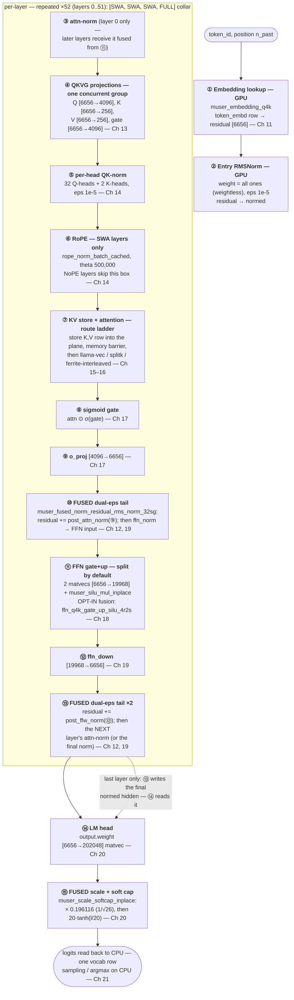
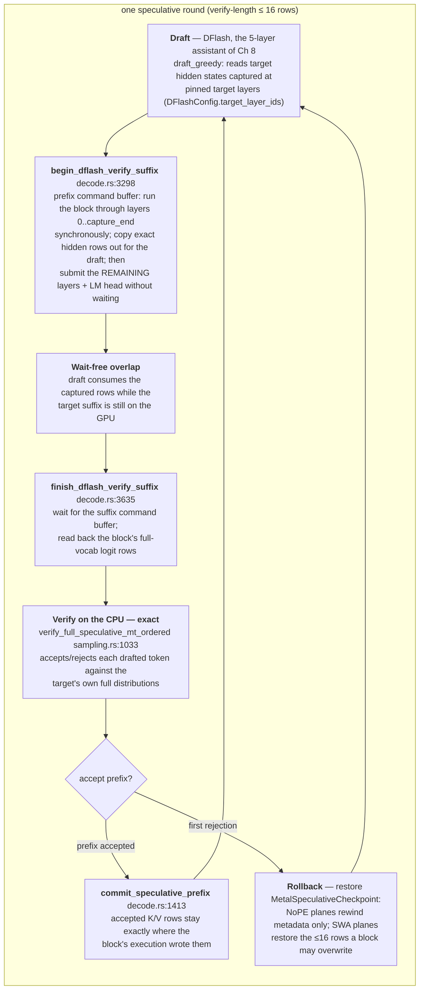
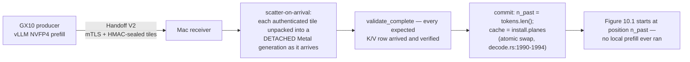

# Chapter 10 — The forward pass at a glance
> **status:** polished  ·  **path:** Muse Glimmer, pinned Muser tree
>
> *Prerequisites: [Ch 9](09-muse-glimmer-architecture.md) (the architecture —
> this chapter walks exactly that graph), [Part I](02-metal-compute-model.md)
> (command buffers, encoders, dispatch). This is the spine chapter: one
> diagram of the whole decode loop. The kernel-by-kernel walk begins in
> [Ch 11](11-token-embedding-lookup.md).*

Chapter 9 gave you the map — 52 sandwich-norm blocks, two attention classes,
a gated output, a scaled-and-capped logit tail — every number cited to the
pinned tree. This chapter makes it *move*. One token will walk the whole
graph on the Metal side, and we will watch the real code open every gate for
it: which kernel runs at each step, what is fused into what, which buffers
the token's data flows through, and how the DFlash draft loop and the remote
prefill handoff wrap around the plain one-token walk without changing it.
Everything quoted here was read from the pinned tree; the op order comes from
a real walk of `encode_token` and its serving twin, not from a design doc.

---

## 10.1 Three regimes, one family of graphs

An LLM generates text in regimes that differ enough that Muser compiles them
as different routes over the same weights. Define them precisely, because
every performance claim in this book is scoped to one of them:

- **[Prefill](../glossary.md#prefill)** — the first step of a generation: the
  entire prompt, all at once. Many query tokens hit each weight matrix, so
  the projections become [GEMMs](../glossary.md#gemm) (matrix × matrix) with
  heavy arithmetic reuse per weight byte. Prefill is *compute-bound*.
- **[Decode](../glossary.md#decode)** — everything after: one token in, one
  prediction out, repeat. A single vector hits every weight matrix — a
  [matvec](../glossary.md#matvec) with almost no reuse. Decode is
  *bandwidth-bound*; it is the regime this book follows, and the regime the
  whole engine is shaped around [Ch 1](01-why-inference-is-a-memory-problem.md).
- **Speculative verify** — decode's batch-shaped cousin: when the DFlash
  draft proposes a block, the target must score up to
  `MAX_DFLASH_BLOCK = 16` tokens in one pass
  [crates/muser-engine/src/decode.rs:47]. For those few dispatches decode
  temporarily *looks* like prefill (multiple query rows), which is exactly
  why speculation is the fourth lever of [Ch 1] — it reintroduces reuse into
  a serial loop.

> **Why the regimes differ, in one sentence.** Prefill has parallelism across
> tokens, so it is compute-bound; decode is one token, so it is
> bandwidth-bound; speculative verify buys back a slice of prefill's reuse
> for the decode path. Same matrices, different bottleneck.

## 10.2 Two routes through the same 52 layers

Here is the single most important routing fact in the engine, and it is
stated in a code comment at the exact decision point. When serving hands the
engine one token, `MetalMuseModel::forward_into` does this:

```rust
// crates/muser-engine/src/decode.rs:2077-2093
pub fn forward_into(
    &mut self,
    tokens: &[u32],
    logits: &mut Vec<f32>,
) -> Result<(), MetalModelError> {
    if tokens.len() == 1 {
        let scheduler = Arc::clone(&self.shared.scheduler);
        let _permit = scheduler.acquire(self.sequence_id, AcceleratorWork::Decode)?;
        // The legacy one-token graph uses Ferrite fused residual/norm and
        // gate-up kernels whose rounding diverges from the source-pinned
        // llama Metal graph enough to breach public logprob tolerance.
        // The one-row batch graph dispatches the exact pinned kernels and
        // has the same KV transition, so it is the serving correctness
        // path until each fused kernel independently passes full-logit
        // parity.
        *logits = self.forward_batch(tokens)?;
        return Ok(());
    }
```

Read that comment twice. Muser *has* a single-token graph with fused
residual/norm and fused gate-up kernels — Ferrite lineage, fast — and serving
**refuses to use it**, because its floating-point rounding diverges from the
pinned llama.cpp Metal graph by more than the public-logprob tolerance
allows. Correctness gates speed. The consequences ripple through this whole
chapter:

1. **The serving decode path is the one-row *batch* graph**: `forward_into`
   → `forward_batch` (`decode.rs:2857`) → `forward_batch_hidden`
   (`decode.rs:3788`) → `encode_batch_hidden_range` (`decode.rs:3858`), with
   `token_count = 1`. One row, exact pinned kernels.
2. **The legacy single-token graph survives as the teacher-forced route**:
   `forward_token` (`decode.rs:5432`) → `encode_token` (`decode.rs:5515`).
   It is the benchmark lane that matches the comparator's no-readback
   policy (`forward_teacher_forced`, `decode.rs:2118-2137`) and the
   phase-profiling route (`MUSER_METAL_PHASE_PROFILE`, `decode.rs:5440`).
   Its op sequence is what Part IV narrates, because it is the cleanest
   straight-line telling of the graph — and the batch route mirrors it
   row-for-row (the packed multi-sequence encoder `encode_decode_group`,
   `decode.rs:4954`, exists precisely to run "batch rows of the same op
   sequence").
3. **Multi-sequence decode packs up to four sequences into one graph**:
   `forward_decode_group` (`decode.rs:4869`) accepts `1..=4` models sharing
   one `MetalShared` executor, encodes all rows with one concurrent encoder,
   commits once, waits once (`decode.rs:4920-4937`). This is the rendezvous
   the server's 250 µs `DecodeBatcher` coalesce window feeds
   [crates/muser-server/src/state.rs:231-254].

Both routes acquire the scheduler before encoding — `AcceleratorWork::Decode`
for one token, `AcceleratorWork::Prefill` per chunk (`decode.rs:2083-2084`,
`decode.rs:2109`) — because one scheduler owns one accelerator, and decode
outranks prefill when both want it [decode.rs:1040-1074].

## 10.3 The master diagram — one decode token, end to end

This is the figure the rest of the book zooms into. Boxes are dispatch
groups as the encoder actually issues them; **FUSED** marks a fusion that is
live by default, and the two opt-in fusions are marked as such. The op order
is `encode_token`'s, which the serving batch route mirrors.



*Figure 10.1: One decode token through Muse Glimmer on the Metal side, as
`encode_token` [crates/muser-engine/src/decode.rs:5515-5907] issues it. Boxes
③–⑬ run 52 times; the SWA layers run ⑥, the 13 NoPE layers skip it. The
residual stream lives in two ping-ponging buffers (§10.4). Sampling is CPU
work on the read-back row (§10.9).*

**Read the fusions explicitly.** The route collapses several "logical" steps
into single kernels; these are the fusions actually present in code, with
their gates:

- **(a) The dual-eps fused tails (boxes ⑩ and ⑬) — live by default.** One
  kernel, `muser_fused_norm_residual_rms_norm_32sg`
  [crates/muser-engine/src/shaders/ferrite/rmsnorm_batch_tail.metal:147],
  does three logical ops: `residual += post_norm(sub_block_out)` with
  **eps 1e-8**, then `next_norm(residual)` with **eps 1e-5** — two norms and
  an add in one dispatch, emitting the next sub-block's *already-normed*
  input. The same kernel closes every layer: box ⑬'s second output is the
  *next layer's* attention-norm result
  (`next_norm` selected at `decode.rs:5869-5876`) — which is why box ③ runs
  only for layer 0. The dispatch is one threadgroup of 1,024 threads per
  row, 32 SIMD-group partials per reduction
  [crates/muser-engine/src/metal/encode/norm.rs:163-235]. The batch/serving
  route uses its batch twin `muser_fused_norm_residual_rms_norm_batch_dual_eps`
  [rmsnorm_batch_tail.metal:250], bound at `decode.rs:4510-4525`.
- **(b) Scale + soft cap (box ⑮) — live.** `muser_scale_softcap_inplace`
  multiplies by `logit_scale` and applies the tanh cap in one pass over the
  logits [crates/muser-engine/src/shaders/muse_reference.metal:15-27;
  decode.rs:5898-5905].
- **(c) The final norm is fused into the last layer's tail.** For layer 51,
  box ⑬'s "next norm" is the model's `output_norm` and its residual output
  goes to the buffer the LM head reads (`decode.rs:5869-5876`): the final
  RMSNorm is not a separate dispatch on this route.
- **(d) FFN gate+up+SiLU (box ⑪) — opt-in, OFF by default.** The Ferrite
  four-row/two-SIMD-group kernel `ffn_q4k_gate_up_silu_4r2s`
  [shaders/ferrite/ffn_fused_tail.metal:496] reads both Q4_K weight matrices
  once and emits the finished `SiLU(gate) ⊙ up` row — but only under
  `MUSER_FERRITE_FFN_GATE_UP` and only when both matrices are Q4_K
  (`decode.rs:5819-5836`). The reason it is opt-in is measured, not
  aesthetic: *"The pinned baseline packet regressed with it on this model,
  so keep the imported route explicitly opt-in for experiments"*
  [decode.rs:980-983]. The default is two matvecs plus
  `muser_silu_mul_inplace` [muse_reference.metal:4].
- **(e) Q/K/V/gate share one concurrent dispatch group (box ④).** Four
  independent matvecs read one shared normed input and write disjoint
  activations — issued as one group so the concurrent encoder can overlap
  them (`decode.rs:5566-5598`; the comment: *"llama.cpp and Ferrite issue
  the four independent attention projections as one concurrent set"*).
  Note what is deliberately **not** fused here: there is no fused QKV+RoPE
  mega-kernel on this path, unlike the ancestor book's engine
  [ferrite-book Ch 13] — the pinned-kernels correctness rule (§10.2)
  forecloses it.
- **(f) KV store and attention are separate dispatches with an explicit
  barrier (box ⑦)** on the vec routes: store K/V, `memory_barrier_with_resources`,
  attend (`decode.rs:5660-5670`). The barrier, not a fused kernel, is what
  orders the store before the read.

Everything from ① to ⑮ is recorded onto **one command buffer with one
concurrent encoder per token**, committed once:

```rust
// crates/muser-engine/src/decode.rs:5448-5458
let command_buffer = queue.new_command_buffer();
// One concurrent encoder owns the complete token. Graph dependencies
// are explicit barriers; independent projection groups share a barrier
// interval and may overlap, matching the accepted Ferrite/llama route.
let serial = GraphEncoder::concurrent(
    command_buffer
        .compute_command_encoder_with_dispatch_type(metal::MTLDispatchType::Concurrent),
);
self.encode_token(&serial, &token_view, self.n_past)?;
serial.encoder.end_encoding();
command_buffer.commit();
```

This is [command-buffer](../glossary.md#command-buffer) amortization
([Ch 2](02-metal-compute-model.md)): the whole 52-layer tape is recorded,
then "play" is pressed exactly once per token.

## 10.4 The residual stream — two buffers in a relay

In the ancestor book the residual stream was one buffer, mutated in place 56
times. Muser's decode graph runs a two-buffer relay instead, and the code
documents it at the top of the layer loop:

```rust
// crates/muser-engine/src/decode.rs:5546-5548
// `normed` is the current hidden buffer at layer entry. Each layer
// writes the attention residual to `hidden`, then the FFN result back
// to `normed`, so no full-width copy dispatch is needed.
```

(The `hidden`/`normed` in that comment are the *kernel parameters* of box
⑩/⑬, not buffer names — the buffers are `activations.normed` and
`activations.post_norm`.) Per fused tail — Figure 10.2 — the kernel does:

```
    activations.normed        activations.post_norm       layer.post_attn_norm (w1)
    (residual, 6656 f32)      (o_proj out, 6656 f32)      layer.ffn_norm      (w2)
          │                          │
          ▼                          ▼
     ┌────────────────────────────────────────┐   eps1 = 1e-8 (post norm)
     │ residual += src · rsqrt(mean(src²)+eps1) · w1 │   eps2 = 1e-5 (ffn norm)
     └────────────────────────────────────────┘
          │                          │
          ▼                          ▼
     normed (updated)    →    post_norm = normed · rsqrt(mean(normed²)+eps2) · w2
                               (the FFN's already-normed input)
```

*Figure 10.2: One fused dual-eps tail (boxes ⑩ and ⑬). Two RMSNorms, one
residual add, one kernel — semantically exactly the CPU oracle's
`rms_norm_mul(proj, post_norm_eps); hidden = proj + residual;
rms_norm_mul(hidden, rms_eps)` [crates/muser-engine/src/reference.rs:466-489].*

So the residual bytes live in `activations.normed` from the entry norm until
layer 51's tail, which writes the final normed stream into
`activations.hidden` for the LM head. Each layer reads the stream twice
(once per tail) and rewrites it twice — 104 full-width reads plus 104 writes
per token across the model, all inside fused kernels, zero standalone copies.

Why the relay instead of in-place mutation? Because each tail must read the
*pre-add* residual to norm it for the next sub-block while simultaneously
writing the post-add stream — and because the fused kernel's two reductions
must reproduce the pinned ggml kernels' rounding boundaries *exactly*, float4
lane for float4 lane [decode.rs:1328-1330; norm.rs:163-235]. The buffer
layout is a consequence of the exactness contract, not a style choice.

## 10.5 The attention route ladder (box ⑦, up close)

Attention is not one kernel but a ladder, selected per layer per token from
the live KV plane's metadata. The predicates, verbatim from the route walk:

```rust
// crates/muser-engine/src/decode.rs:5646-5657
let llama_vec_rows = (strict_attention || self.kernels.has_llama_flash_attn_vec())
    && plane.len > 0
    // The pinned vec kernel rounds KV reads to a 32-row block.
    // A deliberately tiny raw session can have a smaller backing
    // allocation, so taking the vec path would read past it and
    // poison the full distribution with NaNs.
    && plane.capacity >= 32
    && (plane.origin_physical == 0 || plane.len == plane.capacity);
// Token-major SWA cannot use llama's pad kernel (nb11 is a full
// token row, not one head). Only take that path when the window
// is a multiple of 32 so the vec kernel never pads.
let llama_swa = llama_vec_rows && plane.len.is_multiple_of(32);
```

The four rungs the predicates select between (`decode.rs:5658-5792`):

| Layer kind | Vec-eligible | Kernel sequence | Fallback |
|---|---|---|---|
| SWA (39) | yes, window % 32 == 0 | `muser_kv_store_f16` → barrier → llama-pinned `flash_attn_ext_vec` | — |
| SWA (39) | no | `muser_kv_store_f16` → `muser_attention_decode_splitk_f16` + reduce | token-major ring walk |
| NoPE (13) | yes | `muser_kv_store_batch_f16` → barrier → llama-pinned vec | — |
| NoPE (13) | no | `flash_attn_decode_vec_f16_gqa_interleaved` (Ferrite lineage) + reduce | — |

*Table 10.1: The decode attention ladder. "llama-pinned" kernels come from
the prebuilt llama.cpp metallib (`MUSER_GGML_METALLIB`) so their arithmetic
is the comparator's own [crates/muser-engine/src/metal/context.rs:122-131].
The capacity ≥ 32 guard is fail-closed: the pinned vec kernel reads in
32-row blocks, and a tiny backing allocation would be read past its end
[decode.rs:5648-5652].*

Which planes exist in the first place is Ch 9's two-class story made
concrete: SWA layers get a 2,048-row token-major ring, NoPE layers a growing
head-major plane, allocated zero-filled so wrapped rows never leak stale
storage [decode.rs:1344-1358]. The ring is carried as explicit
`origin_logical`/`origin_physical` metadata, and `append` refuses any
position that is not exactly the next one — a `CacheDiscontinuity` error —
so no physical placement is ever derived from absolute position
[decode.rs:265-284].

## 10.6 Overlay one: the DFlash draft/verify/accept loop

Plain decode proposes one token at a time. The speculative lane wraps the
same graph in a three-beat loop — draft, verify, accept — and its Metal
machinery is a *split* of Figure 10.1, not a different model (Figure 10.3):



*Figure 10.3: The DFlash speculative overlay on the decode graph. The
target's KV planes are protected by a transactional checkpoint whose design
comment is worth quoting: "Growing NoPE planes only need their logical
metadata rewound. SWA planes may overwrite live ring rows, so the small set
of destinations touched by the candidate block is retained here instead of
copying the complete multi-gigabyte cache on every DFlash round"
[crates/muser-engine/src/decode.rs:208-212].*

Three properties of this loop carry the engine's exactness culture:

1. **Verification is exact and CPU-side.** Acceptance compares every drafted
   token against the target's *full distributions* — the same read-back
   vocab rows plain decode samples from (`verify_full_speculative_mt_ordered`
   [crates/muser-engine/src/sampling.rs:1033]; the engine entry points are
   `Session::verify_batch` and `begin/finish_dflash_verify_suffix`
   [crates/muser-engine/src/api.rs:913; decode.rs:3298, 3635]). No
   approximate verifier ever touches the accept decision; the distributed
   verifier lane that tried otherwise was measured and rejected
   [Ch 33](33-speculation-and-the-distributed-verdict.md).
2. **The split point is a real command-buffer boundary with a correctness
   rule.** The suffix re-materializes its entry norm from the authoritative
   residual instead of trusting a cross-command-buffer temporary: *"Do not
   rely on the fused layer-49 tail's secondary normalized output surviving
   as an implicit input to layer 50"* [decode.rs:3388-3393].
3. **KV mutation is transactional.** Commit keeps accepted rows in place;
   rollback restores only what a ≤16-row block could have overwritten
   [decode.rs:1413-1419].

What it buys, with the campaign's scope language: the kquant speculative
lane is the engine's speed lane — the 107.9 tok/s figure survives as the
qualification bar, and the current synthetic restatement at the fixed draft
window is decode ratio 1.23692 at 2,048 context (five of five exact reps;
synthetic only, never a natural-text workload claim) `[claims #15]`. The
loop's deep treatment — including why native NVFP4 speculation is
fail-closed by construction — is
[Ch 33](33-speculation-and-the-distributed-verdict.md).

## 10.7 Overlay two: the handoff that plants KV before decode starts

The second overlay changes what happens *before* Figure 10.1 runs at all.
On the disaggregated lane, the GX10 producer prefills NVFP4 and ships the
resulting KV across the wire; the Mac's job is to *plant* those bytes and
start decoding from a nonzero position (Figure 10.4):



*Figure 10.4: The remote-KV install path
([crates/muser-engine/src/decode.rs:1852-1994]). "Detached" is the operative
word: the install builds its own `MetalKvPlane` set alongside the live one,
and the swap happens only after the seal validates — live decode never
observes a half-planted cache.*

The engine-side entry is `begin_remote_kv_install`, and its ring handling
encodes a subtle exactness rule — the planted SWA ring must sit at the same
physical rotation a sequentially-built one would have:

```rust
// crates/muser-engine/src/decode.rs:1880-1885
plane.origin_logical = origin;
// Match a sequentially-built ring exactly. Physical scan order is
// numerically observable, so remote restore cannot repack the
// retained logical tail at row zero.
plane.origin_physical = origin % live.capacity;
plane.len = len;
```

"Physical scan order is numerically observable" is a sentence to sit with:
because the attention kernels accumulate in physical row order, *where* the
ring rows sit changes floating-point sums — so a remote install that
prettily repacked the tail to offset 0 would produce different bits than a
local prefill of the same tokens. The delta variant
(`begin_remote_kv_install_delta`, `decode.rs:1908`) extends this to warm
prefixes: the held `[0, cut)` span is copied out of the live planes with the
exact ring mapping and only suffix tiles are accepted.

The wire schedule exploits Ch 9's two-class split deliberately: the 13 NoPE
layers' tiles are position-free bytes, so they stream during CUDA prefill
(one HMAC/TLS frame per 512-token NoPE tile, ~6.5 MiB), while the SWA tail
groups ship in the last ubatches (micro-batches) [crates/muser-cluster/src/schedule.rs:1-12,
20]. What it buys is the Part VI headline — TTFT (time to first token)
4.149× faster than local prefill at 130,815 tokens (remote 137.405 s vs
local 570.122 s, the EEE-off arm — Energy-Efficient Ethernet disabled on
the link, [Ch 31](31-the-wire-discipline.md)'s invariant — five counted
reps) `[claims #6]` — and the warm-reuse ladder of
[Ch 25](25-warm-reuse.md). The transport itself (mTLS, the HMAC-sealed
manifest, the replay ledger) is
[Ch 30](30-handoff-v2-transport.md); the precision trust question is
[Ch 32](32-precision-across-the-handoff.md).

## 10.8 Where every buffer lives

Figure 10.1 names buffers; this section sizes them. Two scopes matter:
**per-sequence** state (each of up to four slots owns one set) and the
**shared** executor (`MetalShared`: one context, one kernel set, one mmap'd
weight arena — *"retaining one context, pipeline set, mapped weight arena,
and GPU vector set avoids loading the 16+ GiB target once per serving slot"*
[decode.rs:954-957]). Sizes below are derived; the arithmetic is shown so
you can re-derive it.

**Table 10.2 — Per-sequence activation pool** (`Activations::new`,
[decode.rs:897-952]; all GPU, all allocated once at session construction)

| Buffer | Width (elements) | Bytes | Written by |
|---|---|---:|---|
| `token_ids` | 64 × u32 | 256 | host staging (teacher-forced width) |
| `normed` | 6,656 | 26,624 | residual stream (§10.4), entry norm, tails |
| `post_norm` | 6,656 | 26,624 | sub-block outputs / next normed input |
| `projected` | 6,656 | 26,624 | o_proj / ffn_down results |
| `hidden` | 6,656 | 26,624 | final normed stream (LM head input) |
| `q` | 4,096 | 16,384 | ④⑤⑥ |
| `k`, `v` | 256 each | 1,024 each | ④⑤⑥ |
| `gate` | 4,096 | 16,384 | ④ (sigmoid source) |
| `attention` | 4,096 | 16,384 | ⑦ (gated in place by ⑧) |
| `attention_partials` | 32 heads × 32 groups × (2+128) | 532,480 | splitk / vec reduce scratch |
| `attention_mask` | 131,072 × u16 | 262,144 | vec-kernel mask |
| `swa_llama_mask` | 131,072 × u16 | 262,144 | preset −∞ f16 pattern |
| `attention_kv_pad` (+`_masked`) | 32-row pad blocks | 65,536 + 65,600 | vec-kernel 32-row rounding |
| `ffn_gate`, `ffn_up` | 19,968 each | 79,872 each | ⑪ (gate becomes SiLU⊙up in place) |
| `logits` | 202,048 | 808,192 | ⑭⑮, read back once per token |
| `dflash_hidden` | 16 × 6,656 | 425,984 | speculative capture |
| `dflash_logits` | 16 × 202,048 | 12,931,072 | verify-block logit rows |
| `dflash_argmax_*` | partials + results | ≈ 25,400 | no-readback draft lanes |

*Table 10.2: The one-token activation pool totals ≈ 15 MB dominated by the
speculative block's logit rows — noise next to the weights (below), and
every buffer is reused every token with zero hot-path allocation.*

**Table 10.3 — Per-layer KV planes** (`from_shared`, [decode.rs:1344-1358];
f16 element type on every Metal lane [decode.rs:236-237])

| Layer kind | Count | Capacity | Plane pair size (K+V) |
|---|---:|---|---|
| SWA ring | 39 | min(max_context, 2,048) | 2,048 × 256 × 2 B × 2 = 2,097,152 B = 2 MiB |
| NoPE growing | 13 | max_context | C × 1,024 B (131,072 → 128 MiB) |

One slot at the 131,072 limit: `(39 × 2 MiB) + (13 × 128 MiB) ≈ 1.827 GB`
[docs/memory-footprint.md]; four slots ≈ 7.306 GB.

**Shared, GPU-mapped, read-only during decode:** the mmap'd weight arena —
16,756,681,056 bytes of GGUF, zero-copy views
[crates/muser-engine/src/lib.rs:14; docs/muser-architecture.md]; the entry
norm's ones vector (6,656 × f32); the RoPE frequency table
(`head_dim/2 = 64` f32 values built once at startup,
[decode.rs:1240-1264]) and the position table (131,072 u32); per-layer norm
weights. **Prefill-only workspace** (`BatchWorkspace`, [decode.rs:799-856]):
token-scaled activation twins plus two SWA staging shadow planes of
`131,072 × 256 × 2 B = 64 MiB` each and flash-attention scratch — allocated
per chunk width, reused across chunks. **Packed decode workspace**
(`DecodeBatchWorkspace`, [decode.rs:858-866]): up to 4 rows × vocab logits
(4 × 808,192 B ≈ 3.2 MB).

**CPU side:** the retained distribution `Vec<f32>` (202,048 × 4 = 808,192 B)
refilled in place per token, sampler/RNG/grammar state, the detokenizer —
all outside the accelerator owner [docs/muser-architecture.md §Slots and
scheduling].

## 10.9 CPU vs GPU — the division of labor

The GPU owns the entire arithmetic graph: embedding through softcap, one
command buffer per token (§10.3). The CPU owns everything around it, and the
serving loop shows the handoff explicitly:

```rust
// crates/muser-engine/src/api.rs:699-708
// The decode path refills the retained distribution in place, so a
// token costs one vocabulary-sized copy for the result instead of two
// fresh allocations.
let mut logits = self.last_logits.take().unwrap_or_default();
if let Err(error) = self.forward_into(&[input.token_id], &mut logits) {
    // A failed forward leaves the buffer untouched, so the
    // distribution installed before the call is still the current one.
    self.last_logits = (!logits.is_empty()).then_some(logits);
    return Err(error);
}
```

After `forward_into` returns, the CPU validates finiteness
(`ensure_finite_logits` — a NaN row installs no distribution, fail-closed),
takes the argmax or samples (`api.rs:715-737`), and hands the token back.
Speculative acceptance (§10.6) is likewise CPU work on read-back rows. A
GPU two-phase argmax exists (`argmax_f32_phase{1,2}`,
`greedy_argmax_f32_phase{1,2}` [shaders/ferrite/argmax_f32.metal:7,41,77,125])
but serves the no-readback benchmark lanes, not the sampling path — the
read-back here is one vocab row per token, 808 KB, which the CPU must see
anyway to sample.

## 10.10 Prefill is a different graph

Everything above is the decode route. When `forward_into` receives more than
one token it becomes prefill, and the route changes shape at every joint
(`decode.rs:2095-2113`):

- **Chunking:** prompts stream through a 512-row physical batch
  (`PREFILL_BATCH_TOKENS`, `decode.rs:53`); once any decoder is queued the
  boundary shrinks to 64 rows (`MAX_TEACHER_FORCED_TOKENS`, `decode.rs:54`)
  so decode can take the accelerator *"without another long accelerator
  interval in front of it"* [decode.rs:2098-2101].
- **Projections become batch GEMMs** with weight-row reuse
  (`encode_batch_projection`, `decode.rs:5946-5980`; the M16 NVFP4 route
  fires at 16-row multiples). This is the roofline flip of §10.1: same
  weights, arithmetic per byte now dominates.
- **Attention routes differ:** contiguous cache ranges take llama's pinned
  prefill kernels or the local FA2 (`decode.rs:4090-4365`); an SWA ring that
  has wrapped stages old rows into a detached F16 shadow first
  (`encode_stage_swa_prefill_f16`) and commits ring metadata only after the
  chunk attends from the shadow.
- **The one-row output graph gets an exactness special case:** when the last
  row of a deep prompt produces the output logits, the fused dual-eps tail
  splits back into the exact pinned three-dispatch sequence
  (`llama_final_row_boundary`, `decode.rs:4473-4478`) — the same
  correctness-first instinct as §10.2, applied at a batch boundary.

Prefill's full treatment is [Ch 36](36-prefill-vs-decode-paths.md); the
remote lane that replaces Mac-side prefill entirely is Part VI.

## 10.11 Tradeoffs

Three structural bets were made in this code, each with a measured
consequence:

**Bet 1 — route serving decode through the one-row batch graph, not the
fused single-token graph.** The cost is giving up the Ferrite-lineage fused
kernels on the hot path; the measured basis is the routing comment itself —
the fused kernels' rounding *"breaches public logprob tolerance"* against
the pinned llama graph [decode.rs:2085-2091] — and the dispatch-gap
postmortem that quantified the class of problem: the hybrid
retained-activation schedule reached max normalized-logprob error 3.197e-4
against a 1e-4 contract (201,970 of 202,048 logits differing, first
divergence one f16 ULP in layer-1 V) and was removed
[docs/decode-dispatch-gap-20260815.md]. A verified-slow path beats an
unverified-fast path.

**Bet 2 — keep the fused FFN gate-up kernel opt-in.** The imported
`ffn_q4k_gate_up_silu_4r2s` fusion is *off* by default because the pinned
baseline throughput packet regressed with it enabled on this model
[decode.rs:980-983]. Fusing is not automatically faster; here the measured
verdict went the other way, and the code preserves the experiment behind a
flag rather than deleting it.

**Bet 3 — one concurrent command buffer per token, explicit barriers, no
scheduler surgery to close the dispatch gap.** The one-token diagnostic at a
2,048-token fixture counted 760 profiling closures against the legacy
graph's 564 — a +196 delta that reconciles exactly into 104 norm-boundary
groups + 39 SWA staging groups + 52 KV-publication splits + 1 bookkeeping
copy [docs/decode-dispatch-gap-20260815.md §label table]. Every cheap
removal changed bits (Bet 1's numbers); the one *exact* removal — the last
row copy — bought −0.136 ms GPU (−0.34 %) on a 40.330 ms token
[docs/decode-dispatch-gap-20260815.md §Landed and rejected reductions]. The
gap is structural, and the engine chose exactness over the ~3 % it could
have stolen. [Ch 35](35-ordering-hazards-and-the-dispatch-gap.md) tells the
whole story.

## 10.12 What comes next

You have now seen one token's whole journey: staged, embedded, normed, and
sent through 52 layers of concurrent matvecs, gated attention, and fused
norm tails to a scaled, capped, read-back distribution — plus the two
overlays (speculative draft/verify, remote KV install) that wrap the loop
without altering its arithmetic. The map is complete; the descent begins.
The first kernel the token actually meets is the humblest one in Figure
10.1 — box ①, the embedding lookup, a single-row gather from a
1.3-billion-value quantized table (`[6656 × 202048]`, Table 9.2) that turns
an integer into the residual stream.
[Ch 11](11-token-embedding-lookup.md) opens it.

## References

- `crates/muser-engine/src/decode.rs:41-54` — split-workgroup cap, DFlash block width, chunk constants.
- `crates/muser-engine/src/decode.rs:182-226` — `MetalKvPlane` and the speculative checkpoint contract.
- `crates/muser-engine/src/decode.rs:265-314` — fail-closed `append`/`append_batch`.
- `crates/muser-engine/src/decode.rs:799-866` — batch and packed-decode workspaces.
- `crates/muser-engine/src/decode.rs:897-984` — the per-sequence activation pool; `MetalShared`.
- `crates/muser-engine/src/decode.rs:1216, 1240-1268` — entry-norm ones; RoPE tables.
- `crates/muser-engine/src/decode.rs:1328-1334` — fused-tail / concurrent-prefill / FFN-fusion env defaults.
- `crates/muser-engine/src/decode.rs:1344-1358` — two-class KV allocation.
- `crates/muser-engine/src/decode.rs:1386-1419` — speculative checkpoint and prefix commit.
- `crates/muser-engine/src/decode.rs:1852-1994` — remote KV install: begin, delta variant, commit/swap.
- `crates/muser-engine/src/decode.rs:2077-2137` — `forward_into` and the serving-route comment; teacher-forced sink.
- `crates/muser-engine/src/decode.rs:2857-2927` — `forward_batch` entry.
- `crates/muser-engine/src/decode.rs:3298-3407, 3635-3666` — `begin/finish_dflash_verify_suffix`; the boundary-norm rule.
- `crates/muser-engine/src/decode.rs:3788-3912` — `forward_batch_hidden` / `encode_batch_hidden_range`.
- `crates/muser-engine/src/decode.rs:4473-4549, 4570-4611` — `llama_final_row_boundary`; batch dual-eps tails; split FFN.
- `crates/muser-engine/src/decode.rs:4869-4937, 4954-4975` — packed decode group and its mirror encoder.
- `crates/muser-engine/src/decode.rs:5432-5513` — `forward_token`; phase labels (the op census).
- `crates/muser-engine/src/decode.rs:5515-5907` — `encode_token`, the full op walk (Figure 10.1's source).
- `crates/muser-engine/src/metal/encode/norm.rs:163-235` — fused dual-eps dispatch wrappers; 1,024-thread geometry.
- `crates/muser-engine/src/shaders/ferrite/rmsnorm_batch_tail.metal:147, 250` — the 32sg and batch dual-eps kernels.
- `crates/muser-engine/src/shaders/ferrite/ffn_fused_tail.metal:496` — opt-in `ffn_q4k_gate_up_silu_4r2s`.
- `crates/muser-engine/src/shaders/muse_reference.metal:4, 15-27` — `muser_silu_mul_inplace`; `muser_scale_softcap_inplace`.
- `crates/muser-engine/src/shaders/ferrite/argmax_f32.metal:7,41,77,125` — GPU argmax phases (benchmark lanes).
- `crates/muser-engine/src/api.rs:696-737` — serving decode: retained distribution, fail-closed finiteness, CPU argmax.
- `crates/muser-engine/src/sampling.rs:1033` — exact CPU speculative verification.
- `crates/muser-engine/src/dflash/spec.rs:730` — `draft_greedy` (verify-length 3/7/15).
- `crates/muser-cluster/src/schedule.rs:1-21` — NoPE-tiles-during-prefill schedule.
- `crates/muser-server/src/state.rs:231-254` — the 250 µs decode rendezvous.
- `docs/decode-dispatch-gap-20260815.md` — 760/564 closure reconciliation; the rejected fusion's logprob error; the one exact removal.
- `docs/muser-architecture.md` — lane matrix, scheduler ownership, buffer residency framing.
- `docs/memory-footprint.md` — KV plane arithmetic; artifact sizes.
- `[claims #15]`, `[claims #6]` — `docs/launch-claims.md`: speculative restatement scope; TTFT disaggregation scope.
- [ferrite-book Ch 8] — the ancestor spine chapter (pedagogical lineage; its Figure 8.1 fusion list is Ferrite's, not Muser's).
