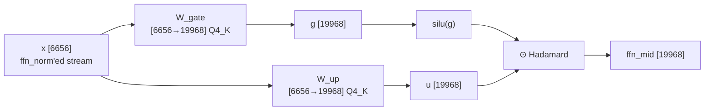

# Chapter 18 — The SwiGLU feed-forward block
> **status:** polished  ·  **path:** Muse Glimmer, pinned Muser tree
>
> *Prerequisites: [Ch 2](02-metal-compute-model.md) (SIMD groups, `simd_sum`,
> threadgroup memory), [Ch 5](05-quantization-from-scratch.md) and
> [Ch 6](06-the-kquant-family.md) (blocks, scales, the Q4_K super-block),
> [Ch 12](12-rmsnorm-and-the-dual-eps-sandwich.md) (the dual-eps tail that
> produces this chapter's input), [Ch 13](13-the-qkv-gate-matvec-family.md)
> (the matvec family and the pinned ggml kernels), [Ch 17](17-sigmoid-gate-and-oproj.md)
> (attention just closed into the residual stream). The FFN and its gated
> activation are taught from zero here.*

---

## 18.1 What it computes

Each Muse Glimmer layer does two things to the
[residual stream](../glossary.md#residual-stream-hidden-state): attention
([Ch 13](13-the-qkv-gate-matvec-family.md)–[Ch 17](17-sigmoid-gate-and-oproj.md))
mixes information *across tokens*; the **feed-forward network (FFN)**
transforms the vector *within a token* — one position at a time, no
cross-token mixing at all. Concretely it is two
[matvecs](../glossary.md#matvec) and a nonlinearity between them:

```
x : [6656]                        (hidden_dim — the ffn_norm'ed stream, Ch 12)
      │  gate projection   W_gate : [6656 → 19968]   (Q4_K)
g : [19968]                       (intermediate_dim)
      │  SiLU·Hadamard with the up branch
h : [19968]                       ("ffn_mid")
      │  down projection  W_down : [19968 → 6656]   (Ch 19)
out : [6656]
```

The vector is blown up 6,656 → 19,968 — a 3× wider "thinking space" (the
checkpoint declares `muse-glimmer.feed_forward_length`,
`config.rs:180`) — and squeezed back down in [Ch 19](19-downproj-and-residual.md).
The widening is where most of the model lives: the two projections this
chapter covers are **74.76 MB each** of Q4_K per layer (§18.7), against
48.4 MB for the entire attention block ([Ch 17](17-sigmoid-gate-and-oproj.md)
Figure 17.2).

The combination rule between the two branches is **SwiGLU** — Figure 18.1
shows its wiring:

```
h = silu(W_gate · x)  ⊙  (W_up · x)
```

Read the symbols: `W_gate · x` and `W_up · x` are two independent
`[6656 → 19968]` matvecs over the *same* input `x`; `silu(·)` is the
activation of §18.4 applied only to the gate branch; `⊙` is the
element-wise (Hadamard) product, `(a ⊙ b)[j] = a[j] × b[j]`, no mixing
across the 19,968 coordinates.

## 18.2 Why it exists — the "thinking" half of the layer

Attention is the block's mechanism for *gathering* context: it decides which
earlier tokens this token looks at. The FFN is the mechanism for *reasoning
over* what was gathered: a learned, position-independent transformation
applied to the vector attention assembled. Every token at every layer walks
the same FFN weights; what differs is the vector it walks in with. That is
the "thinking" framing — and the size framing is starker: at ~30 B
parameters, the FFN pair-plus-down is roughly 224–259 MB of the ~273–307 MB
per-layer weight read (§18.7), so when [Ch 1](01-why-inference-is-a-memory-problem.md)
said decode is ~99 % reading weights, this is where most of the weights are.

**Why *gated*?** A plain FFN (`out = down(act(up(x)))`, the original
transformer's shape [arxiv:1706.03762]) applies its activation
unconditionally per element — for feature `j`, "should this feature fire?"
and "what does it carry?" are the same number. A gated FFN splits them into
two learned projections: the gate branch answers *should it fire*, the up
branch answers *what does it carry*. The silu turns the gate into a smooth
on/off ramp. This structural claim is standard SwiGLU motivation
[arxiv:2002.05202]; the quality delta for Muse Glimmer specifically is
**[unverified]** here — this book does not retrain the model to A/B its own
architecture. The cost side, however, is exact arithmetic: gating means
*two* widening matrices instead of one, ~50 % more FFN parameters than the
ungated shape — and it is why `W_gate` and `W_up` both stream past every
token.


*Figure 18.1: The SwiGLU dataflow. The fusion this chapter covers collapses
the two projections, the silu, and the Hadamard into one kernel; the down
projection that consumes `ffn_mid` is [Ch 19](19-downproj-and-residual.md).*

## 18.3 The matrix operation, by hand

For output element `j` (`0 ≤ j < 19,968`):

```
g_j = Σ_{i=0..6655} W_gate[j, i] · x[i]      one dot product over hidden_dim
u_j = Σ_{i=0..6655} W_up  [j, i] · x[i]      another, independent, same x
h_j = silu(g_j) · u_j                        the gated combination
```

Two dot products over the **same** `x`, then a pointwise combine. A toy
worked example with `hidden = 2`, one output element, invented numbers:

```
x = [1.0, −2.0]
W_gate row = [0.5, 0.25]  →  g = 0.5·1 + 0.25·(−2) = 0.0
W_up   row = [2.0, −1.0]  →  u = 2.0·1 + (−1.0)·(−2) = 4.0
silu(0.0) = 0.0 · σ(0.0) = 0.0 · 0.5 = 0.0
h = 0.0 · 4.0 = 0.0          ← gate fully closed: nothing flows
```

Had the gate row been `[1.0, 0.0]` instead, `g = 1.0`, `silu(1.0) ≈ 0.731`,
and `h ≈ 0.731 · 4.0 ≈ 2.92` — the same up-value flows, scaled by how open
the gate is. That decoupling is the whole idea.

The observation that motivates a *fused kernel*: both dot products read the
same `x[k]`. In an unfused pair of matvecs, `x` is fetched twice and both
19,968-wide intermediates (`g` and `u`) make a round trip through memory.
One kernel that loads `x[k]` once and updates **two accumulators in
lockstep** eliminates both — Figure 18.2 shows the loop shape.

## 18.4 SiLU — the sigmoid linear unit

The activation on the gate branch is **SiLU** (a.k.a. *Swish*,
[arxiv:1710.05941]):

```
silu(x) = x · σ(x)  =  x / (1 + e^(−x))        (σ from Ch 17 §17.1)
```

Behavior at the extremes — like ReLU at the ends, unlike it in the middle:

| `x`    | `silu(x)` | `relu(x)` | note                                  |
|-------:|----------:|----------:|---------------------------------------|
| `0`    | `0.000`   | `0.000`   | both zero                             |
| `1`    | `0.731`   | `1.000`   | silu passes ~73 %                     |
| `−1`   | `−0.269`  | `0.000`   | silu dips *negative*                  |
| `2`    | `1.762`   | `2.000`   | converging to identity                |
| `−4`   | `−0.072`  | `0.000`   | the dip bottoms near x ≈ −1.28 at ≈ −0.278 |

*Table 18.1: SiLU vs ReLU at five points (computed by hand from the
formula). Large positive `x` passes through nearly unchanged; large negative
`x` is suppressed — but *small* negative `x` lets the gate subtract a little,
not merely go silent.*

Two properties matter downstream. First, SiLU is smooth and its gradient is
nonzero everywhere (ReLU has a dead zone for `x < 0`) — whether that is *the*
reason gated FFNs ship SiLU is **[unverified]** here; we inherit the
checkpoint's choice. Second, it is cheap but not free: one `exp`, one add,
one divide per element. At 19,968 elements per layer it runs 19,968 times —
fully parallel, no reduction, and in every kernel this chapter quotes it is
folded into the final write.

The CPU oracle states the whole combination in two loops
(`crates/muser-engine/src/reference.rs:511-513`):

```rust
for (a, b) in ffn_a.iter_mut().zip(ffn_b.iter()) {
    *a = silu_fast(*a) * *b;
}
```

with `silu_fast(x) = x / (1.0 + (−x).exp())` — the one-liner of the formula
(`crates/muser-engine/src/quant/helpers.rs:70-74` per the extraction
manifest's Ferrite lineage [docs/extraction-manifest.md]).

## 18.5 The Metal kernel — `ffn_q4k_gate_up_silu_4r2s`

There are two gate+up routes in the tree, and which one *runs* is the
chapter's real story (§18.6). The fused kernel first — it is the cleanest
expression of the SwiGLU fusion, a wholesale port of Ferrite's accepted
`897a6256b` kernel (`decode.rs:5823-5825`, `ffn.rs:7-8`). The signature, the
x-load, and the lockstep MAC, verbatim; the Q4_K decode helper it calls is
summarized after:

```metal
// crates/muser-engine/src/shaders/ferrite/ffn_fused_tail.metal:485
// ── ffn_q4k_gate_up_silu_4r2s ─────────────────────────────────────────────
//
// 4-row-per-TG fused gate+up variant using the V4 x-load pattern.
// 64 threads (2 SIMDs × 32), 4 output rows per TG (2 per SIMD).
// Each thread loads x into local registers yl[16]/yh[16] via stride-4
// block sub-groups (same as matvec_q4k_f32_v4), reusing x for both
// gate and up weight rows.
//
// Activation selected at PSO build time via FC_FFN_ACTIVATION.
// dispatch_thread_groups( (ceil(i_dim/4), 1, 1), (64, 1, 1) )
//
kernel void ffn_q4k_gate_up_silu_4r2s(
    device const uchar* W_gate [[ buffer(0) ]],
    device const uchar* W_up   [[ buffer(1) ]],
    device const float* x      [[ buffer(2) ]],
    device       float* out    [[ buffer(3) ]],
    constant     uint&  rows   [[ buffer(4) ]],
    constant     uint&  cols   [[ buffer(5) ]],
    uint tgid [[ threadgroup_position_in_grid ]],
    uint lid  [[ thread_index_in_simdgroup ]],
    uint sgid [[ simdgroup_index_in_threadgroup ]])
{
    const uint n_blocks    = cols / 256u;
    const uint block_bytes = 144u;
    const uint row_bytes   = n_blocks * block_bytes;

    // 2 rows per SIMD, 2 SIMDs = 4 rows per TG
    const uint base_row = tgid * 4u + sgid * 2u;
    if (base_row >= rows) return;

    // V4 thread partitioning: 4 sub-groups of 8 threads for block stride
    const uint ix = lid / 8u;   // 0..3 — block stride index
    const uint it = lid % 8u;   // 0..7 — position within block
    const uint iq = it / 4u;    // 0 or 1 — half-block selector
    const uint ir = it % 4u;    // 0..3 — quarter within half

    // x-vector pointer: each thread reads 8 positions per block (stride-4 blocks)
    device const float* xp = x + ix * 256u + 64u * iq + 8u * ir;

    float yl[16], yh[16];
    float gate_sumf[2] = {0.f, 0.f};
    float up_sumf[2]   = {0.f, 0.f};

    for (uint ib = ix; ib < n_blocks; ib += 4u) {
        // Load x slice into registers (8 elements × 4 positions)
        float4 sumy = {0.f, 0.f, 0.f, 0.f};
        for (uint i = 0u; i < 8u; i++) {
            yl[i]     = xp[i];       sumy[0] += yl[i];
            yl[i + 8] = xp[i + 32];  sumy[1] += yl[i + 8];
            yh[i]     = xp[i + 128]; sumy[2] += yh[i];
            yh[i + 8] = xp[i + 160]; sumy[3] += yh[i + 8];
        }

        // Gate weight: 2 rows starting at base_row + sgid*2
        device const uchar* gate_blk = W_gate + (ulong)base_row * (ulong)row_bytes
                                       + (ulong)ib * block_bytes;
        q4k_v4_dual_row_mac(gate_blk, row_bytes, yl, yh, sumy, iq, ir, gate_sumf);

        // Up weight: same 2 rows
        device const uchar* up_blk = W_up + (ulong)base_row * (ulong)row_bytes
                                     + (ulong)ib * block_bytes;
        q4k_v4_dual_row_mac(up_blk, row_bytes, yl, yh, sumy, iq, ir, up_sumf);

        xp += 4u * 256u;  // advance by 4 blocks (stride)
    }

    // Reduction across all 32 threads in each SIMD
    const float gr0 = simd_sum(gate_sumf[0]);
    const float gr1 = simd_sum(gate_sumf[1]);
    const float ur0 = simd_sum(up_sumf[0]);
    const float ur1 = simd_sum(up_sumf[1]);

    if (lid == 0u) {
                                    out[base_row]      = apply_activation(gr0, ur0);
        if (base_row + 1u < rows)   out[base_row + 1u] = apply_activation(gr1, ur1);
    }
}
```

Line by line:

- **Bindings (496–505).** Two weight buffers (`W_gate` slot 0, `W_up` slot
  1), the input `x` (slot 2), the output `out` (slot 3), and `rows`/`cols`
  as inline constants (`19,968` / `6,656` on this model).
- **Row ownership (511–513).** `base_row = tgid·4 + sgid·2`: one threadgroup
  of 64 threads = 2 SIMD groups, each SIMD group owns **two whole output
  rows**. Four rows per threadgroup; the grid of §18.6 covers 19,968 rows.
- **The V4 lane decomposition (515–522).** The 32 lanes split into 4
  sub-groups of 8 (`ix`), each striding a different Q4_K super-block
  (`ib += 4`); within a sub-block, `iq`/`ir` select which of the eight
  32-element runs this lane dots. This is the same x-in-registers pattern as
  the QKV matvec family of [Ch 13](13-the-qkv-gate-matvec-family.md) — the
  header says so ("same as matvec_q4k_f32_v4").
- **The register x-cache (524–536).** Each thread pulls its 32 x-slice
  elements (`yl[16]`, `yh[16]`) and their quarter-sums `sumy` into registers
  **once per block iteration**. The four `sumy` partial sums exist for the
  Q4_K min-term subtraction (`w = d·sc·nib − dmin·m`, [Ch 6](06-the-kquant-family.md)).
- **The lockstep MAC (538–548).** This is the fusion. The same register-held
  `yl`/`yh`/`sumy` feed *two* calls to `q4k_v4_dual_row_mac` — once against
  the gate rows, once against the up rows at the same `base_row`:

```
                       ┌─► gate_sumf[r] += dequant(W_gate[base_row+r, k]) · x[k]
  x[k] (registers)  ───┤
                       └─► up_sumf[r]   += dequant(W_up  [base_row+r, k]) · x[k]
```
*Figure 18.2: The lockstep MAC. Every x element is loaded from device memory
once (into `yl`/`yh`) and consumed by both the gate and the up accumulator
for two rows each — one load, four dot-product contributions.*

  `q4k_v4_dual_row_mac` itself (`shaders/ferrite/_q4k_helpers.metal:34-88`)
  decodes two consecutive Q4_K rows' block: it unpacks the 6-bit scale strip
  with the `0x3F3F/0x0F0F/0xC0C0` masks, accumulates nibble·x products into
  four `float4` lanes per row, and folds them into the
  `d·(Σ…) − dmin·(Σ…)` super-block epilogue — the deferred-scaling schedule
  of [Ch 13](13-the-qkv-gate-matvec-family.md), here applied to two rows and
  two matrices at once.
- **Reduction and activation (551–560).** `simd_sum` collapses each
  accumulator across the 32 lanes; lane 0 of each SIMD group writes the two
  finished rows via `apply_activation(g, u)`. There is no cross-SIMD
  combine and no `threadgroup_barrier` — whole-row ownership per SIMD group
  means each group's `simd_sum` *is* the final answer for its rows. The
  ownership implies synchronization freedom, the same argument as
  [Ch 17](17-sigmoid-gate-and-oproj.md) §17.7.

**`apply_activation` is compiled, not branched.** The helper is selected at
PSO build time through a Metal function constant:

```metal
// crates/muser-engine/src/shaders/ferrite/ffn_fused.metal:15
// 0 = SiLU (default), 1 = GELU
constant uint FC_FFN_ACTIVATION [[function_constant(32)]];
constant bool HAS_FC_FFN_ACTIVATION = is_function_constant_defined(FC_FFN_ACTIVATION);

// Activation helper — compiled away at pipeline creation time (zero runtime cost)
inline float apply_activation(float g, float up) {
    if (HAS_FC_FFN_ACTIVATION && FC_FFN_ACTIVATION == 1u) {
        // … (GELU branch elided) …
    } else {
        // SiLU (default): g * sigmoid(g) * up
        return (g / (1.0f + exp(-g))) * up;
    }
}
```

Build the PSO without slot 32 and the dead-code eliminator removes the GELU
path entirely; the shipped Muse kernel contains only the SiLU line —
`silu(g) · u`, the chapter's formula, as the kernel's last instruction
(`ffn_fused.metal:14-30`, the [Ch 4](04-pso-and-three-kernel-sources.md)
function-constant mechanism).

## 18.6 The Rust dispatch — and the opt-in flag story

The wrapper:

```rust
// crates/muser-engine/src/metal/encode/ffn.rs:7
/// Ferrite 897a6256b Q4_K SiLU gate+up route: four rows per threadgroup,
/// two SIMD groups, with the input vector shared by both projections.
pub fn encode_ffn_q4k_gate_up_silu_4r2s(
    &self,
    encoder: &ComputeCommandEncoderRef,
    gate_weights: GpuByteView<'_>,
    up_weights: GpuByteView<'_>,
    input: &GpuBuffer,
    output: &GpuBuffer,
    intermediate_dim: usize,
    hidden_dim: usize,
) {
    let row_bytes = hidden_dim / 256 * 144;
    debug_assert_eq!(gate_weights.len(), intermediate_dim * row_bytes);
    // … (up/input/output length asserts elided) …
    self.bind(encoder, "ffn_q4k_gate_up_silu_4r2s");
    encoder.set_buffer(0, Some(gate_weights.metal()), gate_weights.offset() as u64);
    encoder.set_buffer(1, Some(up_weights.metal()), up_weights.offset() as u64);
    encoder.set_buffer(2, Some(input.metal()), 0);
    encoder.set_buffer(3, Some(output.metal()), 0);
    set_value(encoder, 4, &(intermediate_dim as u32));
    set_value(encoder, 5, &(hidden_dim as u32));
    encoder.dispatch_thread_groups(
        MTLSize::new(intermediate_dim.div_ceil(4) as u64, 1, 1),
        MTLSize::new(64, 1, 1),
    );
}
```

In prose: **grid `(19,968 ÷ 4, 1, 1) = (4,992, 1, 1)` threadgroups of
`(64, 1, 1)` threads** — 4,992 × 4 = 19,968 rows covered exactly. The two
weight views are bound at their offsets into the mmap'd GGUF
([Ch 3](03-unified-memory-and-buffers.md)); `rows`/`cols` ride as inline
constants.

Now the part that separates this book from a kernel tour: **the fused kernel
is opt-in, and the default is the unfused control.** The gate at the call
site:

```rust
// crates/muser-engine/src/decode.rs:5819
if self.ferrite_ffn_gate_up
    && layer.ffn_gate.layout.dtype == GgmlType::Q4_K
    && layer.ffn_up.layout.dtype == GgmlType::Q4_K
{
    // Port Ferrite 897a6256b wholesale: the four-row/two-SIMD-
    // group kernel reads the normalized input once for both Q4_K
    // projections and writes the final SiLU(gate) * up row.
    dispatch(command, |encoder| {
        self.kernels.encode_ffn_q4k_gate_up_silu_4r2s(
            encoder,
            layer.ffn_gate.view(&self.mapped_weights),
            layer.ffn_up.view(&self.mapped_weights),
            &self.activations.post_norm,
            &self.activations.ffn_gate,
            cfg.intermediate_dim,
            cfg.hidden_dim,
        );
    });
} else {
    // Exact upstream-matvec control and non-Q4_K fallback.
    dispatch(command, |encoder| {
        self.encode_projection(
            encoder,
            &layer.ffn_gate,
            &self.activations.post_norm,
            &self.activations.ffn_gate,
            1,
        );
        self.encode_projection(
            encoder,
            &layer.ffn_up,
            &self.activations.post_norm,
            &self.activations.ffn_up,
            1,
        );
    });
    dispatch(command, |encoder| {
        self.kernels.encode_silu_mul(
            encoder,
            &self.activations.ffn_gate,
            &self.activations.ffn_up,
        );
    });
}
```

`ferrite_ffn_gate_up` is set from the environment —
`MUSER_FERRITE_FFN_GATE_UP` (`decode.rs:1334`) — so by default the engine
takes the `else` branch: **two pinned ggml matvecs (`W_gate`, `W_up`, the
exact `kernel_mul_mv_q4_K_f32` of [Ch 13](13-the-qkv-gate-matvec-family.md))
plus one pointwise activation kernel**. That third kernel is
`muser_silu_mul_inplace`, which does `gate[i] = silu(gate[i]) · up[i]` — the
same formula as the fused tail, materialized:

```metal
// crates/muser-engine/src/shaders/muse_reference.metal:4
kernel void muser_silu_mul_inplace(
    device float *gate [[buffer(0)]],
    device const float *up [[buffer(1)]],
    constant uint &count [[buffer(2)]],
    uint index [[thread_position_in_grid]]) {
    if (index < count) {
        float value = gate[index];
        gate[index] = (value / (1.0f + exp(-value))) * up[index];
    }
}
```

dispatched one-thread-per-element over 19,968 (`ffn.rs:38-60`).

Why is the beautiful fused kernel behind a flag? The source answers in the
routing comment that governs serving decode:

```rust
// crates/muser-engine/src/decode.rs:2085
// The legacy one-token graph uses Ferrite fused residual/norm and
// gate-up kernels whose rounding diverges from the source-pinned
// llama Metal graph enough to breach public logprob tolerance.
// The one-row batch graph dispatches the exact pinned kernels and
// has the same KV transition, so it is the serving correctness
// path until each fused kernel independently passes full-logit
// parity.
```

That is the contract discipline in one comment: the fused kernel's
reduction order (two interleaved accumulators folded per super-block) is
*mathematically* SwiGLU but not *bit-* the same as llama.cpp's graph of
independent `mul_mv` nodes plus a pointwise silu-mul, and Muser's public
commitment is logprob parity with the pinned comparator. The fused kernel is
therefore a qualified-off fast path — runnable under the flag for the
teacher-forced/diagnostic route (`encode_token`), not the serving default.
(The dtype guards in the `if` also mean any non-Q4_K FFN tensor would fall
back automatically; on the release artifact `ffn_gate`/`ffn_up` are Q4_K —
`ffn_gate/up 6656->19968 q4k`, `crates/muser-bench/src/m16.rs:171-175`.)

## 18.7 The access pattern — the largest weight read in the layer

All arithmetic derived from the verified shapes, shown step by step:

```
  W_gate: 19,968 rows × (6,656 / 256 = 26 blocks) × 144 B = 19,968 × 3,744
        = 74,760,192 B ≈ 74.76 MB        (Q4_K: 0.5625 B/element)
  W_up  : same shape, same dtype          = 74,760,192 B ≈ 74.76 MB
                                          ────────────────────────
  gate + up pair per layer                ≈ 149.5 MB   ← read once per token
  (for scale: the whole attention block   ≈  48.4 MB;  o_proj alone 15.34 MB,
   Ch 17 Figure 17.2; the down projection is Ch 19: 74.76 MB Q4_K /
   109.03 MB Q6_K)
```

Activation traffic, fused vs unfused (per layer):

```
  FUSED (one kernel):
    read  x [6656] f32                    26,624 B  (registers thereafter)
    read  W_gate + W_up                 149,520,384 B
    write ffn_mid [19968] f32             79,872 B

  UNFUSED (two matvecs + silu_mul — the default):
    read  x twice                          53,248 B
    read  W_gate + W_up                  149,520,384 B
    write g [19968], u [19968]            159,744 B   ← intermediates born
    read  g + u                           159,744 B   ← …and read back
    write ffn_mid                          79,872 B
                                          ──────────
    extra activation traffic vs fused:    ≈ 345,856 B ≈ 338 KiB/layer
```

Same lesson as the ancestor's FFN chapter [ferrite-book Ch 17], re-derived
for this geometry: the x-read-once is mostly a cache effect (`x` is 26 KiB);
the *hard* saving is never materializing the two 19,968-wide intermediates.
338 KiB/layer × 52 layers ≈ **18.0 MB/token** of avoided activation traffic
— about 12 % of one layer's FFN weight read, i.e. real but second-order;
and on the serving route it is *deliberately not taken* (§18.6). The weight
stream — 149.5 MB per layer, 7.78 GB across 52 layers — is irreducible at
Q4_K bitrate no matter which route dispatches it, and that is the number
[Ch 1](01-why-inference-is-a-memory-problem.md)'s bandwidth argument leans
on.

## 18.8 Tradeoffs

**Fused 4r2s vs the unfused control — bytes versus bits.** The fusion saves
~338 KiB/layer of activation round-trips and one dispatch (three closures
become one); the control preserves llama.cpp's exact per-node arithmetic and
therefore the public logprob contract. Muser ships the control as default
and gates the fusion behind `MUSER_FERRITE_FFN_GATE_UP`
(`decode.rs:5819-5836`, `:1334`), with the reason documented at
`decode.rs:2085-2091`: the fused kernels' rounding divergence "breache[s]
public logprob tolerance" against the source-pinned llama Metal graph. The
discipline is the one the dispatch-gap investigation made explicit — the
hybrid fusions were "removed, not hidden behind a tolerance"
[docs/decode-dispatch-gap-20260815.md, Rejected hybrid postmortem]. No
retained A/B quotes an end-to-end tok/s delta for this specific flag
**[unverified]** — the burden the fused route must clear is full-logit
parity first, per the comment, and that gate has not been recorded as
passed at the pin.

**Two accumulators in lockstep vs two kernels.** The 4r2s design doubles
down on the V4 pattern of [Ch 13](13-the-qkv-gate-matvec-family.md): the
register x-cache is shared across *two matrices and two rows
simultaneously* — one x load feeds `gate_sumf[0..1]` and `up_sumf[0..1]`.
The cost is register pressure (`yl[16]`, `yh[16]`, `sumy`, four running
accumulators) and a kernel that only exists for Q4_K (the `q4k_v4_…` helper
is Q4_K-specific; Q5_K/Q6_K tensors would need their own decoders — hence
the dtype guard at `decode.rs:5820-5821`). The payoff is the traffic ledger
of §18.7. An older 4-SIMD-group variant (`ffn_q4k_gate_up_silu_4sg`,
one row per threadgroup, 128 threads) sits in the same shader file at
`ffn_fused_tail.metal:295` (with a threadgroup-x-cache sibling at `:392`) —
lineage of the same idea with a coarser x-reuse; the 4r2s port at `:496` is
the one Muser wired.

**SiLU vs GELU vs ReLU.** The choice is the checkpoint's, not the engine's;
the function-constant mechanism (§18.5) exists so one `.metal` source could
serve either at zero runtime cost. Muse Glimmer is SiLU — every route
(fused `apply_activation`, control `muser_silu_mul_inplace`, CPU oracle
`silu_fast`) implements `x·σ(x)`.

**The normed-quant tail variants — present but unwired.** The shader
library carries a family that goes one step further than 4r2s: fuse the
*norm* into the gate+up read (`ffn_q4k_gate_up_silu_normed`,
`shaders/ferrite/ffn_fused_normed_quant.metal:296`, with Q5_K siblings at
`:1` and `:190`), so the FFN would consume the raw residual and normalize
in-kernel. At the pinned commit **no Rust wrapper binds any kernel from
that file** (verified: no reference in `crates/muser-engine/src`), so it is
not on a live path — retained as Ferrite-lineage research material. Its
fate is the same story as §18.6 taken further: the more arithmetic you fold
across a norm boundary, the harder bit-exactness becomes
([Ch 19](19-downproj-and-residual.md) §19.9 makes that tradeoff precise).

## 18.9 Where the gap lives

**The gate+up stage is not the gap — but its fusion is one of the
casualties of the exactness contract.** In the one-token closure accounting,
the FFN gate-up and swiglu closures are "common math" — identical counts in
the production and legacy graphs (the 406 = 406 row of
[docs/decode-dispatch-gap-20260815.md]); the +196-closure gap lives in norm
boundaries, SWA staging, KV publication, and one copy, not here. The FFN's
connection to that story is the *reverse* direction: the fused kernel this
chapter teaches is part of the legacy route's fusion set, and the serving
graph pays extra closures (two matvecs + silu_mul instead of one) precisely
to keep llama.cpp's node-for-node arithmetic (`decode.rs:2085-2091`). When
[Ch 35](35-ordering-hazards-and-the-dispatch-gap.md) and
[Ch 40](40-what-we-measured-and-rejected.md) audit what was measured and
rejected, this is a standing example: a structurally sound bandwidth win,
held out of serving by a logprob tolerance, exactly as the campaign's
fail-closed culture requires.

The FFN is half closed: `ffn_mid [19968]` holds the gated, activated
intermediate. One projection remains — the squeeze back to 6,656, the
residual add, and the fused tail that hands the next layer its normed input.
That tail is also where this book's central tradeoff — dispatch count versus
the logprob contract — gets priced to the last ULP. It is
[Ch 19](19-downproj-and-residual.md).

---

## References

- `crates/muser-engine/src/shaders/ferrite/ffn_fused_tail.metal:485-561` —
  `ffn_q4k_gate_up_silu_4r2s`, the fused Q4_K SwiGLU kernel (primary
  source; the `_4sg` ancestor variant at `:295`, `_4sg_tgcache` at `:392`).
- `crates/muser-engine/src/shaders/ferrite/ffn_fused.metal:14-30` —
  `FC_FFN_ACTIVATION` function constant + `apply_activation`
  (PSO-build-time SiLU/GELU selection).
- `crates/muser-engine/src/shaders/ferrite/_q4k_helpers.metal:34-88` —
  `q4k_v4_dual_row_mac`, the dual-row Q4_K MAC both projections share.
- `crates/muser-engine/src/metal/encode/ffn.rs:7-36` —
  `encode_ffn_q4k_gate_up_silu_4r2s` (grid `(i_dim/4, 1, 1)` × 64 threads);
  `:38-60` `encode_silu_mul` (control-route activation).
- `crates/muser-engine/src/shaders/muse_reference.metal:4-13` —
  `muser_silu_mul_inplace`, the pointwise control kernel.
- `crates/muser-engine/src/decode.rs:5819-5862` — the flag/dtype gate, the
  fused dispatch, and the unfused control; `:1334` the
  `MUSER_FERRITE_FFN_GATE_UP` env read; `:2085-2091` the serving-exactness
  comment; `:5165-5185` the packed decode group's unfused FFN.
- `crates/muser-engine/src/reference.rs:493-516` — the CPU oracle's
  gate/up/silu·mul order; `quant/helpers.rs:70-74` `silu_fast`.
- `crates/muser-engine/src/config.rs:180` — `intermediate_dim` from
  `muse-glimmer.feed_forward_length`.
- `crates/muser-bench/src/m16.rs:171-175` — `ffn_gate/up 6656->19968 q4k`
  (release-artifact dtype evidence).
- `crates/muser-engine/src/shaders/ferrite/ffn_fused_normed_quant.metal:1,190,296`
  — the normed-input fused FFN family; no Rust binder at the pin (§18.8).
- [docs/decode-dispatch-gap-20260815.md] — closure accounting (common math)
  and the rejected-hybrid postmortem's remove-don't-tolerate discipline.
- [docs/extraction-manifest.md] — `silu_fast` and the shader lineage from
  Ferrite `83cfd55…`/`a85048a9…`.
- [Ch 13](13-the-qkv-gate-matvec-family.md) — the V4 lane decomposition and
  the pinned ggml matvec the control route dispatches.
- [Ch 6](06-the-kquant-family.md) — the Q4_K super-block and dequant
  formula behind the MAC helper.
- [Ch 1](01-why-inference-is-a-memory-problem.md) — the per-token weight-read
  arithmetic this block dominates.
- [ferrite-book Ch 17] — the ancestor's SwiGLU chapter; the fused-vs-control
  honesty pattern and the intermediate-buffer byte ledger ported here.
- [arxiv:1706.03762] — Vaswani et al., *Attention Is All You Need* (the
  ungated ReLU FFN).
- [arxiv:1710.05941] — Ramachandran et al., *Searching for Activation
  Functions* (Swish/SiLU).
- [arxiv:2002.05202] — Shazeer, *GLU Variants Improve Transformer* (SwiGLU).
