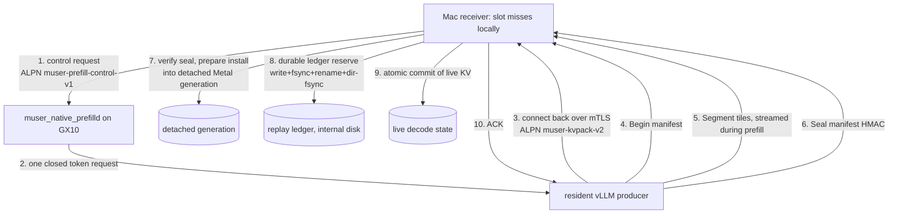

# Chapter 30 — Handoff V2: the authenticated transport
> **status:** polished  ·  **path:** Muse Glimmer, pinned Muser tree
>
> *Prerequisites: [Ch 24](24-kvpack-the-format.md) (the kvpack container
> and manifest), [Ch 27](27-why-disaggregate.md), [Ch 28](28-the-gx10-and-vllm-nvfp4-prefill.md),
> [Ch 29](29-cuda-versus-metal.md).*

---

## 30.1 Where we are

[Ch 29](29-cuda-versus-metal.md) ended with the observation that pinning
identity — kernels, commits, op order — is only as strong as the channel
that carries the result. This chapter is that channel. **Handoff V2** is
the protocol that moves a prefilled KV cache from the GX10 producer to the
Mac receiver: mutually authenticated TLS, an HMAC-sealed manifest, a
durable replay ledger, and an atomic engine-side install. Its one-sentence
specification lives at the top of the cluster crate:

> "CUDA prefill -> authenticated Handoff V2 tiles -> Metal
> scatter-on-arrival -> atomic commit -> Metal decode."
> `[crates/muser-cluster/src/lib.rs:5-7]`

Two terms before they are used. **[mTLS](../glossary.md#mtls-mutual-tls)** (mutual
TLS) is Transport Layer Security with *both* sides presenting certificates
— each machine proves its identity to the other, not just the client to
the server. **[HMAC](../glossary.md#hmac)** (keyed hash-based message
authentication code) is a cryptographic tag computed over a message with a
shared secret key — anyone holding the key can compute it, nobody without
the key can forge it.

## 30.2 The threat model: why two keys and not one

What must be true when 1.8 GB of KV lands on the Mac
([Ch 27 §27.4](27-why-disaggregate.md) derived the payload)?

1. It came from *the enrolled producer*, not an impostor with a valid
   certificate from some other CA. → **mTLS with pinned leaves.**
2. The bytes are exactly what the producer sealed — not truncated,
   spliced, or tampered in flight. → **HMAC over the canonical manifest
   core, plus per-segment SHA-256.**
3. It is not a *replay* — a captured, perfectly valid, correctly signed
   handoff being re-sent to roll the engine's KV back to stale state.
   → **the durable replay ledger.**

Note the ordering discipline in that list: HMAC and mTLS prove *who* and
*what*; only the ledger proves *when* — "HMAC and mTLS prove the message
came from a key/cert this receiver trusts, but only the ledger proves the
message isn't a valid, correctly-signed *replay* of one already installed"
`[docs/one-button-onboarding.md §Why the generation ledger must never
reset]`. The architecture document summarizes the whole design in three
sentences:

> "GX10 Handoff V2 uses mutually authenticated TLS plus an HMAC-sealed
> manifest. Enrollment generates each TLS private key on the machine where
> it remains; the HMAC is a shared secret transferred over
> known-host-verified SSH. Replay admission durably reserves the generation
> with file and directory fsync before target+DFlash publication and ACK."
> `[docs/muser-architecture.md §Durable and remote KV]`

The whole transaction, end to end (Figure 30.1):


*Figure 30.1: The Handoff V2 transaction. Cache bytes never ride the
control channel (step 1); they flow only on the mutually authenticated
data connection (steps 4–6). Nothing live is touched before the seal
verifies (step 7) and the generation is durably reserved (step 8).*

## 30.3 The mTLS layer: TLS 1.3, exact ALPN, pinned leaves

Take the threat-model questions in order. The first one is *who*: when a
socket opens, how does the receiver know the machine on the far end is the
producer it enrolled, and not something else that happens to hold a
certificate? The security module answers with three non-negotiable
properties, built symmetrically into both sides of the connection.

First, **TLS 1.3 only**. The client config is built
`with_protocol_versions(&[&rustls::version::TLS13])`, and the server side
likewise, so there is no older version on offer for a downgrade to fall
back to (`[crates/muser-cluster/src/security.rs:122-124]`,
`[crates/muser-cluster/src/security.rs:172-174]`). Second, an
**exact ALPN** string — Application-Layer Protocol Negotiation, the
protocol name agreed inside the TLS handshake:

```rust
// crates/muser-cluster/src/security.rs:21
pub const MUSER_HANDOFF_ALPN: &[u8] = b"muser-kvpack-v2";
```

Third — and this is the load-bearing one — **leaf pinning on top of chain
validation**. A certificate that chains to your CA is not enough; the
receiver additionally demands the SHA-256 of the exact leaf certificate it
was enrolled with:

```rust
// crates/muser-cluster/src/security.rs:196-213
fn verify_connection(
    alpn: Option<&[u8]>,
    peer: Option<&[CertificateDer<'_>]>,
    pins: &BTreeSet<String>,
    expected_alpn: &[u8],
) -> Result<(), SecurityError> {
    if alpn != Some(expected_alpn) {
        return Err(SecurityError::Alpn);
    }
    let leaf = peer
        .and_then(|chain| chain.first())
        .ok_or_else(|| SecurityError::Config("peer certificate chain is empty".into()))?;
    let digest = format!("{:x}", Sha256::digest(leaf.as_ref()));
    if !pins.contains(&digest) {
        return Err(SecurityError::LeafPin);
    }
    Ok(())
}
```

Why pins, when CA trust already worked? Because "enroll records the pin for
the specific certificate it just issued, not a CA that could later sign a
different one" `[docs/one-button-onboarding.md §Security model]` — a
valid-but-unpinned certificate is rejected exactly like an invalid one.

The key-management rule is the quiet half of the design: **TLS private keys
never leave the machine that generated them.** Enrollment generates the
node's key on the node (inside a versioned `0700` staging directory),
retrieves and verifies only its CSR, and returns the signed public
certificate; "the node TLS private key never leaves GX10"
`[docs/one-button-onboarding.md §4 enroll]`. Even the file contract is
fail-closed: the key loader rejects symlinks, group/other-readable modes,
and files that change while being opened, closing the
validate-then-reopen race `[crates/muser-cluster/src/security.rs:289-335]`.

One more channel, and it is worth a paragraph here rather than later,
because it is what keeps the data path the *only* path bytes travel: the
**control plane**. The Mac asks the resident producer daemon to prefill one
exact token sequence over its own mTLS connection, with its own ALPN
`muser-prefill-control-v1` (`[crates/muser-cluster/src/control.rs:10]`).
The rule attached to that channel is absolute — "cache bytes never ride
this channel; the daemon connects back over Handoff V2"
`[crates/muser-cluster/src/control.rs:1-3]`. Say it the other way round:
control is small canonical JSON with closed bounds, and every byte of cache
arrives on a connection the producer opened *back* to the receiver, after
proving itself again. Ask for the work on one wire; receive the artifact on
another. That second wire is the subject of the next section.

## 30.4 The HMAC-sealed manifest

mTLS answers *who is on the far end of this socket*, and that answer dies
with the socket. The KV cache does not: it gets installed into an engine,
re-checked against a delta witness, quoted in receipts, kept as evidence.
So the second threat-model question is about the artifact rather than the
channel — what proves *these bytes* are the ones the producer sealed, long
after the connection that carried them is gone?

Inside the mTLS stream, then, the payload itself is framed as a
transaction (the wire format is §30.5). The transaction's anchor is the
**begin manifest**:
a typed structure carrying the transfer id, a **generation number**, the
exact model identity digests, the full prompt token ids, the component
list, and the segment descriptors
(`BeginManifestV2`, `[third_party/kvpack/crates/kvpack-handoff/src/handoff_v2.rs:72-91]`).
The terminal frame is the **seal**: a core of digests plus an HMAC tag over
that core:

```rust
// third_party/kvpack/crates/kvpack-handoff/src/handoff_v2.rs:273-286
        let core = SealCoreV2 {
            transfer_id: begin.manifest.transfer_id.clone(),
            generation: begin.manifest.generation,
            begin_sha256: sha256_hex(begin.canonical_bytes()),
            descriptor_sha256: hex::encode(descriptor_hash.finalize()),
            payload_sha256: hex::encode(payload_hash.finalize()),
            segment_count: descriptors
                .len()
                .try_into()
                .map_err(|_| validation("segment count exceeds u32"))?,
            total_bytes: total,
        };
        let hmac_sha256 = key.tag_hex(&canonical_json(&core)?)?;
        Ok(Self { core, hmac_sha256 })
```

Read what the seal binds: the *begin manifest's* canonical bytes (so the
declared identity and prompt cannot change after the fact), the *concatenated
canonical descriptors*, and the *entire payload stream* — every KV byte —
hashed in order as segments arrived. One tag covers all of it.

The word **canonical** is doing cryptographic work, and this is the part
that trips people up. An HMAC is computed over bytes, not over meaning. Two
JSON documents that any parser would call equal — same fields, same values,
different key order or different spacing — are two *different* messages to
the tag. So the seal only works if the producer and the receiver serialize
the core to the same bytes, and here they are not even the same language:
the producer is Python, the receiver is Rust. `canonical_json` is what makes
the two agree. It sorts object keys recursively and emits compact JSON, "so
Rust and Python (`sort_keys=True`, compact separators) emit identical
bytes"; the recursive sort is "load-bearing" because a Cargo feature flag
(`preserve_order`) would otherwise silently change the wire form
(`[third_party/kvpack/crates/kvpack-handoff/src/canonical.rs:8-17]`).

Notice what kind of failure that flag would produce, because it is the
reason the next detail matters. A dependency change nobody reviewed as a
protocol change would reorder some keys, the tag would stop matching, and a
perfectly honest handoff would be refused as tampering — a security
mechanism firing on a build-configuration bug. Byte-layout contracts across
ecosystems do not happen by accident, so the vendoring record carries a
deliberate one-file patch for exactly this concern: canonical-json sorted
keys, independent of serde's `preserve_order` feature
(`third_party/kvpack/provenance.json`, audited by
`scripts/audit_vendored_kvpack.py`).

Verification is streaming, not retrospective. The receiver's
`AtomicReceiverV2` hashes descriptors and payloads *as each segment
arrives*, and at the seal it re-derives everything and checks the tag in
constant time:

```rust
// third_party/kvpack/crates/kvpack-handoff/src/handoff_v2.rs:435-452 (excerpt)
        if core.transfer_id != expected.transfer_id
            || core.generation != expected.generation
            || core.segment_count as usize != self.next
            || core.total_bytes != self.total
            || core.begin_sha256 != sha256_hex(self.begin.canonical_bytes())
            || core.descriptor_sha256 != hex::encode(self.descriptor_hash.clone().finalize())
            || core.payload_sha256 != hex::encode(self.payload_hash.clone().finalize())
        {
            return self.fail("seal identity or digest mismatch");
        }
        validate_hex("seal HMAC", &seal.hmac_sha256)?;
        let stream = canonical_json(core)?;
        if let Err(error) = self.key.verify_hex(&stream, &seal.hmac_sha256) {
            self.abort();
            return Err(error);
        }
```

The `MacKey` behind `verify_hex` is a 256-bit key that zeroizes on drop,
with constant-time tag comparison
`[third_party/kvpack/crates/kvpack-handoff/src/mac.rs:28-32, 79-80]`. And
because this is fail-closed culture, the refusals are *tested as passes*:
"stale replay generations, identity-mismatched configs, and tampered
manifests are refused end-to-end on live hardware — the refusal itself is
the passing test" `[docs/disaggregated-prefill.md §Correctness]`. The
return-runbook's `secd1` cell exists purely to keep one of those refusals
proven live (the exact `replayed or stale generation` message in a
retained command log; `[docs/gx10-return-runbook-2026-08.md §2]`).

## 30.5 The wire format

The seal is checked at the *end* of the transaction. That leaves an
uncomfortable stretch of time in between, and the question the wire format
has to answer is: what can a peer make the receiver do before the seal
arrives to vindicate or condemn it? The design's answer is to keep the
pre-seal surface as small and as bounded as it can be made.

On the TLS stream, frames are length-prefixed JSON headers with binary
payloads. The constants and the frame set:

```rust
// crates/muser-cluster/src/transport.rs:15-16
const MAGIC: &[u8; 8] = b"KVPKV2\0\0";
const PREAMBLE_BYTES: usize = 20;
```

```rust
// crates/muser-cluster/src/transport.rs:19-38 (excerpt)
pub enum WireFrameV2 {
    Begin(BeginAdmissionV2),
    Segment { sequence: u32, payload: Vec<u8> },
    DeferredSegment { descriptor: SegmentDescriptorV2, payload: Vec<u8> },
    Seal(SealManifestV2),
    Ack { transfer_id: String, generation: u64 },
    Abort { reason: String },
}
```

The header carries a magic plus a 20-byte preamble and the frame kind;
payloads are bounded by explicit limits — 8 MiB header, 512 MiB payload
(`FrameLimitsV2`, `[crates/muser-cluster/src/transport.rs:83-95]`) — so a
hostile or corrupted stream cannot ask for unbounded memory. One frame
shape deserves its own note: **`DeferredSegment`** exists because a
*streaming* producer "cannot know hashes for future KV tiles at begin
time. In deferred mode each ordered segment frame carries its complete
descriptor; the terminal seal still binds the canonical descriptor stream
and all payload bytes before commit"
(the `deferred_segments` field doc,
`[third_party/kvpack/crates/kvpack-handoff/src/handoff_v2.rs:84-90]`).
The sender-side mirror of that schedule is [Ch 29 §29.5](29-cuda-versus-metal.md)'s
streaming seam: segments leave during prefill, each with its own
just-in-time descriptor, and the seal closes the transaction.

## 30.6 The replay ledger and the durable reservation

Now the third leg of the threat model: replay. Every handoff carries a
**generation number**, a monotonically increasing counter scoped to one
HMAC key id and **epoch**. The receiver's `ReplayLedger` admits a
generation only if it is strictly above the highest ever *committed* for
that `key_id:epoch`; generation 0 is refused unconditionally
(`[crates/muser-cluster/src/security.rs:387-406]`). The dangerous window
is between "engine prepared" and "engine published": a crash there must
not allow the same generation to install twice. So the reservation is
made durable *before* anything live changes, with the full
write-fsync-rename-dir-fsync dance.

Two words in that dance need unpacking, because the whole guarantee rests
on them. **fsync** is the operating-system call that forces buffered writes
out of volatile caches onto the storage device itself. Put the other way
round: without it, "written" means only that the kernel intends to write it
soon, and a power cut turns that intention into nothing. The *directory*
variant is the one people forget. A rename is a modification of the
directory, not of the file, so a renamed file whose directory entry never
landed is a file that never got renamed. Together the two give the property
the ledger actually needs — the new high-water mark either exists after a
crash or it does not, and there is no state in between.

The sequence:

```rust
// crates/muser-cluster/src/security.rs:472-486
    let result = (|| -> std::io::Result<()> {
        let mut options = OpenOptions::new();
        options.write(true).create_new(true);
        #[cfg(unix)]
        {
            use std::os::unix::fs::OpenOptionsExt as _;
            options.mode(0o600);
        }
        let mut output = options.open(&temporary)?;
        output.write_all(&bytes)?;
        output.write_all(b"\n")?;
        output.sync_all()?;
        std::fs::rename(&temporary, path)?;
        File::open(parent)?.sync_all()
    })();
```

Walk it slowly, because every step answers a specific crash:

1. `create_new` (O_EXCL) + mode 0600 — the temp file cannot clobber or
   alias anything;
2. `write_all` then **`sync_all()`** — the new high-water mark is on the
   platter *before* it becomes authoritative;
3. **`rename`** — one atomic step replaces the ledger;
4. **`File::open(parent)?.sync_all()`** — the *directory* is fsynced, so
   the rename itself survives power loss.

If any step fails, the ledger **latches degraded**: "A failed reservation
latches this ledger degraded; the receiver refuses all later traffic until
the operator repairs storage and restarts the process"
`[crates/muser-cluster/src/security.rs:407-411]`. A durability layer that
silently continued after failing to be durable would be a worse liar than
an outage.

The epoch rule closes the last loop: if a node's PKI is ever regenerated,
its `hmac_epoch` must be bumped "so the ledger starts a fresh, disjoint
counter space rather than silently reusing one whose history was just
discarded" `[docs/one-button-onboarding.md §Why the generation ledger must
never reset]` — deleting or truncating the ledger file resets the
high-water mark and makes every previously captured, validly-signed
handoff replayable again.

## 30.7 What lives where: the durability lesson

That directory-fsync in step 4 is where a whole failure class was
discovered, and the fork is worth walking slowly, because the wrong turn
was the *reasonable* one.

Look at the replay ledger and it presents itself as evidence. It is an
append-only record of which generations were admitted — precisely the sort
of file this campaign keeps forever. And the fleet has a disk for exactly
that: the **evidence volume**, `muser-receipt://`, an external disk
optimized for append-only writes. So on 2026-08-18 the fast lane's
qualification config pointed the replay ledger there. The premise was
sound; only the conclusion was wrong. This file is not evidence, it is
*operational state*, and what a receiver needs from it is not cheap appends
but a fast, boring, predictable rename.

The symptom was time-to-first-token that would not sit still. Not uniformly
slow — *bimodal*. Most handoffs were fine; some stalled by most of a second,
apparently at random, on identical work. When a decode arrives late, the
expensive machinery is the natural suspect: the network transfer of a
multi-gigabyte cache, or the Metal install on the far side. Neither
explains a stall that comes and goes on runs that are otherwise the same.

The cheap step was the culprit. Measured directly, the evidence volume's
directory-fsync had a bimodal tail of its own — median 0.22 ms, observed
~0.7 s — and that tail sat exactly where it could do maximum damage,
"sit[ting] between prepare_commit and commit — delaying ACK and first
decode." A sub-millisecond call in the common case was, in its tail, the
single longest step in the critical path.

Moving the ledger to the internal disk settled it: "TTFT median 1.596 s,
CV 0.56% (was 2.699 s / 21.40%)" `[docs/disaggregated-prefill-sealing-plan-20260818.md §W1 finding 1]`.
Read the coefficient of variation before the median. The median improved,
but the real result is that the run stopped being erratic — which is the
lesson worth carrying out of this section. What a latency budget spends on
a durability primitive is not its average cost; it is its tail.

The lesson is now codified in two places, and the pairing is the point: one
rule for the humans, one gate in the code that would otherwise suffer.
In the operator rules: "operational state (replay ledger, sockets, locks)
belongs on the internal disk — the
evidence volume's directory-fsync tail produces bimodal ~1 s stalls in
commit paths" `[AGENTS.md §Hard rules]`. And in the receiver itself — the
**ledger-volume gate**: at bind time, the receiver probes its own ledger
directory with the exact reserve pattern (20 iterations) and refuses to
start if the worst sample exceeds 100 ms:

```rust
// crates/muser-cluster/src/receiver.rs:108-116 (doc comment, excerpt)
/// The commit path durably reserves every generation with
/// write+fsync+rename+directory-fsync before the ACK leaves. On a volume with
/// a slow directory-fsync tail this stalls the ACK and first decode by
/// hundreds of milliseconds at random (the 2026-08-18 p4 seal stall), so a
/// receiver whose replay ledger sits on such a volume is refused at bind
/// time. `scripts/gx10/durable_fsync_probe.py` is the standalone operator
/// check for the same pattern.
const LEDGER_RESERVE_PROBE_ITERATIONS: usize = 20;
const LEDGER_RESERVE_PROBE_MAX_TAIL: Duration = Duration::from_millis(100);
```

So the placement rule is not tribal knowledge; it is enforced by the code
that would otherwise suffer (`check_ledger_volume`,
`[crates/muser-cluster/src/receiver.rs:118-148]`) and re-checkable by the
operator tool (`scripts/gx10/durable_fsync_probe.py`, exit 1 past
`--max-tail-ms`). [Ch 31](31-the-wire-discipline.md) generalizes this into
the wire discipline: *every stall in this campaign was self-inflicted
infrastructure until proven otherwise.*

## 30.8 Enrollment and the one-button wizard

Everything above needs material: certificates, pins, an HMAC key, a
deployed producer, a qualified identity. The **one-button wizard** —
`muser node add user@host` on the CLI, **Add node** on the dashboard —
does the whole pipeline, and the operator reference is careful to say
"every step below is a real action against a real remote host, over real
SSH, with real files on disk on both ends" `[docs/one-button-onboarding.md]`.
Six executable stages, seven progress labels (`smoke` emits two):

| # | Stage | What it does |
|---|---|---|
| 1 | `preflight` | SSH with BatchMode (fails closed rather than prompting), `aarch64`, NVIDIA driver, docker — nothing copied |
| 2 | `deploy` | Pushes the **pinned runtime container** (a `sha256:…` id, never a mutable tag); records the container receipt |
| 3 | `model` | Places the pinned GGUFs under `lane_dir`, **verifying byte sizes and SHA-256** against the release artifact manifest |
| 4 | `enroll` | Node-local TLS key generation (CSR out, certificate in); pinned leaf exchange; **mints the HMAC key and transfers it over the known-host-verified SSH channel**; bumps `hmac_epoch` |
| 5 | `daemon` | Starts the producer daemon in the container, pointed at the enrolled PKI and model |
| 6 | `smoke` | `netqual` (median TCP RTT; installed-payload throughput derived from committed bytes — **median across three handoffs ≥ 3.0 Gbps**) then the qualification recipe |

*Table 30.1: The onboarding pipeline `[docs/one-button-onboarding.md §Six
executable stages, seven progress labels]`. The MAC-side receiver config
lands at `~/.muser/nodes/<name>/cluster.json` (§Where things live) —
secrets referenced by path, never inlined.*

The qualification recipe is declared by the enrolled producer identity and
is always **exactly three ordered Handoff V2 exchanges at a 2,048-position
prompt and 256 output tokens** `[docs/muser-architecture.md §Durable and
remote KV]`:

- **`native/text`**: exact target tokens under the identity's *bounded
  full-logit drift policy*; "no DFlash identity or token trace is
  admitted" — the exact-vs-bounded distinction is [Ch 32](32-precision-across-the-handoff.md)'s
  core subject;
- **`kquant/target-plus-dflash`**: exact target tokens, exact required
  full logits, and exact DFlash tokens and trace.

"An identity with no known recipe is refused at enrollment" — the same
fail-closed stance as everything else in this chapter. Only after the
three passes *and* the 3.0 Gbps median is `state=healthy` durably written
`[docs/one-button-onboarding.md §6b smoke]`.

Does any of this actually run, end to end, against real hardware? Two
retained wizard packets say yes, and they are worth reading side by side,
because the second one holds itself to a strictly harder contract than the
first `[claims #9]`:

- **Attempt 9 (native/text)**: all seven labels; three 2,048/256 handoffs
  with exact tokens (digest `42f09900…`) under the bounded-logit rule —
  max/mean logit deltas 10.884401 / 1.233788776 against the <11 / <1.25
  policy — at payload rates 6.866 / 6.976 / 6.708 Gbps; `state=healthy`
  `[receipt wizard-validation-20260823/attempt-9-native-live-20260824T051305Z/validation-summary.json]`.
- **Attempt 31 (combined)**: 7/7 stages; three handoffs with **exact full
  logits (max/mean delta 0)** and exact DFlash tokens/trace; payload rates
  **9.811736 / 8.886919 / 8.689889 Gbps**; `state=healthy`, canonical
  resident restored afterward `[receipt wizard-validation-20260823/attempt-31-combined-full-20260824T132639Z/validation-summary.json]`.

Two clean packets. That is what the record shows, and it is not what the
work looked like — the attempt numbers give that away before anything else
does.

Behind attempt 9 stood eight earlier attempts, and the useful thing
about them is *how* they ended. Not one hung, and not one produced quietly
plausible output that someone had to catch by eye later. Each failed
closed, on a real defect the gates were built to find: stale geometry
residuals; a wrong-route `flash_attn_ext` override; a stale RoPE-cache
manifest; and a 3.0 Gbps gate computed from the wrong clock
`[ledger Arc "The wizard: attempts 9 and 31"]`. Sit with that last one for
a moment, because it is the most instructive of the four. The gate did not
wrongly admit a bad node — it wrongly *rejected* a good one, by measuring
the sender's own optimism instead of the wire. We expected a failing gate
to mean "the node is not ready." What it meant that time was "the
instrument is not ready," and nothing but going and looking will tell those
two apart. The next chapter turns that particular scar into a standing rule
about which clock is allowed to time a transfer.

Getting from attempt 9 to attempt 31 then took attempts 10–30 — the
arithmetic-ABI chase of [Ch 29 §29.8](29-cuda-versus-metal.md), a long
stretch of runs spent making two vendors' arithmetic agree when both
believed they already did.

So read the two passing packets the right way. They are not evidence that
the pipeline worked on the first try; they are the runs that came out the
far side of a gate that had been refusing everything before them. That is
the pattern of this whole Part: the channel is trustworthy exactly because
its refusals kept firing.

One operational requirement survives the wizard and lands on the operator,
and it matters because it is the seam where all of this could still be
undone by a default: a cache sealed under strict cross-vendor arithmetic is
only meaningful if the machine that decodes from it does the same
arithmetic. So the enrolled consumer must run the matching strict Metal
graph — `MUSER_CROSS_VENDOR_QK=1`
— and "both modes refuse startup when `MUSER_CROSS_VENDOR_QK` is absent or
not exactly `1`; they never install a strict CUDA cache into the ordinary
Metal math route" `[docs/one-button-onboarding.md §Starting the production
consumer]`.

## 30.9 Scatter-on-arrival: the engine side of the transaction

The last piece is what the receiver does *while* bytes stream in — and
there is a real tension to resolve there. Waiting for the seal before
touching anything is the safe order, but a receiver that waits idly until
the last frame has thrown away the whole prefill window it could have spent
installing. The resolution is to do the work early and make it
*unobservable* until the seal clears.

The `MuseCacheShadow` sink "writes authenticated target tiles into a detached
Metal generation as they arrive. Live decode state is replaced only in
`commit`, after the HMAC seal has been verified"
(`[crates/muser-cluster/src/muse_sink.rs:41-43]`). A detached generation is
a staging area with the shape of the real thing: bytes land in it during
the transfer, and if the seal fails they are discarded having never been
visible to a decode.

If the sink can install as tiles land, the next question belongs to the
producer: what can it send before prefill has finished? The wire order that
makes streaming productive is fixed by the transfer schedule — the 13 NoPE
layers `[3, 7, …, 51]` as 512-token tiles (~6.5 MiB each), three SWA
groups of 13 layers, **layer-major** so "every SWA group is sendable as
soon as its 13 layers exist mid-prefill and only the NoPE tiles trail"
(`[crates/muser-cluster/src/schedule.rs:19-26, 124-129]`).

The same schedule carries the delta-handoff discipline from
[Ch 26](26-delta-handoff-and-migration.md): a prefix cut is legal only on
a 256-token boundary (`PREFIX_CUT_ALIGN = 256`,
`[crates/muser-cluster/src/schedule.rs:25-26]`), NoPE tiles cover only
`[cut, position)`, and SWA tiles cover `[max(cut, position−2048), position)`
— mirrored exactly by the producer's Python `muse_intents`
`[crates/muser-cluster/src/schedule.rs:75-90]`. The sink even records a
*delta witness* — the observed `(role, layer, start, count)` stream — and
re-checks it against the span schedule at prepare time, because a
deferred stream declared no schedule at begin
(`[crates/muser-cluster/src/muse_sink.rs:19-21, 68-76]`).

Prepare-then-publish is itself two-phase and component-scoped: "a combined
remote install prepares and verifies both [target and DFlash] before an
infallible publication step" `[docs/muser-architecture.md §Model and
engine]` — and qualification evidence must prove both components prepared
and installed separately, because "aggregate byte counts cannot establish
that on their own" (`ComponentInstallEvidence`,
`[crates/muser-cluster/src/muse_sink.rs:23-28]`).

## 30.10 Tradeoffs

- **HMAC *on top of* mTLS (chosen) vs TLS alone.** TLS authenticates the
  channel; the seal authenticates the artifact. The split pays off the
  moment the sealed bytes outlive one connection — durable stores,
  delta witnesses, receipts — where a channel-only design would have no
  artifact-level tag to verify `[third_party/kvpack/crates/kvpack-handoff/src/mac.rs:1-18]`.
  The cost is the key-provisioning channel: a shared secret needs the
  known-host-verified SSH leg of enrollment, accepted deliberately
  `[docs/one-button-onboarding.md §Security model]`.
- **Reserve-before-ACK (chosen) vs record-after-install.** The durable
  reservation costs a write+fsync+rename+dir-fsync *in the TTFT path* —
  the measured downside is the entire 2026-08-18 stall story (§30.7). The
  alternative (ack first, persist later) reopens the replay window after
  every crash; the campaign chose the stall and then *engineered it away*
  by placement (internal disk) plus the bind-time gate. Both the failure
  and the fix are retained evidence
  `[docs/disaggregated-prefill-sealing-plan-20260818.md §W1]`
  `[crates/muser-cluster/src/receiver.rs:108-148]`.
- **Three handoffs at 2,048/256 as the qualification recipe (chosen) vs
  deeper/longer qualification at enrollment.** The recipe is deliberately
  shallow and fast; depth and sustained load live in the campaign packets
  (the eight-handoff soak, the 130,815 cells — [Ch 27 §27.5](27-why-disaggregate.md)).
  The wizard's scope is "can this enrolled identity be trusted to serve
  *this lane's* contract," not "prove all performance claims" — the
  claims register keeps the boundary explicit `[claims #9]`.

## 30.11 What comes next

Handoff V2 answers *who* and *what* and *when-not-before*: the producer is
pinned, the bytes are sealed, the replay is refused, the ledger survives
power loss. But authentication says nothing about *throughput*. The deep
cell still has to put 1,823,184,896 bytes across a 10GbE link inside a
137-second budget — at the qualified floor that is ~2.1 s of pure wire
time (1.823e9 B × 8 ÷ 6.995e9 b/s), and the campaign learned, painfully,
that the difference between 9.4 Gbps of raw TCP and 3.9 Gbps of installed
payload was *its own pacing pin*; that a power-saving Ethernet feature
could black out exactly the burst pattern this schedule produces; and
that the honest wire clock is the kernel's busy-time, not anyone's
send-loop. That discipline — pacing, EEE, clocks, and where state lives —
is the next chapter.

---

## References

- `[crates/muser-cluster/src/lib.rs:5-22]` — the crate's one-sentence
  pipeline and the 3.0 Gbps release floor.
- `[crates/muser-cluster/src/security.rs]` — ALPN constant (21), TLS 1.3
  (122–124, 172–174), `verify_connection` leaf pins (196–213), `MacKey`
  loading contract (55–95), private-key file contract (289–335),
  `ReplayLedger` admit/reserve/latch (356–439), `persist_replay_state`
  (460–491).
- `[third_party/kvpack/crates/kvpack-handoff/src/handoff_v2.rs]` —
  `BeginManifestV2` (73–91), deferred-segments doc (84–89),
  `SealManifestV2::sign` (247–287), streaming verify in
  `prepare_commit` (419–460).
- `[third_party/kvpack/crates/kvpack-handoff/src/canonical.rs:8-36]` —
  `canonical_json`, the load-bearing recursive sort.
- `[third_party/kvpack/crates/kvpack-handoff/src/mac.rs]` — `MacKey`
  (28–32), constant-time `verify_hex` (79–80), the F1 design note (1–18).
- `[crates/muser-cluster/src/transport.rs:15-16, 19-38, 83-95]` — magic,
  preamble, the frame enum, frame limits.
- `[crates/muser-cluster/src/control.rs:1-13]` — control-plane scope and
  ALPN.
- `[crates/muser-cluster/src/receiver.rs:108-148]` — the ledger-volume
  gate and its probe constants.
- `[crates/muser-cluster/src/muse_sink.rs]` — detached-generation contract
  (41–43), `ComponentInstallEvidence` (23–28), delta witness (19–21,
  68–76).
- `[crates/muser-cluster/src/schedule.rs:19-26, 75-90, 124-129]` — NoPE
  layers, tile/group sizes, `PREFIX_CUT_ALIGN`, layer-major streaming
  order.
- `[docs/muser-architecture.md §Durable and remote KV]` — the three-line
  security summary and the recipe contracts.
- `[docs/one-button-onboarding.md]` — the six stages, the security model,
  the generation-ledger essay, v1 limits.
- `[docs/disaggregated-prefill.md §Correctness]` — refusals as passing
  tests.
- `[docs/disaggregated-prefill-sealing-plan-20260818.md §W1]` — the
  2026-08-18 fsync-tail root cause and fix.
- `[AGENTS.md §Hard rules]` — operational-state-on-internal-disk as a
  hard rule.
- `[docs/gx10-return-runbook-2026-08.md §2]` — the live stale-generation
  refusal proof.
- `[docs/launch-claims.md]` — #9 (wizard attempts 9 and 31, their rates
  and scopes).
- `[receipt wizard-validation-20260823/attempt-9-native-live-20260824T051305Z/validation-summary.json]`
  and `[receipt wizard-validation-20260823/attempt-31-combined-full-20260824T132639Z/validation-summary.json]`
  — the two passing wizard packets.
- [glossary](../glossary.md) — terms introduced this chapter: Handoff V2,
  mTLS, ALPN, leaf pin, HMAC-sealed manifest, canonical JSON, generation
  number, hmac_epoch, replay ledger, durable reservation, ledger-volume
  gate, one-button wizard, qualification recipe, detached generation,
  delta witness.
