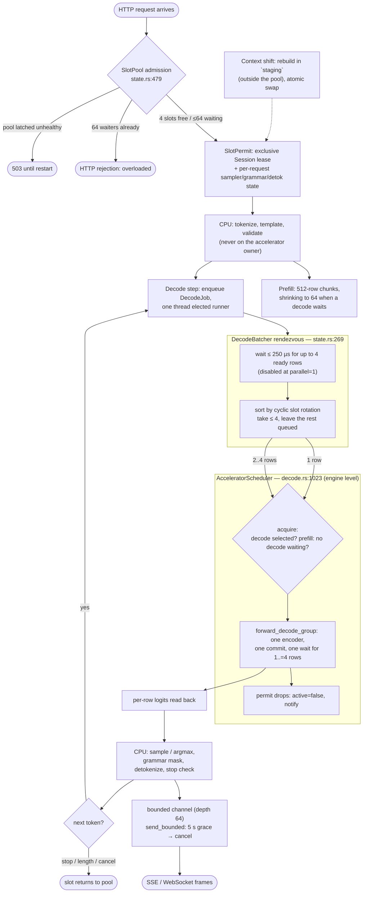

# Chapter 34 — The scheduler and the slots
> **status:** polished  ·  **path:** Muse Glimmer, pinned Muser tree

*Prerequisites: [Ch 2](02-metal-compute-model.md) (command buffers, encoders,
the "record a tape, press play" model), [Ch 10](10-the-forward-pass-at-a-glance.md)
(the one-token graph and its two routes), [Ch 22](22-the-price-of-context.md)
(KV footprint per slot), [Ch 33](33-speculation-and-the-distributed-verdict.md)
(the DFlash loop that shares this machinery). No OS-scheduling background is
assumed; the chapter builds the concurrency story from one Mutex and one
Condvar.*

---

[Ch 33](33-speculation-and-the-distributed-verdict.md) closed Part VI with a
measured verdict: speculative decoding stays local and kquant-only, because a
remote verifier's ceiling sat below the 107.9 tok/s bar even under physically
impossible assumptions. Part VII now turns from *what one token computes* to
*how many tokens share the machine*. The same question the book has asked since
[Ch 1](01-why-inference-is-a-memory-problem.md) — what does one token cost,
and what may be moved without breaking the exactness contract? — acquires a
concurrency dimension: what may be *shared* without one generation ever
observing another's state?

The answer in Muser is a discipline, stated in one line of the architecture
document: "One scheduler owns one accelerator and between one and four resident
slots" `[docs/muser-architecture.md §Slots and scheduling]`. This chapter takes
that sentence apart. There are two schedulers, actually — an engine-side owner
of the Metal queue, and a server-side pool that admits requests into slots —
and the design keeps them deliberately separate. By the end you will know why
four is the number, what exactly a slot owns, what is shared and why sharing is
safe, and how a 250 µs rendezvous turns four independent request threads into
one packed Metal submission without any of them giving up its slot.

---

## 34.1 The problem a scheduler solves

Start from the hardware. One Mac, one GPU, one `MTLCommandQueue`
([Ch 2](02-metal-compute-model.md)). Multiple HTTP requests arrive; each wants
a generation; each generation is a serial loop of one-token forward passes
through the same 52-layer graph. Naively, every request could open its own
session and submit its own command buffers onto the shared queue. Three things
go wrong with that picture:

1. **Interleaving is uncontrolled.** A 512-row prefill chunk from request B can
   land in front of request A's next decode token, and A's user stares at a
   frozen stream for the whole chunk. Decode latency — the per-token time a
   streaming user feels — must not queue behind prefill work.
2. **Weight residency multiplies.** The mmap'd 16,756,681,056-byte GGUF
   [crates/muser-engine/src/lib.rs:14] plus the pipeline set plus the RoPE
   tables are one immutable arena. Loading "the 16+ GiB target once per serving
   slot" is exactly what the code refuses to do
   [crates/muser-engine/src/decode.rs:954-957].
3. **Starvation.** If one hot slot re-acquires the accelerator ahead of its
   peers in a tight loop, the other users' tokens stall indefinitely.

A scheduler is the piece of code that turns "everyone submits whenever" into
"one owner decides who runs next." Muser's answer is two levels with different
jobs, and it is worth naming them precisely because the word "scheduler" is
overloaded:

- **Engine level — `AcceleratorScheduler`** (this chapter, §34.2): a Mutex and
  a Condvar inside `muser-engine` that serialize *command submission onto the
  Metal queue*, with decode preferred over prefill and round-robin fairness
  across sequences.
- **Server level — `SlotPool` + `DecodeBatcher`** (§34.4–34.5): admission and
  rendezvous inside `muser-server`. The pool bounds how many generations may
  become resident (and how many may wait); the batcher packs ready decode rows
  into one submission.

The split is not accidental. The engine knows about Metal but not about HTTP;
the server knows about requests but never touches a command buffer. Each level
can be tested, and reused, alone — the engine scheduler is exercised by
Metal-only tests with no server in sight
[crates/muser-engine/src/decode.rs:6295-6306].

## 34.2 The engine scheduler: one owner for one queue

Here is the whole type. This is the "one scheduler" of the architecture
sentence, and it is 25 lines including comments:

```rust
// crates/muser-engine/src/decode.rs:1013-1030
#[derive(Default)]
struct AcceleratorSchedulerState {
    active: bool,
    decode_waiting: BTreeSet<usize>,
    last_decode: Option<usize>,
}

/// One owner for the shared Metal queue. Decode work is selected first and
/// resident sequence IDs rotate in ascending cyclic order, preventing a hot
/// slot from repeatedly reacquiring the accelerator ahead of its peers.
struct AcceleratorScheduler {
    state: Mutex<AcceleratorSchedulerState>,
    ready: Condvar,
}

struct AcceleratorPermit {
    scheduler: Arc<AcceleratorScheduler>,
}
```

Read the state fields as a sentence: either someone holds the accelerator
(`active`), or they do not; the set of sequence IDs waiting for decode is kept
sorted (`decode_waiting: BTreeSet<usize>` — sorted by sequence ID, which is
what makes the rotation below cheap); and `last_decode` remembers who ran last
so fairness can resume *after* them. The permit is a
[RAII](../glossary.md#acceleratorpermit) guard — acquiring returns it, dropping it
releases the accelerator and wakes the next waiter
(`Drop for AcceleratorPermit`, `decode.rs:1154-1159`). There is no "release"
call you can forget to make.

### Acquire: decode first, prefill only into silence

Every graph — every token, every prefill chunk — acquires the scheduler before
encoding. The policy lives in `acquire`:

```rust
// crates/muser-engine/src/decode.rs:1053-1069
loop {
    let selected_decode = next_decode_sequence(&state);
    let eligible = !state.active
        && match work {
            AcceleratorWork::Decode => selected_decode == Some(sequence_id),
            AcceleratorWork::Prefill => selected_decode.is_none(),
        };
    if eligible {
        state.active = true;
        if work == AcceleratorWork::Decode {
            state.decode_waiting.remove(&sequence_id);
            state.last_decode = Some(sequence_id);
        }
        return Ok(AcceleratorPermit {
            scheduler: Arc::clone(self),
        });
    }
    state = self.ready.wait(state).map_err(|_| {
        MetalModelError::InvalidSnapshot("accelerator scheduler is poisoned".into())
    })?;
}
```

Decode the eligibility line, because both clauses are the design:

- **`!state.active`** — the accelerator is exclusive. One command-submission
  critical section at a time; the GPU itself may still be draining earlier
  buffers asynchronously, but no second encoder walks the queue concurrently
  from the host side.
- **`AcceleratorWork::Prefill => selected_decode.is_none()`** — prefill may
  proceed *only when no decode is waiting anywhere*. This is the decode-favored
  rule as code: a single queued decode token outranks any amount of prefill
  work, because a decode token is somebody's next streamed word and a prefill
  chunk is nobody's.
- **`AcceleratorWork::Decode => selected_decode == Some(sequence_id)`** — a
  waiting decoder is not served merely because it woke up; it is served when
  the rotation selects it.

### Fairness: ascending cyclic order

`next_decode_sequence` implements the rotation promised by the doc comment:

```rust
// crates/muser-engine/src/decode.rs:1142-1152
fn next_decode_sequence(state: &AcceleratorSchedulerState) -> Option<usize> {
    let Some(last) = state.last_decode else {
        return state.decode_waiting.first().copied();
    };
    state
        .decode_waiting
        .range((std::ops::Bound::Excluded(last), std::ops::Bound::Unbounded))
        .next()
        .copied()
        .or_else(|| state.decode_waiting.first().copied())
}
```

With sequences {1, 3, 4} waiting and `last_decode = 3`, the next selection is
4, then wraps to 1, then 3 — strictly cyclic. No sequence can be skipped twice
in a row by a peer. This is the "preventing a hot slot from repeatedly
reacquiring the accelerator ahead of its peers" clause made algorithmic, and
the same rotation reappears at the server level (§34.5), where the batch sorts
its candidates by a matching `decode_rotation_key`
[crates/muser-server/src/state.rs:444-450].

### Chunk shrinking: keeping decode's escape hatch open

Decode-over-prefill has a sharp edge the engine also handles: once a prefill
chunk has *started*, decode must wait for it. So the chunk *boundary* itself is
adaptive, in `forward_into`:

```rust
// crates/muser-engine/src/decode.rs:2097-2107
while offset < tokens.len() {
    // Long idle prefills retain the accepted 512-row physical batch.
    // Once a decoder is queued, the next prefill boundary shrinks to
    // 64 rows so decode can take ownership without another long
    // accelerator interval in front of it.
    let scheduler = Arc::clone(&self.shared.scheduler);
    let chunk_tokens = if scheduler.has_waiting_decode() {
        MAX_TEACHER_FORCED_TOKENS
    } else {
        PREFILL_BATCH_TOKENS
    };
```

`PREFILL_BATCH_TOKENS = 512` and `MAX_TEACHER_FORCED_TOKENS = 64`
[crates/muser-engine/src/decode.rs:53-54]. An idle machine prefills in 512-row
chunks; the moment any decoder queues, the *next* boundary drops to 64 rows, so
the worst-case wait for the accelerator is one 64-row interval rather than one
512-row interval. The prefill still finishes — just in smaller bites. This is
the interplay [Ch 36](36-prefill-vs-decode-paths.md) revisits from the prefill
side.

## 34.3 What a slot is: the state inventory

"One scheduler owns one accelerator and between one and four resident slots."
What, precisely, is a slot? The architecture document inventories it:

> Each slot owns independent target KV, DFlash state, logits, RNG, sampler and
> grammar state, detokenizer/stop state, and cancellation state. Immutable
> weights, Metal pipelines, and the DFlash executor are shared.
> `[docs/muser-architecture.md §Slots and scheduling]`

That paragraph is a summary of real types spread across two crates. Walk it
bottom-up.

**The engine's per-sequence handle** is `MetalMuseModel` — its doc comment
states the isolation contract directly:

```rust
// crates/muser-engine/src/decode.rs:986-998
/// Sequence-local Metal state. Immutable execution resources are shared;
/// cache, activations, speculative workspaces, and logical position remain
/// isolated for this one resident sequence.
pub struct MetalMuseModel {
    pub cfg: MuseConfig,
    shared: Arc<MetalShared>,
    cache: Vec<MetalKvPlane>,
    activations: Activations,
    batch_workspaces: BTreeMap<usize, BatchWorkspace>,
    n_past: usize,
    sequence_id: usize,
    verify_route_banner_printed: bool,
}
```

Every field after `shared` is per-sequence: the 52 KV planes (the ring and
growing cache of [Ch 15](15-kv-store-and-the-ring.md)), the ~15 MB activation
pool of [Ch 10 §10.8](10-the-forward-pass-at-a-glance.md), the prefill
workspaces, the logical position `n_past`, and the `sequence_id` the scheduler
rotates on.

**The engine's session wrapper** adds the retained distribution and token
history — the state that makes a decode error non-destructive:

```rust
// crates/muser-engine/src/api.rs:602-613
/// Mutable inference state for one sequence.
///
/// A session owns its KV cache, token history, retained next-token logits,
/// and context limit. Call [`Session::prefill`] once or more, then pass each
/// selected token to [`Session::decode`] to advance the sequence.
pub struct Session {
    backend: SessionBackend,
    tokenizer: Arc<BpeTokenizer>,
    max_context: usize,
    token_history: Vec<u32>,
    last_logits: Option<Vec<f32>>,
}
```

**The server's per-request state** adds everything the architecture sentence
lists after "logits": RNG, sampler, grammar, detokenizer/stop, cancellation.
The sampler state is one concrete struct worth quoting, because it is what a
durable session bundle later snapshots (§34.6 and
[Ch 37](37-server-sessions-and-security.md)):

```rust
// crates/muser-server/src/openai.rs:4331-4337
struct RequestSamplerState {
    distribution_rng: Mt19937,
    xtc_rng: Mt19937,
    mirostat_rng: Mt19937,
    mirostat_mu: f32,
    adaptive: AdaptiveSamplerState,
}
```

One `Mt19937` stream per stochastic sampler feature — the deterministic
Mersenne Twister of [Ch 21](21-sampling-argmax-and-grammar.md), snapshot-able
and restore-able so the same RNG stream survives across local/remote lanes and
across a session save/restore. Grammar state (`GrammarMatcher`, GBNF Earley
recognizer [crates/muser-server/src/grammar.rs:1-9]), the streaming
detokenizer, and the stop filter are constructed per request in the generation
loop [crates/muser-server/src/openai.rs:2266-2270]. Cancellation is a flag
checked between tokens — §34.6.

**What is shared** is the counter-list, `MetalShared`:

```rust
// crates/muser-engine/src/decode.rs:954-970
/// Immutable Metal execution resources shared by every resident sequence.
/// Metal command submission is scheduler-serialized; retaining one context,
/// pipeline set, mapped weight arena, and GPU vector set avoids loading the
/// 16+ GiB target once per serving slot.
pub struct MetalShared {
    context: MetalContext,
    kernels: MetalKernels,
    _residency_set: Option<crate::metal::residency::ResidencySet>,
    mapped_weights: GpuBytes,
    // …(embedding/output projections, entry-norm ones, RoPE tables,
    //    per-layer weights, scheduler, shared batch workspaces; elided —
    //    decode.rs:963-971)…
    scheduler: Arc<AcceleratorScheduler>,
    decode_batch_workspaces: Mutex<BTreeMap<usize, DecodeBatchWorkspace>>,
```

Every field is either immutable after load or already synchronized (`scheduler`
is the Mutex+Condvar; the batch workspaces are keyed by row-count behind a
Mutex, allocated once per width and reused). That is the whole sharing-safety
argument: *there is no shared mutable state on the token path.* Two sequences
never write the same buffer; they borrow the same read-only weights
([Ch 3](03-unified-memory-and-buffers.md)'s zero-copy mmap views) and take
turns at the queue.

The bound on how many of these may exist — why four — has two halves. The
**memory** half is [Ch 22](22-the-price-of-context.md)'s arithmetic: one
slot's KV at the 131,072-position limit is ≈1.827 GB and four slots ≈7.306 GB
on the 96 GB M3 Ultra `[docs/memory-footprint.md]`. The **throughput** half is
the packed-decode graph: the engine's group runner rejects anything outside
its supported width, "decode group must contain 1..=4 sequences"
[crates/muser-engine/src/decode.rs:4874-4877]. Four is a designed width, not
an accident of memory.

## 34.4 The server level I: `SlotPool` — bounded admission

Above the engine sits the server's `InferenceRuntime`, and its doc-commented
fields state the second level's job:

```rust
// crates/muser-server/src/state.rs:221-243
pub struct InferenceRuntime {
    pub(crate) model: Model,
    // …(vision, identities; elided — state.rs:223-227)…
    /// Independent serving slots. The pool owns admission and makes it
    /// impossible for more than `--parallel` generations to become resident.
    pub(crate) slots: SlotPool,
    /// Decode-step rendezvous. Request threads retain their independent slot
    /// ownership while one elected runner packs up to four ready Metal rows.
    pub(crate) decode_batcher: DecodeBatcher,
    /// DFlash state is sequence-local for exactly the same reason as target
    /// KV/RNG state. Indexes correspond one-for-one with `slots`.
    pub(crate) dflash: Option<Vec<Mutex<DFlashRuntime>>>,
    /// One assistant context paired with `staging`; it is never indexed by a
    /// serving slot and cannot participate in decode before an atomic swap.
    pub(crate) dflash_staging: Option<Mutex<DFlashRuntime>>,
    /// The one full-capacity generation reserved for atomic context rebuilds.
    /// It is deliberately outside `slots`, so it can never admit or decode a
    /// fifth serving request.
    pub(crate) staging: Mutex<Session>,
```

Three bounds live near it:

```rust
// crates/muser-server/src/state.rs:253-254
const MAX_QUEUED_REQUESTS: usize = 64;
const DECODE_COALESCE: Duration = Duration::from_micros(250);
```

plus the engine-side width checks: `--parallel` must lie in `1..=4`
[crates/muser-server/src/state.rs:1054-1056] and an OpenAI-style request's `n`
(the number of parallel completions) must too — `"n must be in 1..=4"`
[crates/muser-server/src/openai.rs:3480-3482]. So the admission pyramid is:
**4 slots, 64 waiters, 256 concurrent HTTP connections**
(`ConcurrencyLimitLayer::new(256)`, [crates/muser-server/src/axum_httpd.rs:546]).
Every layer is bounded; nothing anywhere waits forever.

The pool itself is a classic condition-variable resource pool — but read its
doc comment, because the third sentence is a whole philosophy:

```rust
// crates/muser-server/src/state.rs:474-483
/// Bounded admission for the resident target sessions.
///
/// A poisoned accelerator/session lease is not recovered in place. The
/// process is latched unhealthy so an operator restart is required before
/// any further inference, which avoids serving from uncertain GPU state.
pub(crate) struct SlotPool {
    state: Mutex<SlotPoolState>,
    available: Condvar,
    unhealthy: AtomicBool,
}
```

Acquire [crates/muser-server/src/state.rs:545-590] pops a free slot if one
exists; otherwise it counts itself among the waiters — and if 64 waiters are
already queued it fails immediately with `SlotAcquireError::Overloaded` (an
HTTP-level rejection, not a hang). A poisoned mutex or a missing session
latches the pool **unhealthy** permanently: every subsequent acquire returns
`Unhealthy`, which surfaces as HTTP 503
[crates/muser-server/src/axum_httpd.rs:1066-1070]. That latch is fail-closed
scheduling — the same culture as the producer's exit-75
[Ch 28](28-the-gx10-and-vllm-nvfp4-prefill.md) — and [Ch 37](37-server-sessions-and-security.md)
finishes the story.

## 34.5 The server level II: `DecodeBatcher` — the 250 µs rendezvous

Four independent decode loops, one weight pass. [Ch 10](10-the-forward-pass-at-a-glance.md)
showed the engine side: `forward_decode_group` packs 1..=4 rows that share one
`MetalShared` executor into a single concurrent encoder, one commit, one wait
[crates/muser-engine/src/decode.rs:4869-4937]. The economics are the whole
point — its doc comment says it in one line: "Pack one ready decode row from
each resident sequence into a single weight pass"
[crates/muser-engine/src/decode.rs:4866-4868]. Four sequences reading the same
16.76 GB of weights amortize the dominant cost of
[Ch 1](01-why-inference-is-a-memory-problem.md) across four users.

But four request threads arrive at four unaligned moments. Who calls
`forward_decode_group`? The `DecodeBatcher` is the rendezvous, and its own
comment is the contract: "Request threads retain their independent slot
ownership while one elected runner packs up to four ready Metal rows"
[crates/muser-server/src/state.rs:231-233]. The mechanics, in `decode` and
`run_one_batch`:

1. Each request thread enqueues a `DecodeJob` — slot, input, and a shared
   result cell — then loops waiting for its cell to fill
   [crates/muser-server/src/state.rs:314-340].
2. One thread is *elected* (the first to find `running == false` sets it and
   becomes the runner; the others go back to sleep)
   [crates/muser-server/src/state.rs:341-360].
3. The runner waits a **coalesce window of 250 µs** if fewer than four rows
   are queued, then drains the queue, sorts candidates by the same cyclic
   rotation the engine uses, takes up to four, and leaves the rest:

```rust
// crates/muser-server/src/state.rs:370-385
if state.queue.len() < 4 {
    let (next, _) = match self.ready.wait_timeout(state, DECODE_COALESCE) {
        Ok(next) => next,
        Err(_) => return,
    };
    state = next;
}
let mut candidates = state.queue.drain(..).collect::<Vec<_>>();
candidates.sort_by_key(|job| decode_rotation_key(state.last_slot, job.slot));
let split = candidates.len().min(4);
let remainder = candidates.split_off(split);
state.queue.extend(remainder);
```

4. One row runs `session.decode`; two-to-four rows run
   `Session::decode_group` — the engine entry that fronts
   `forward_decode_group` and then fans results back out, one per session
   [crates/muser-engine/src/api.rs:796-826; crates/muser-server/src/state.rs:398-435].
5. The runner installs each job's result, clears `running`, and notifies; the
   blocked threads wake with their token computed.

The 250 µs window is a *latency budget spent to buy bandwidth amortization*:
if a second and third row are 100 µs behind the first, waiting for them costs
each early row a fraction of a millisecond and saves up to three full weight
passes. And the window is conditional on deployment shape — a single-slot
server disables batching outright, with a comment that shows the measured
instinct behind the constant:

```rust
// crates/muser-server/src/state.rs:280-284
// A single resident slot can never form a multi-row batch. The
// 250 us coalescing window only delays every token in the
// release-relevant parallel-1 latency cell.
enabled: metal && resident_slots > 1,
```

What the four-way packing buys in absolute throughput on this hardware is not
claimed as a measurement anywhere in the campaign docs [unverified] — the
design justification in source is the weight-pass amortization argument above,
and the qualification cells were run per-lane, not per-width.

## 34.6 Keeping the owner clean, and the staging generation

Two disciplines complete the design.

**Nothing slow happens on the accelerator owner.** The architecture document
lists what stays off: "Tokenization, sampling, grammar/tool parsing, disk,
TLS, and socket writes stay outside the accelerator owner"
[docs/muser-architecture.md §Slots and scheduling]. Concretely: the request
thread tokenizes, then acquires a slot, then decodes; sampling and speculative
acceptance run on the CPU against the read-back row
([Ch 10 §10.9](10-the-forward-pass-at-a-glance.md)); the SSE/WebSocket writer
is a separate async task fed through a bounded channel. While *your* token
computes on the GPU, nothing about *your* TLS handshake can delay *someone
else's* token — the accelerator critical section contains encode, commit,
wait, and nothing else.

**Output is bounded, and blocked consumers are cancelled.** The streaming
channel has depth 64 (`STREAM_CHANNEL_DEPTH`,
[crates/muser-server/src/axum_httpd.rs:54]) and writes go through
`send_bounded`, which never blocks the generator indefinitely:

```rust
// crates/muser-server/src/axum_httpd.rs:2277-2287
match sender.try_send(item) {
    Ok(()) => return Ok(()),
    Err(mpsc::error::TrySendError::Full(returned))
        if started.elapsed() < SLOW_CLIENT_GRACE =>
    {
        item = returned;
        std::thread::sleep(Duration::from_millis(5));
    }
    Err(_) => return Err(openai::ChatError::Cancelled),
}
```

A client that stops reading gets a 5 s grace (`SLOW_CLIENT_GRACE`,
[crates/muser-server/src/axum_httpd.rs:55]) — backpressure relief, not a
hostage situation — and then the request is *cancelled*, not parked: the
error type maps to HTTP 499
"Client Closed Request" [crates/muser-server/src/openai.rs:649, 665]. A
disconnected socket cancels immediately (the closed-channel arm of the same
match, axum_httpd.rs:2319). The resumable-stream variant keeps the same rule
on purpose — its comment is the isolation contract in miniature: "A connected
client that remains backpressured for the full grace period still cancels this
request, as required by the serving isolation contract"
[crates/muser-server/src/axum_httpd.rs:2310-2313]. A slow reader can waste its
own request; it cannot hold the accelerator or a slot.

**The staging generation is not a fifth slot.** Context shift
([Ch 23](23-the-swa-ring-and-the-growing-cache.md)) is server policy: to shift
context, the server rebuilds the truncated context in a *separate*
full-capacity `Session` — `staging` — and swaps it into the slot only when the
replacement state is complete [crates/muser-server/src/state.rs:240-243]. The
field's doc comment carries the warning you now have the context to read:
"It is deliberately outside `slots`, so it can never admit or decode a fifth
serving request." Admission counting and rebuild scratch are different
lifecycles; conflating them is how a context shift becomes an accidental
fifth tenant that the 1..=4 invariants (and the batcher's four-row packs)
never learned about. The same pattern guards the DFlash assistant's rebuild
context (`dflash_staging`, "never indexed by a serving slot and cannot
participate in decode before an atomic swap", state.rs:237-239).

## 34.7 The two levels, one picture

Every piece of this chapter now has a place on one path — Figure 34.1
traces a request from the HTTP admission gate through the rendezvous, the
engine scheduler, the read-back, and the bounded output channel, with the
staging generation off to the side where it belongs:



*Figure 34.1: The request lifecycle across both scheduler levels. The server
level (SlotPool admission, DecodeBatcher rendezvous) owns requests and
boundedness; the engine level (AcceleratorScheduler) owns the Metal queue and
decode-over-prefill priority. The `staging` generation sits outside the pool
entirely.*

## 34.8 Tradeoffs

**Decode-absolute vs prefill-throughput.** Prefill runs only when no decode
waits (`decode.rs:1058`), and chunk boundaries collapse 512→64 under decode
pressure (`decode.rs:2103-2107`). The cost side is explicit: under concurrent
load, prefill throughput drops (smaller chunks, deferred acquisition). The
benefit side is structural, not a measured serving cell: decode latency is
bounded by one 64-row interval plus the running decode queue, which is the
quantity a streaming user perceives as responsiveness. The campaign's
throughput matrices (e.g. the six-depth plain matrix
`[ledger, "Phase 2 non-spec context matrix"]`) were measured without
concurrent decode pressure, so they do not adjudicate this trade — the code's
own comments are the design record.

**The 250 µs window as a spent latency budget.** With `--parallel 1` the
batcher disables itself because the window "only delays every token in the
release-relevant parallel-1 latency cell" [crates/muser-server/src/state.rs:281-284];
at `--parallel > 1` the window trades ≤250 µs per packed row for up to
three avoided weight passes. No five-rep measurement of the packed-batch win
exists in the campaign evidence [unverified]; the justification in source is
the weight-pass amortization argument of [Ch 1], and the constant is small
enough to dominate in only one direction.

**Two schedulers instead of one.** A single admission-plus-dispatch monolith
would remove a level, but the engine would then know about HTTP concepts
(slots, waiters, overload) and the server about Metal concepts (permits,
encoders). The split keeps `muser-engine` independently testable — the
scheduler tests run without any server [crates/muser-engine/src/decode.rs:6295-6306]
— and lets the batcher's unsafe row-packing (`SAFETY: a DecodeJob exists only
while its caller is blocked inside decode`, state.rs:390-392) stay in the one
crate where its invariants are local. The cost is that fairness is maintained
twice, at both levels, by matching rotation keys (`next_decode_sequence`
decode.rs:1142; `decode_rotation_key` state.rs:444) — a duplication that must
not drift.

**Fail-closed admission over best-effort recovery.** The unhealthy latch
(state.rs:474-478) turns uncertain GPU state into a hard 503 wall until an
operator restarts. The alternative — reset the poisoned session and keep
serving — would serve from state whose integrity nobody can vouch for, which
is precisely what the exactness contract forbids. This is the same ruling as
the engine's "a failed forward installs no distribution" gate
[Ch 10 §10.9](10-the-forward-pass-at-a-glance.md), lifted to process
lifetime; [Ch 39](39-the-evidence-culture.md) collects the pattern.

## 34.9 What comes next

You now have four slots, one queue owner, and a rendezvous that packs ready
rows — but everything so far treats a submitted command buffer as if ordering
were free. It is not. The moment one encoder holds a whole token's graph,
*when each kernel's writes become visible to the next kernel* becomes a
program you must write, with hazards to name and barriers to place — and the
accounting of those placement decisions, the +196-closure dispatch gap, is the
single most instructive measurement in the campaign.
[Ch 35](35-ordering-hazards-and-the-dispatch-gap.md) builds the hazard
taxonomy from zero and then reads the gap diagnosis against it.

## References

- `crates/muser-engine/src/decode.rs:41-54` — workgroup cap; chunk constants
  (512 / 64).
- `crates/muser-engine/src/decode.rs:954-998` — `MetalShared` (the shared
  inventory) and `MetalMuseModel` (the sequence-local inventory), doc comments
  quoted.
- `crates/muser-engine/src/decode.rs:1013-1030, 1040-1074, 1142-1152,
  1154-1159` — the scheduler state, acquire loop, cyclic rotation, permit
  drop.
- `crates/muser-engine/src/decode.rs:2077-2113` — `forward_into` and the
  decode-aware chunk shrinking (quoted).
- `crates/muser-engine/src/decode.rs:4866-4952` — `forward_decode_group`: the
  1..=4 packed graph, one encoder/commit/wait.
- `crates/muser-engine/src/api.rs:602-613, 796-826` — `Session` inventory;
  `decode_group` fan-out.
- `crates/muser-server/src/state.rs:221-254, 269-441, 444-483, 512-590,
  1054-1056` — `InferenceRuntime` fields (quoted), `DecodeBatcher` and
  `run_one_batch` (quoted), rotation key, `SlotPool` (quoted), admission,
  `--parallel` bound.
- `crates/muser-server/src/openai.rs:4331-4337, 649, 665, 2266-2270,
  3480-3482` — `RequestSamplerState` (quoted); 499 mapping; per-request
  grammar/detokenizer/stop construction; `n` in 1..=4.
- `crates/muser-server/src/axum_httpd.rs:54-55, 544-546, 1066-1070,
  2271-2289, 2310-2321` — channel depth, slow-client grace, concurrency
  limit, 503 mapping, `send_bounded` (quoted), the resumable-stream
  isolation comment.
- `crates/muser-engine/src/metal/buffer.rs` — the tracked-buffer substrate
  behind "no shared mutable state" ([Ch 35](35-ordering-hazards-and-the-dispatch-gap.md)
  opens here).
- `[docs/muser-architecture.md §Slots and scheduling]` — the one-scheduler
  contract and the state inventory (quoted).
- `[docs/memory-footprint.md]` — 1.827 GB/slot and 7.306 GB/four-slot KV at
  131,072 positions.
- `[ledger]` (`docs/goal-parity-ledger-2026-08.md`) — the campaign matrices
  whose scope excludes concurrent-load scheduling.
- [Ch 33](33-speculation-and-the-distributed-verdict.md) — the previous
  chapter; [Ch 36](36-prefill-vs-decode-paths.md) — the prefill side of the
  chunk-shrinking bargain.
