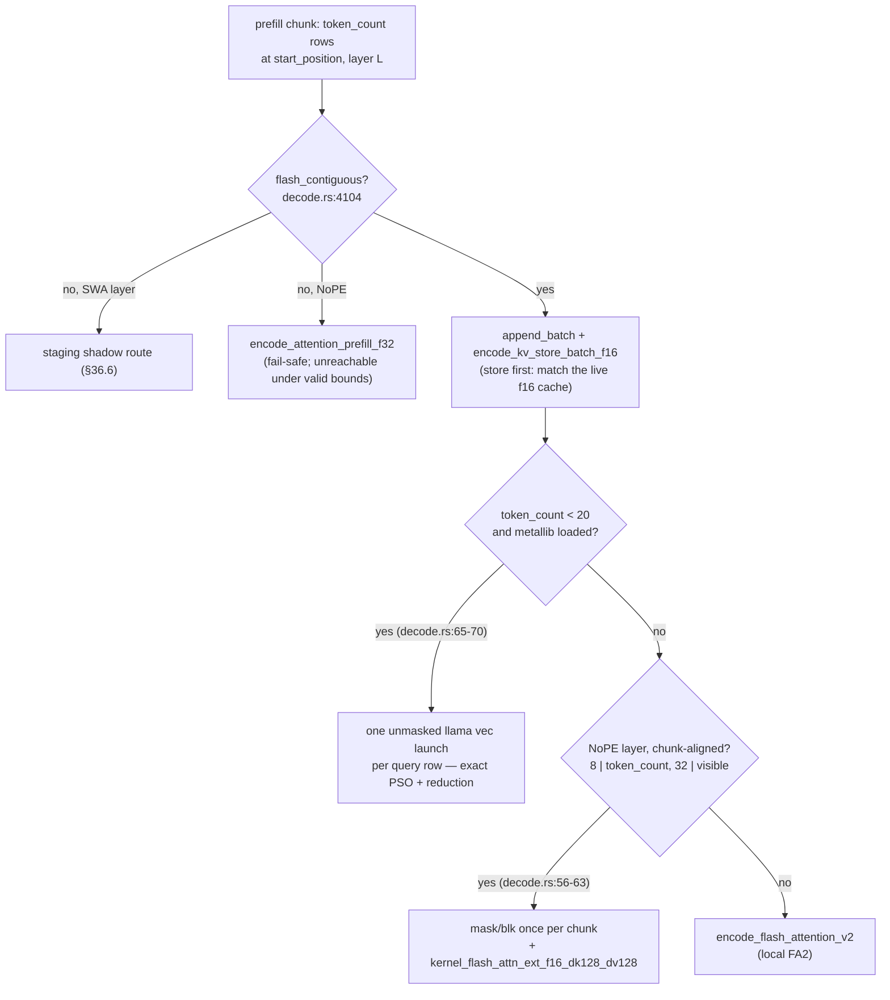

# Chapter 36 — Prefill vs decode: the two graphs
> **status:** polished  ·  **path:** Muse Glimmer, pinned Muser tree

*Prerequisites: [Ch 1](01-why-inference-is-a-memory-problem.md) (bytes per
token), [Ch 10](10-the-forward-pass-at-a-glance.md) (the decode graph and the
"prefill is a different graph" preview), [Ch 13](13-the-qkv-gate-matvec-family.md)
(matvec math — this chapter generalizes it to GEMM), [Ch 15](15-kv-store-and-the-ring.md)
and [Ch 16](16-attention-decode-kernels.md) (the ring the staging shadow
protects), [Ch 34](34-scheduler-and-slots.md) (chunk boundaries and
decode-priority). GEMM is defined here from the matvec you already know.*

---

[Ch 35](35-ordering-hazards-and-the-dispatch-gap.md) closed with the
dispatch-gap families, and the largest structural one — 39 SWA staging groups
— lives on a route this book has visited only in passing: prefill. Time to
walk it properly. Everything in Parts III–IV was the *decode* graph: one
token, one row, matvecs, a bandwidth story. Prefill is the same 52 layers,
the same weights, the same sandwich norms — run over a *prompt* of hundreds
or thousands of tokens at once. The math per layer is identical; the shape of
every operation changes; the bottleneck flips from memory to compute; and on
the disaggregated lane of Part VI the whole graph may be skipped on the Mac
entirely, replaced by a wire and a KV install. This chapter is the two-graph
chapter: decode-matvec-serial versus prefill-GEMM-parallel, in code.

---

## 36.1 The same model, two regimes

Fix the vocabulary once more (it was introduced in
[Ch 10 §10.1](10-the-forward-pass-at-a-glance.md) and every performance claim
in the book is scoped to one of these):

- **[Prefill](../glossary.md#prefill)** — process the entire prompt as one batch
  of query rows: `T` tokens through each weight matrix together.
- **[Decode](../glossary.md#decode)** — one token in, one prediction out, repeat.

The engine's routing is disarmingly small — token count picks the regime:

```rust
// crates/muser-engine/src/decode.rs:2082-2094
if tokens.len() == 1 {
    let scheduler = Arc::clone(&self.shared.scheduler);
    let _permit = scheduler.acquire(self.sequence_id, AcceleratorWork::Decode)?;
    // …(serving-route comment; elided — quoted in Ch 10 §10.2)…
    *logits = self.forward_batch(tokens)?;
    return Ok(());
}
```

One token takes the decode route (through the one-row batch graph, as
[Ch 10](10-the-forward-pass-at-a-glance.md) explained); more than one takes
the prefill loop of §36.7. From that single branch, everything differs
downstream: the projections, the attention kernels, the workspace sizes, the
scheduler work class (`Decode` vs `Prefill` permits,
[Ch 34](34-scheduler-and-slots.md)).

## 36.2 The roofline flip, with the arithmetic shown

Why do the regimes deserve different kernels? Because of one ratio:
**arithmetic intensity** — FLOPs performed per byte read from DRAM. Derive it
for Muse Glimmer, both regimes, from facts you already have.

**The weight stream is the same for both.** Every forward pass — one row or
five hundred — reads the weight arena once per matrix touched. The pinned
artifact is 16,756,681,056 bytes [crates/muser-engine/src/lib.rs:14] for a
model this book counts by hand at 27,854,794,240 parameters total — the
"~30B" class of `[docs/muser-architecture.md]` — of which the matmul subset
that generates FLOPs is 26,508,558,312 ≈ 26.5e9 (both counts derived in
[Ch 1 §1.3](01-why-inference-is-a-memory-problem.md); the difference is the
embedding table, which is a gather, not multiplies).

**Per row, each weight parameter participates in one multiply-accumulate —
2 FLOPs.** So one decode row performs ≈ 2 × 26.5e9 FLOPs while moving
16.7566e9 bytes of weights, plus its (small) activations and KV:

```
  decode intensity  ≈ 2 × 26.5e9 FLOPs / 16,756,681,056 B ≈ 3.2 FLOPs/byte

  prefill, B rows  ≈ B × 3.2 FLOPs/byte     (each weight byte feeds B MACs)
      B = 64  →  ~202 FLOPs/byte
      B = 512 →  ~1,619 FLOPs/byte
```

*Figure 36.1: arithmetic intensity per weight byte, derived. The numerator
is the canonical matmul parameter count 26,508,558,312 ([Ch 1 §1.3](01-why-inference-is-a-memory-problem.md));
the denominator is the exact artifact size.
Intensity scales linearly with batch width B — the whole roofline story in
one line.*

Now place the two points against the machine. The M3 Ultra's memory system
is of the ~800 GB/s class `[ledger L0]`. The GPU's compute ceiling on this
part is not published by Apple and was not measured by the campaign
[unverified] — so take the knee (the intensity where compute time equals
memory time) symbolically: `knee = FLOPs_ceiling / 800 GB/s`. Whatever the
true ceiling, decode at ~3.2 FLOPs/byte sits far below any plausible knee —
*memory-bound: halve the bytes, halve the time* — while a 512-row prefill
chunk at ~1,619 FLOPs/byte sits far above it — *compute-bound: time tracks
FLOPs, and extra bytes are nearly free*. This is the flip. It is why
[Ch 1](01-why-inference-is-a-memory-problem.md) could cost a decode token by
bytes alone, and why prefill wants the opposite of everything the decode path
optimizes for: wide tiles, arithmetic-dense kernels, batches as large as
memory and latency allow.

One corollary to carry through Part VI: because prefill is compute-bound, a
*remote* prefiller with more compute (the GB10's tensor cores) plus a wire
can beat local prefill even after paying the network — the economics
[Ch 27](27-why-disaggregate.md) quantifies.

## 36.3 `prefill.rs` is a signpost — by design

Where does the prefill code live? In a file that is *only* a module
document, and the file itself explains why:

```rust
// crates/muser-engine/src/prefill.rs:1-17
//! Batched GPU prefill driver — muse-fixed, no VM. macOS-only.
//!
//! **REIMPLEMENTED** (docs/muser-architecture.md §D), replacing Ferrite's
//! `forward_gpu/engine_prefill/*`. The implementation lives beside decode in
//! `decode.rs` so both routes share the exact layer graph. It is batched
//! over T query positions, exploiting the same weight-row-reuse
//! `weights.rs` documents ("prefill of T tokens ≈ one token's DRAM
//! traffic"). Release throughput remains gated on the paired campaign.
//!
//! Also the Mac-local fallback path when GX10 disaggregated prefill
//! (`muser-cluster`) isn't available or isn't worth the wire hop for a
//! short prompt.
//!
//! Chunks retain their activation/token arenas and encode the full 52-layer
//! graph into one serial command encoder. Cache placement remains explicit in
//! logical/physical ring metadata and never derives placement from absolute
//! positions.
```

Every sentence is load-bearing. *Reimplemented, no VM* — this is the same
divergence from the ancestor's compiled-program design that
[Ch 35 §35.8](35-ordering-hazards-and-the-dispatch-gap.md) documented for
decode. *Beside decode so both routes share the exact layer graph* — the
exactness argument again: one layer graph, two widths, not two
implementations that could drift. *"prefill of T tokens ≈ one token's DRAM
traffic"* — Figure 36.1 restated as the reuse invariant. *Fallback when
disaggregated prefill isn't worth the wire hop* — the lane boundary of
Part VI, resting on prompt length. And the closing paragraph names the two
invariants this chapter will watch: explicit ring placement (no
absolute-position addressing, [Ch 15](15-kv-store-and-the-ring.md)) and the
chunk arena discipline.

The actual driver is `forward_batch` → `forward_batch_hidden` →
`encode_batch_hidden_range` [crates/muser-engine/src/decode.rs:2857, 3788,
3824-3855], and the last is the prefill twin of [Ch 10](10-the-forward-pass-at-a-glance.md)'s
`encode_token` — the function a prompt chunk actually flows through:

```rust
// crates/muser-engine/src/decode.rs:3857-3875
#[allow(clippy::too_many_arguments)]
fn encode_batch_hidden_range<T: EncodeTarget + ?Sized>(
    &mut self,
    batch: &BatchActivations,
    swa_staged_key: &GpuHalfBuffer,
    swa_staged_value: &GpuHalfBuffer,
    fa_prefill: Option<(&GpuBytes, &GpuBytes)>,
    token_count: usize,
    start_position: usize,
    command: &T,
    capture_layers: &[usize],
    capture_buffers: &[GpuBuffer],
    layer_major_capture: Option<&GpuBuffer>,
    batch_logits: Option<&GpuBuffer>,
    tail_capture: Option<BatchTailCapture<'_>>,
    layers: Range<usize>,
    encode_entry: bool,
    encode_output: bool,
) -> Result<(), MetalModelError> {
```

The parameter list *is* the chapter's table of contents: a `BatchActivations`
workspace (T-scaled twins of the decode pool), the two SWA staging shadow
planes (§36.6), the llama prefill mask/block pair (§36.5), a layer *range*
(this same function also encodes partial layer spans for the DFlash split
graph of [Ch 10 §10.6](10-the-forward-pass-at-a-glance.md)), and entry/output
switches. Inside, the loop is `encode_token`'s sequence — norm, projections,
QK-norm, RoPE on SWA layers, attention, gate, o_proj, fused tails — with
every dispatch carrying `token_count` rows instead of one
[crates/muser-engine/src/decode.rs:3922-4007].

## 36.4 Projections: from matvec to GEMM

A [matvec](../glossary.md#matvec) computes `y = W·x` for one vector `x`: each
output element is a dot product of one weight row with `x`
([Ch 13](13-the-qkv-gate-matvec-family.md)). Prefill has `T` input vectors —
`Y = W·X`, a **[GEMM](../glossary.md#gemm)** (general matrix-matrix
multiply): output row `i`, column `t` is `W_i · X_t`. The weight row `W_i`
is read once and used `T` times — Figure 36.1's reuse, in kernel terms.

The dispatch site is `encode_batch_projection`, and its first branch is a
lane surprise worth slowing down for:

```rust
// crates/muser-engine/src/decode.rs:5955-5961
if token_count == 16
    && projection.layout.dtype == GgmlType::NVFP4_E2M1
    && projection.layout.n_in.is_multiple_of(64)
    && std::env::var_os("MUSER_NO_M16_N32").is_none()
{
    if let Some(input_scale_inv) = projection.layout.nvfp4_input_scale_inv {
        self.kernels.encode_nvfp4_w4a4_prequant_m16(
```

On the native NVFP4 lane, 16-row chunks with 64-aligned input widths take a
*quantized-activation* GEMM — the W4A4 M16 route of
[Ch 7](07-nvfp4-native-lane.md), `muser_nvfp4_w4a4_prequant_m16_n32`
[crates/muser-engine/src/shaders/nvfp4.metal:504]. Everything else falls
through to the same projection stack decode uses, just with `token_count`
rows. The four independent Q/K/V/gate GEMMs share one dispatch closure so a
concurrent encoder can overlap them — with the comment: "Independent
projections share a read-only normalized input and write disjoint
activations. Group them so a concurrent prefill encoder can overlap the four
GEMMs" [crates/muser-engine/src/decode.rs:3953-3956]. That is
[Ch 35](35-ordering-hazards-and-the-dispatch-gap.md)'s closure-boundary
discipline, applied at batch width: independent work in one closure, real
dependencies at closure edges.

## 36.5 Prefill attention: the route tree

Decode attention was a four-rung ladder selected per layer per token
([Ch 16 §16.0](16-attention-decode-kernels.md)). Prefill attention is a
three-route tree selected per layer per chunk, plus a fail-safe. The trunk
predicate:

```rust
// crates/muser-engine/src/decode.rs:4104-4106
let flash_contiguous = old_origin_logical == 0
    && old_origin_physical == 0
    && old_len + token_count <= capacity;
```

A chunk whose cache span is *contiguous from physical row zero* — the common
case for a fresh prompt before any ring wraps — takes one of three routes;
otherwise an SWA layer jumps to the staging shadow (§36.6). The decision, as
a picture (Figure 36.2):



*Figure 36.2: the prefill attention route tree
[crates/muser-engine/src/decode.rs:4090-4374]. "llama" = pinned metallib
kernels (`MUSER_GGML_METALLIB`); SWA = the 39 sliding layers; NoPE = the 13
full layers.*

**Route (a) — short chunks: the pinned vec kernel, per query.** The pinned
Metal backend selects its vec flash-attention kernel for batches below 20
queries (`llama_vec_prefill_route_available`: `token_count < 20 && capacity
>= 32 && has_llama_flash_attention && !cross_vendor`,
[crates/muser-engine/src/decode.rs:65-70]). Muser then runs one unmasked vec
launch per query row with that row's exact visible-prefix length — and the
comment explains why something so brute-shaped survives: it is "equivalent to
its causal mask (NQPSG=1 for DK128), while reusing the exact upstream PSO and
reduction order. This matters for public embedding/logprob parity: the older
local FA2 path was mathematically close but diverged sharply after four
positions across 52 layers" [crates/muser-engine/src/decode.rs:4117-4127].
The recurring exactness theme again: *mathematically close* is not a
compatibility contract.

**Route (b) — NoPE layers at chunk bounds: the pinned non-vec kernel.**
Full-attention layers with `token_count` a multiple of 8 and the visible
prefix a multiple of 32 take llama's own masked causal prefill kernel
(`llama_fa_prefill_route_available`, decode.rs:56-63). The comment: "same
kernel, tiling, and reduction order the comparator measures. SWA layers and
unaligned shapes keep the local FA2 route" [crates/muser-engine/src/decode.rs:4181-4184].
The dispatch is two encodes — a per-*chunk* mask/block preparation shared by
every eligible layer, then the attention itself:

```rust
// crates/muser-engine/src/decode.rs:4195-4198, 4207-4209
if !llama_fa_prefill_mask_ready {
    dispatch(command, |encoder| {
        self.kernels.encode_llama_fa_prefill_mask_blk(
// …(mask/blk dispatch once; elided)…
        dispatch(command, |encoder| {
            self.kernels.encode_llama_flash_attn_prefill_f16(
```

The two wrappers [crates/muser-engine/src/metal/encode/attn.rs:266-317,
328-369] carry the contract. `encode_llama_fa_prefill_mask_blk` fills a
causal f16 mask and runs llama's `flash_attn_ext_blk` block classifier —
bytes that mark each 32×8 tile skip/partial/dense, "what make the pinned
kernel's causal prefill cheap on the fully-masked upper triangle"
[attn.rs:259-265] — with one barrier after each stage and a note that "one
dispatch per prefill chunk is shared by every full-attention layer in that
chunk" [attn.rs:262-263]. `encode_llama_flash_attn_prefill_f16` is
`kernel_flash_attn_ext_f16_dk128_dv128` from the pinned metallib, with the
shape constants `LLAMA_FA_PREFILL_NQPTG = 8`, `LLAMA_FA_PREFILL_NCPSG = 32`,
`LLAMA_FA_PREFILL_NSG = 4` [crates/muser-engine/src/metal/encode.rs:1069-1072]
and strides that map Muser's token-major f32 Q onto ggml's expectations —
"Q and the output stay in Muser's token-major `[token, head, dim]` f32
layout via explicit strides" [attn.rs:325-326].

**Route (c) — everything else: local FA2.** `flash_attn_v2`
[crates/muser-engine/src/shaders/ferrite/flash_attn_v2.metal:59] over the
just-stored f16 cache — including every SWA layer whose chunk has not caused
a ring wrap. Note the store-first order shared by all contiguous routes:
"Ferrite's production order is store-to-F16 then FA2. This also makes
prefill arithmetic match the live cache used by subsequent decode rather
than attending transient F32 K/V" [crates/muser-engine/src/decode.rs:4108-4110]
— prefill's outputs must be the *same bits* a later decode token would have
attended from, so it reads through the same f16 planes.

## 36.6 The SWA staging shadow: prefill through a wrapped ring

Now the 39-group family from [Ch 35](35-ordering-hazards-and-the-dispatch-gap.md).
Once a sliding layer's ring has wrapped (Ch 15's `origin_logical > 0`), the
live cache is no longer a contiguous span from row zero — `flash_contiguous`
fails, and the pinned kernels cannot walk an arbitrary physical rotation.
The route:

```rust
// crates/muser-engine/src/decode.rs:4247-4252
} else if cfg.layer_kinds[layer_index].is_swa() {
    // Preserve Ferrite FA2 after the explicit SWA ring wraps.
    // The staging arena is a detached logical tail: old ring rows
    // in logical order followed by this chunk, all F16 exactly as
    // the production cache stores them. The live ring is changed
    // only after attention has consumed the complete shadow.
```

Three steps, per wrapped SWA layer, per chunk. **Stage:**
`encode_stage_swa_prefill_f16` dispatches `muser_stage_swa_prefill_f16`
[crates/muser-engine/src/shaders/muse_reference.metal:1240] — a
`(old_len + token_count) × kv_dim` gather that rewrites the ring's retained
logical tail into a *detached* shadow plane, in logical order, followed by
the chunk's own K/V rows [crates/muser-engine/src/metal/encode/attn.rs:103-138].
**Attend:** FA2 runs against the shadow — contiguous by construction, window
masking against logical indices that now match physical layout
[crates/muser-engine/src/decode.rs:4328-4345]. **Commit:** only then does
`append_batch` update the live ring's metadata [crates/muser-engine/src/decode.rs:4348-4352].
The live ring is never observed mid-rebuild — the same
build-detached-then-swap shape as the remote KV install of
[Ch 10 §10.7](10-the-forward-pass-at-a-glance.md) and the server's staging
generation of [Ch 34 §34.6](34-scheduler-and-slots.md), here at kernel
granularity.

There is also a single-row special case with an exactness twist. When a
one-row continuation lands on a wrapped ring (token_count = 1, metallib
present, full window), the stage kernel is `muser_stage_swa_llama_decode_f16`
[crates/muser-engine/src/shaders/muse_reference.metal:1281], and its wrapper
comment is the sharpest sentence in the file:

> "Materialize Muser's compact SWA ring at llama.cpp's absolute, 256-row-
> padded KV indices for one-row decode. The staged mask retains llama's
> masked cells, so the pinned vec kernel sees the same reduction lanes
> rather than a mathematically equivalent compact permutation."
> [crates/muser-engine/src/metal/encode/attn.rs:140-143]

The shadow is not merely a contiguous copy — it reproduces llama's *padding
and mask topology*, so the pinned vec kernel reduces over the same lanes
llama itself would. A resource barrier over the three staged buffers orders
the RAW before attention [crates/muser-engine/src/decode.rs:4300-4305]. This
is why the 39 staging closures of [Ch 35](35-ordering-hazards-and-the-dispatch-gap.md)
carry the disposition "Keep until a bit-exact ring-aware replacement exists"
[docs/decode-dispatch-gap-20260815.md]: the copies are the price of pinned
reduction lanes, and the ranked-work item gates any replacement on "bitwise
KV and full-logit equality at positions 1, 31, 32, 33, 2,047, 2,048, and
2,049."

## 36.7 Chunking, and yielding to decode

Prompts do not arrive pre-sliced. `forward_into`'s prefill loop
([Ch 34 §34.2](34-scheduler-and-slots.md), quoted there) walks the prompt in
`PREFILL_BATCH_TOKENS = 512`-row chunks — and shrinks the next boundary to
`MAX_TEACHER_FORCED_TOKENS = 64` rows the moment any decoder is queued
[crates/muser-engine/src/decode.rs:53-54, 2097-2113]. Each chunk acquires a
`Prefill` permit per [Ch 34](34-scheduler-and-slots.md)'s decode-first
scheduler, so between chunks a waiting decode always wins the accelerator.
The chunk width is also a memory decision: the batch workspace's activation
twins scale with rows, and ~0.99 GB of f32 batch-activation widths at the
512-position chunk are *reused*, with the explicit caveat that this "must
not be labeled peak RSS" `[docs/memory-footprint.md]`.

## 36.8 The measured contrast — and the two latencies users feel

**Local parity, both regimes.** The production six-depth plain matrix
(2,048 → 131,008 positions, five exact-token reps per depth, llama ÷ muser
ratios) measured prefill means **1.0139–1.0397×** and decode means
**1.0274–1.0504×** across depths — 30/30 cells at or above parity
`[ledger, "Phase 2 non-spec context matrix"; receipt root
ctx-matrix-plain-b972b55-20260819/]`. Both graphs hold parity against the
pinned comparator; read the tables' scope language before quoting any single
cell [Ch 38](38-measuring-against-llama-cpp.md).

**Disaggregation, the prefill-side lever.** When prefill moves to the GX10,
TTFT — time to first token, almost pure prefill plus wire — improves
**4.26×** at 2,048 tokens (Phase-4 matrix, five reps) and **4.149×** at
130,815 tokens (remote 137.405 s median vs local 570.122 s mean, EEE-off
arm)
`[claims #6; ledger "Phase 4 disaggregated GX10→Mac context matrix"; ledger
"EEE A/B at 130815"]`. The full depth band and its caveats are
[Ch 27](27-why-disaggregate.md)'s subject — this chapter only claims the
regime split that makes the lever coherent.

**TTFT and TPOT are the user-facing twins of this chapter's two graphs.**
Time-to-first-token is prefill-dominated; time-per-output-token is decode-
dominated. Every serving optimization in this book attacks exactly one of
them: disaggregation and kvpack warm reuse ([Ch 25](25-warm-reuse.md))
attack TTFT; DFlash speculation ([Ch 33](33-speculation-and-the-distributed-verdict.md))
attacks TPOT (the kquant spec bar 107.9 tok/s; current synthetic restatement
decode ratio 1.23692 at 2,048, five of five exact reps `[claims #15]`). The
frozen serving verify-length 7 came from exactly this matrix's natural-text
cells `[ledger, "Spec re-measurement at the fixed window"]`. And the
131,008-depth wall-parity cell — end-to-end 1.02536× with prefill 1.02460×,
the first 131k-class result above parity — is the two graphs measured
*together* `[claims #16]`.

## 36.9 Tradeoffs

**Three attention routes instead of one.** The route tree costs complexity
(predicates on chunk shape, alignment, layer class, lane) and buys exactness
plus regime-appropriate kernels: pinned vec for short chunks and parity-
critical reads, pinned non-vec for aligned NoPE chunks, local FA2 for
everything else. The measured basis for preferring pinned kernels where
eligible is the comment's own history — the local FA2 path "was
mathematically close but diverged sharply after four positions across 52
layers" [crates/muser-engine/src/decode.rs:4121-4124] — plus the parity
matrices above, run with the pinned routes in place. No isolated A/B of
route (b) versus route (c) throughput exists in the campaign evidence
[unverified].

**Stage-then-attend versus a ring-aware kernel.** The staging shadow pays 39
closure groups per wrapped token diagnostic [docs/decode-dispatch-gap-20260815.md]
plus shadow-plane memory (two 131,072-row staging planes in the batch
workspace, [Ch 10 §10.8](10-the-forward-pass-at-a-glance.md)). The
alternative — an attention kernel addressing the rotated ring natively —
exists on the decode side (the splitk rung of
[Ch 16](16-attention-decode-kernels.md)) but would need a bit-exactness proof
at seven named boundary positions before it could replace the pinned-lane
staging route [docs/decode-dispatch-gap-20260815.md §Ranked remaining exact
work].

**512/64 adaptive chunks.** Wide chunks maximize GEMM intensity (Figure
36.1); the shrink-to-64 rule trades that intensity away precisely when a
decode is waiting, capping decode's worst-case queue-behind interval
[crates/muser-engine/src/decode.rs:2098-2101]. The prefill-throughput cost
under concurrent load was not isolated as a measurement [unverified]; the
benefit side is the bounded decode-latency argument, and the constants are
in source.

**Local prefill retained at all.** Even with a qualified GX10 lane, the Mac
keeps this graph — short prompts "aren't worth the wire hop"
[crates/muser-engine/src/prefill.rs:10-12], and the lane must degrade when
the producer is down ([Ch 28](28-the-gx10-and-vllm-nvfp4-prefill.md)'s
fail-closed ritual). The crossover is an operator/economics question
[Ch 27](27-why-disaggregate.md), not a constant in this code.

## 36.10 What comes next

Both graphs now end the same way: with logits, samples, and tokens that
exist because a person, somewhere, sent an HTTP request. Everything in Parts
I–VII ultimately serves a wire protocol — llama-compatible routes, sessions
that outlive connections, migration between decode nodes, and a security
boundary that decides who may ask at all. The last chapter of this part
assembles that surface, and the deliberately asymmetric auth model that
guards it. [Ch 37](37-server-sessions-and-security.md) is the server.

## References

- `crates/muser-engine/src/prefill.rs:1-17` — the module header (quoted in
  full): reimplementation note, reuse invariant, fallback role, chunk
  invariants.
- `crates/muser-engine/src/decode.rs:53-54, 59-70, 2082-2113` — chunk
  constants; prefill route predicates; the regime branch and adaptive
  chunking.
- `crates/muser-engine/src/decode.rs:2857, 3788-3855` — `forward_batch` →
  `forward_batch_hidden` → `encode_batch_hidden` chain.
- `crates/muser-engine/src/decode.rs:3857-4007` — `encode_batch_hidden_range`
  (signature quoted) and the batch layer loop.
- `crates/muser-engine/src/decode.rs:4090-4374` — the prefill attention route
  walk: `flash_contiguous`, pinned-vec comment, llama non-vec comment,
  staging route (quoted), NoPE fail-safe.
- `crates/muser-engine/src/decode.rs:5946-5980` — `encode_batch_projection`
  and the M16 NVFP4 predicate (quoted).
- `crates/muser-engine/src/metal/encode/attn.rs:103-183` — the two staging
  wrappers; the llama-lanes comment (quoted).
- `crates/muser-engine/src/metal/encode/attn.rs:259-369` — mask/blk and
  `kernel_flash_attn_ext_f16_dk128_dv128` wrappers with contracts.
- `crates/muser-engine/src/metal/encode.rs:1066-1072` — the pinned prefill
  shape constants.
- `crates/muser-engine/src/shaders/muse_reference.metal:1240, 1281` — the
  staging kernels.
- `crates/muser-engine/src/shaders/ferrite/flash_attn_v2.metal:59` — local
  FA2.
- `[docs/memory-footprint.md]` — batch workspace widths; chunk arithmetic.
- `[docs/decode-dispatch-gap-20260815.md]` — the 39 staging families and the
  ring-aware-replacement gate.
- `[ledger, "Phase 2 non-spec context matrix"]` /
  `ctx-matrix-plain-b972b55-20260819/` — prefill 1.0139–1.0397×, decode
  1.0274–1.0504× across the six depths (five-rep exact-token means).
- `[claims #6]`, `[claims #15]`, `[claims #16]` — TTFT disaggregation scope;
  speculative restatement scope; 131,008 wall-parity scope.
- [Ch 27](27-why-disaggregate.md) — the disaggregation economics in full;
  [Ch 35](35-ordering-hazards-and-the-dispatch-gap.md) — the ordering
  discipline this graph inherits; [Ch 38](38-measuring-against-llama-cpp.md)
  — how the parity matrices behind §36.8 were run.
