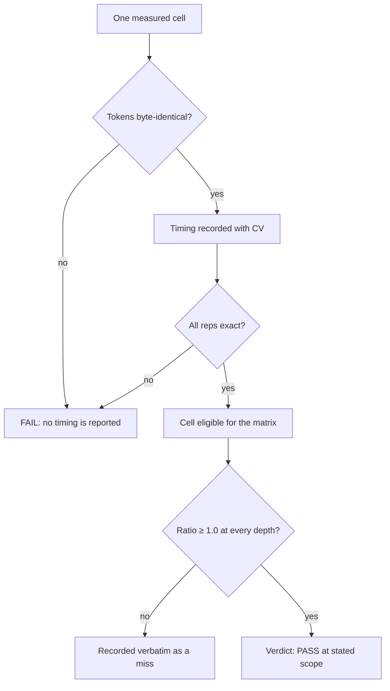
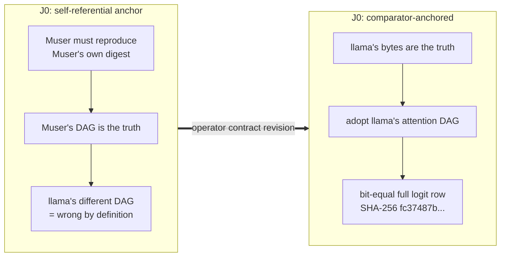

# Chapter 38 — Measuring against llama.cpp
> **status:** polished  ·  **path:** Muse Glimmer, pinned Muser tree
>
> *Prerequisites: Chapters 1 and 35 are the load-bearing ones. You need the
> book's standing question (what does one token cost, where does the time go,
> and what may be moved without breaking exactness?) and the vocabulary of
> [Ch 35](35-ordering-hazards-and-the-dispatch-gap.md): dispatches, closures,
> and why the decode graph is the shape it is.*

---

## 38.1 Why this chapter exists

Chapter 37 closed the serving surface: sessions, migration, the security
boundary — the last of the machinery. This part is not machinery. Part VIII is
about how you *know* anything the previous thirty-seven chapters claimed, and
this chapter is the instrument itself: how do you compare two inference
engines — one you wrote, one pinned from upstream — and produce a number that
survives being quoted?

The comparator is **llama.cpp**, pinned at commit
`89e0aa6fd362617d9073e0dafc18e41241521572`, running the same pinned Muse
Glimmer GGUF with its `flash_attn_ext` prefill route
`[docs/benchmarks.md §Methodology]`. Every throughput ratio in this book is
`llama ÷ muser`, so **above 1.0 means Muser wins** — a convention you must
state every time, because half the world writes it the other way
`[docs/benchmarks.md §Methodology]`.

The ancestor Ferrite book had a chapter with this same title, and its core
lesson survives intact: *absolute tok/s is noise; the same-session interleaved
ratio is the only stable cross-engine statistic* `[ferrite-book Ch 24]`. The
Ferrite lab measured ~30 % session-to-session spread on identical builds —
75–99 tok/s bands with nothing changed `[ferrite-book Ch 24]`. That is
ancestor-lab context, not a Muser measurement, but the physics is universal:
thermal state, DVFS (the chip's clock-boost governor), background load, and
memory pressure all move an absolute number between sessions. Muser rebuilds
the *apparatus* around that lesson — the parity ledger, the accelerator lease,
the exact-token gate — and this chapter walks all of it.

## 38.2 Why absolute tok/s lie

Start with the failure mode. Suppose you run Muser on Monday (35.1 tok/s) and
llama.cpp on Tuesday (33.4 tok/s), and conclude Muser is 5 % faster. Three
things can quietly invalidate that:

1. **Thermal state.** A 96 GB M3 Ultra running a 16.76 GB weight stream
   heats up; the clock governor throttles. Monday's cold machine and
   Tuesday's warmed machine are different machines.
2. **Background load.** A build, a backup, a browser tab compositing —
   anything that touches the unified memory pool steals bandwidth from the
   exact resource decode is starving for. Recall from
   [Ch 1](01-why-inference-is-a-memory-problem.md): decode time *is*
   weight-read time; anything that slows memory slows tokens exactly
   proportionally.
3. **Clock choice.** Which clock did you divide by? Muser's campaign learned
   this the hard way on the wire side: userspace send-time and
   receiver-first-read clocks were both rejected, and Linux
   `TCP_INFO.busy_time` became "the only honest link denominator" for wire
   rate `[ledger P4, "The original installed-payload row…"]`. The one-button
   wizard once computed its 3.0 Gbps link gate from the wrong clock and
   reported 0.67 Gbps against a true 6.71 Gbps median — a healthy link
   failed its own gate `[ledger §2b wizard attempt 8, 2026-08-24]`.

The cure is not a better stopwatch. It is a design that makes the noise
*common-mode*: measure both engines in the same session, interleaved, so that
whatever the machine is doing to A it is also doing to B, and the ratio
cancels it.

## 38.3 Same-session interleaved A/B — the only stable cross-engine statistic

The canonical protocol is the **J3 five-pair streamed verdict**, and it is
worth reading as a recipe — its five reps are Table 38.1
`[ledger J3, "Stage A five-pair streamed verdict",
2026-08-15]`:

- Each repetition starts a **fresh Muser server and a fresh pinned llama
  server** — no state carry-over.
- Each engine runs **one uncached 2,048+1 warmup** request first.
- Then one uncached streamed 2,048+256 request is measured, per engine, within
  the same rep window.
- Five repetitions. Tokens must match **exactly** in every pair.

```text
Rep |  Muser decode | llama decode | Muser prefill | llama prefill | Tokens
 1  |  35.0973      |  33.3817     |  317.6623     |  306.5062     | exact
 2  |  35.0850      |  33.3035     |  317.4944     |  306.3196     | exact
 3  |  35.1586      |  33.4304     |  317.8869     |  306.3874     | exact
 4  |  35.1939      |  33.4261     |  317.5583     |  306.2955     | exact
 5  |  35.1910      |  33.4900     |  317.9913     |  305.9840     | exact
```
*Table 38.1: The J3 five-pair table, verbatim from the ledger
`[ledger J3]`. Medians: Muser decode 35.1586 tok/s (CV 0.131 %) vs llama
33.4261 (CV 0.185 %) → 1.05183×; prefill 317.6623 (CV 0.060 %) vs 306.3196
(CV 0.057 %) → 1.03703×.*

Three details in that table carry the whole methodology:

- **The citable statistic is the ratio of per-engine medians**, not the mean
  of per-pair ratios. Medians resist a single poisoned rep; the CV column
  tells you how much the five samples disagreed, and CVs under ~0.2 % here
  say the session was clean.
- **Fresh servers per rep.** Reusing a warm server would let allocator state,
  page-cache layout, and JIT'd pipeline caches leak between reps — real
  serving conditions, but not a controlled comparison.
- **"Exact" is a column.** Timing and correctness travel together, always.

For the product-lane decode cells, the same discipline has a name: the
**adjacent lease window**. The kquant-vs-NVFP4 plain-decode comparison (35.440
vs 35.491 tok/s) used "the same 66-token prefix, 32 teacher-forced tokens, F16
KV, flash attention, release binary, and adjacent lease window"
`[ledger P1.3]` — the two lanes measured back-to-back under one held
accelerator lease, so drift between them is bounded by seconds, not days.
*Teacher-forced* means the harness feeds each engine the correct previous
token rather than its own prediction, which is what makes per-token timing
comparable even before you trust either engine's sampler.

## 38.4 Exact-token comparison — divergence poisons timing

Here is the rule that trips people up: **if the two engines generate
different tokens, you cannot compare their speed.** Different tokens mean
different attention patterns, different KV growth, different branch behavior
in speculative rounds — different *work*. A 10 % "win" measured over
divergent outputs is a measurement of two different computations, not of two
implementations of one computation.

So every performance rep in the campaign is simultaneously an exactness check:

- Local matrices: "every cell exact-token vs llama.cpp" — "Cells that fail
  exactness are not reported as passes" `[docs/benchmarks.md
  §Methodology]`.
- Remote lane: the qualifier "compares 256 greedy tokens plus every full
  target-logit row" `[crates/muser-bench/src/remote.rs:3-10]` — not just the
  chosen token, the entire 202,048-wide distribution, per position. Its gates
  are hard-coded: `LINK_GBPS_MINIMUM = 3.0` Gbps installed payload and
  `DFLASH_ACCEPTANCE_MINIMUM = 0.95`
  `[crates/muser-bench/src/remote.rs:32,36]`.

Figure 38.1 shows the whole gate as a flow — correctness is checked before
any throughput number exists:


*Figure 38.1: The exactness-first gate. Correctness is checked before any
throughput number exists; misses are recorded, never smoothed.*

The J-series went further than tokens: after the J0 re-anchor (§38.6), the
single-row gate became equality of **raw bytes** — the complete
little-endian f32 logit row, 808,192 bytes, SHA-256 `fc37487b…` from llama's
own `llama_get_logits()` `[ledger J0]`. And on natural text, where
cross-engine outputs *do* diverge, the honest move is to say so and drop the
exactness gate rather than fake it: "on real corpora, cross-engine outputs
diverge, so speed stands without an exactness gate" `[docs/benchmarks.md §2]`.

## 38.5 Five-repetition means and the six-depth matrix

The campaign's headline throughput artifact is the **Phase 2 non-spec context
matrix**: six prompt depths × five reps, every cell exact-token, zero failures
`[ledger "Phase 2 non-spec context matrix", 2026-08-20]`, all timings through
`representative_target_smoke.py` under the accelerator lease
`[scripts/representative_target_smoke.py]`:

| Depth | Decode mean | Decode CV | Prefill mean | Prefill CV |
|---:|---:|---:|---:|---:|
| 2,048 | 1.0504 | 0.47 % | 1.0397 | 0.12 % |
| 8,192 | 1.0429 | 0.32 % | 1.0208 | 0.06 % |
| 16,384 | 1.0414 | 0.50 % | 1.0185 | 0.06 % |
| 32,768 | 1.0479 | 0.92 % | 1.0171 | 0.05 % |
| 65,536 | 1.0274 | 1.39 % | 1.0163 | 0.11 % |
| 131,008 | 1.0277 | 0.43 % | 1.0139 | 0.23 % |

*Table 38.2: The six-depth plain matrix, `llama ÷ muser`, five exact-token
reps per depth `[ledger "Phase 2 non-spec context matrix"]`, receipt root
`[receipt ctx-matrix-plain-b972b55-20260819/]`. The 131,008 cells reserve 64
output tokens inside the 131,072 context; all other depths ran 256 outputs.*

Two things to internalize. First, **five reps after the stated warmup
convention** is the campaign's unit of evidence: one discarded warmup handoff
in disaggregated cells, 60 s cooldowns in spec matrices, means reported with
CV `[docs/benchmarks.md §Methodology]`. Single-rep diagnostics exist but are
marked `†` and never join a matrix (the 8,192 and 65,536 spec cells are
single-rep diagnostics at 1.214† and 1.188† `[docs/benchmarks.md §2]`).
Second, look at the 65,536 decode row: mean 1.0274, but "min 0.9990 rep2"
`[ledger "Phase 2 non-spec context matrix"]` — one rep dipped below parity and
the ledger says so in the same breath as the mean. That is the house style:
the mean is the statistic, the min is the disclosure.

The claim the matrix supports is precisely worded and precisely bounded —
this is `[claims #2]`, one of the rows carrying **OPERATOR REVIEW REQUIRED**:

> "Across a six-depth synthetic plain-generation matrix, Muser's
> five-repetition mean prefill and decode matched or beat the pinned llama.cpp
> comparator at every tested depth." — proposed wording, `[claims #2]`;
> must retain "synthetic," "mean," and the exact tested range; no
> workload-general throughput wording.

Note what the row does *not* allow: it "does not establish performance on
natural workloads" `[claims #2]`. Which brings us to what synthetic fixtures
can and cannot see.

## 38.6 The J0 anchor flip — the chapter's centerpiece

Every methodology chapter needs one story where the method itself was the
problem. Here is Muser's.

**Day zero (2026-08-14).** A single-sample server diagnostic — one warm
server, concurrency one, 2,048+256, exact tokens — reported Muser prefill
3.6 % faster and **decode 0.7814× llama** `[ledger "Stage A entry gate"]`,
receipt `[receipt
human-test-target-only-run-20260814-v1/target-comparator.json]`. A 22 % decode
deficit, single sample, non-notarial. The ledger recorded it as "observation,
not a parity claim" `[ledger "Stage A entry gate"]` — but it was now the
number to explain.

**The wrong first assumption.** The obvious reading was "Muser's kernels are
slower." The [Ch 35](35-ordering-hazards-and-the-dispatch-gap.md) story is
what happened next: the +196-closure dispatch-gap diagnosis (760 vs 564
profiling closures), the reconciliation into 104 norm-boundary groups + 39 SWA
staging groups + 52 KV-publication splits + 1 copy, and the brutal finding
that every fusion which would remove the 104 groups changed bits — the
rejected hybrid's normalized-logprob error was 3.197e-4 against a 1e-4
contract `[docs/decode-dispatch-gap-20260815.md §Rejected hybrid postmortem]`.
The A/H-series chased the deficit through exact reductions — copy elision,
the one-query GQA FA2 kernel — and topped out at **0.8463×**
`[docs/decode-dispatch-gap-20260815.md §Landed and rejected reductions]`.
Thirteen points below the bar, with every exact lever spent.

**The question that flipped everything.** The engines use *the same pinned
GGML Metal kernels* for the quantized projection paths. If the kernels are
the same and the work is the same, whose schedule is "the" schedule? Or, as
the ledger put it when comparing submission topology: llama "commits an
initial prefix promptly, and parallel-encodes the remaining command buffers"
while Muser "encodes one retained command buffer in full before commit and
wait" — "this makes submission/encoding topology the leading hypothesis, not
a claim that llama has a fundamentally different matvec kernel"
`[ledger "Stage A entry gate"]`.

And underneath that sat a deeper question: **whose bytes gate the round?**
Muser's exactness gate until that day was a *self-referential* hash — Muser
had to reproduce Muser's own historical production digest
(`9cdf6323…`). On 2026-08-15 the operator rewrote the contract, verbatim:

> "llama.cpp at 89e0aa6fd362617d9073e0dafc18e41241521572 is THE reference.
> Muser's output must be bit-identical to it, and decode performance must
> match it within measurement noise. The self-referential production hash
> 9cdf6323… is hereby retired as the exactness gate for the single-row decode
> path; it is replaced by equality with the pinned comparator's own bytes."
> `[ledger J0, "Stage A reference re-anchor"]`

A fresh probe was built from a detached checkout of the exact pinned source;
it published llama's complete 202,048-element f32 logit row — 808,192 bytes,
SHA-256 `fc37487b8eb5…` — as the one comparator golden `[ledger J0]`.
Figure 38.2 contrasts the two anchors, before and after the flip:


*Figure 38.2: The J0 anchor flip. The gate changed from self-consistency to
comparator equality `[ledger J0]`.*

**J1** then transplanted llama's attention DAG into Muser's single-row graph
— staging the wrapped SWA ring into llama's absolute masked layout,
dispatching the exact pinned masked-vec/pad/reduce pipelines, reproducing the
pinned LM-head scale/tanh chain literally — and landed byte-equality at
`fc37487b…` `[ledger J1]`. **J3** ran the five-pair verdict of Table 38.1:
decode 1.05183×, prefill 1.03703×, every pair exact. Verdict, in the ledger's
own voice: "**Stage A met.** The margin comes from retaining H3's bounded
GPU-resident greedy chain while replacing the old self-referential attention
constraint with llama's exact bytes and exact DAG. No tolerance, waiver,
finding-status change, readiness receipt, or seal was used."
`[ledger J3]`

Sit with what happened. Muser did not get faster by optimizing. It got
*honest about what the reference was*, adopted the reference's execution
shape where exactness demanded it, and the 22 % deficit — most of which had
been an artifact of comparing two valid-but-different execution graphs under
a self-chosen anchor — became a ~5 % win measured against the comparator's
own bytes. The lesson generalizes far past inference engines: **when you
cannot reach parity, before concluding you are slow, ask whose reference
frame the parity is defined in.** The ancestor book's version of this was
"the gate before perf" `[ferrite-book Ch 24]`; Muser's version is sharper:
sometimes the gate *is* the perf story.

**Stage B, briefly**, because the spec lane repeats the shape: initial
five-rep verdict 0.8670× (six exact levers probed and rejected), then the
L-series microbenchmark-first n32 tile took the 16-row verify matmul from
~148 to ~83 ms/cycle and the verdict to 1.3273× `[ledger K0, L2]`. That
1.3273× is **superseded** — it predates the draft-window fix of §38.7 — and
must not be cited as a current result `[ledger "Spec re-measurement at the
fixed window"]`.

## 38.7 Synthetic vs natural — the fixture that could not see the bug

The campaign's synthetic fixture is a **period-8 cycle of 9 token ids** — a
prompt whose next token is predictable from token identity alone. It exists
so exactness and speed can be compared deterministically across engines. And
for the entire campaign it certified a broken draft lane.

The story is [Ch 33](33-speculation-and-the-distributed-verdict.md)'s to
tell in full; the measurement lesson belongs here. Muser never read
`dflash.attention.sliding_window` (2,048) from the GGUF and hardcoded sink 64
+ window 1,024 — the DFlash draft was conditioned on **half its trained
window** for every measurement to date `[ledger "ROOT CAUSE FOUND AND FIXED",
2026-08-21]`. The consequences, measured, are Table 38.3:

| cell | acceptance before → after | decode before → after |
|---|---|---|
| python suffix 8192 | 1.1 % → **72.7 %** | 0.535 → **1.322** |
| rust 2048 | 36.5 % → **59.1 %** | 0.833 → **0.930** |
| synthetic 2048 (matrix fixture) | 100 % → 99.6 % | 1.3012 → 1.2368 |

*Table 38.3: The window-fix deltas `[ledger "ROOT CAUSE FOUND AND FIXED"]`,
commit `a7a4d11`, evidence `[receipt gate-fix-20260821/]`.*

Read the last row twice. The natural-text cells moved from catastrophic to
healthy; the synthetic cell barely moved — because a period-8 cycle is
predictable *with no context at all*, so it "scored 100 % acceptance
throughout the defect's lifetime, and therefore certified a broken draft lane
for the entire campaign" `[ledger "ROOT CAUSE FOUND AND FIXED", consequence
2]`. The ledger's own enrolled corollary: "natural-text cells must be a
standing part of the spec matrix" — and the current numbers carry both
regimes side by side:

- **Synthetic** (fixed window, current): decode means 1.23692 @2,048,
  1.20323 @16,384, 1.19616 @32,768, 5/5 exact reps per depth `[claims #15]`
  (OPERATOR REVIEW REQUIRED wording; never generalize to natural text, native
  NVFP4, or untested depths).
- **Natural text**: spec decode *wins* python-like content (16,384: 1.186;
  8,192 suffix: 1.321) and **loses** high-acceptance shallow text — rust at
  2,048: 0.931, improving to 0.945 at verify-length 7 — where llama's lighter
  draft wins `[docs/benchmarks.md §2]` `[ledger "Spec re-measurement at the
  fixed window"]`. That asymmetry is why serving froze verify-length 7.

The fixture question — *what does the fixture hide?* — is the book's
methodological chorus, and this is its proven case study: a fixture that
certified a broken lane for a week of campaign time.

## 38.8 The apparatus — the lease, the lock, the labels, the receipts

You cannot measure fairly on a machine you do not control. Every accelerator
run — Metal, llama.cpp, Core ML — goes through one wrapper,
`scripts/accelerator_safe.py`:

```python
# scripts/accelerator_safe.py:2
"""Dry-run-first, serialized wrapper for every accelerator invocation."""
```

Its contract, all of it load-bearing for benchmark integrity:

- **Dry-run by default.** Without `--execute` it prints the plan and returns
  0 `[scripts/accelerator_safe.py:35-38, 331-332]`. You read what *would*
  run before anything touches the GPU.
- **One machine-wide lock.** It holds `/tmp/ferrite.gpu.lock` via `flock`
  (exclusive, non-blocking; refusal is exit-code 75, the same fail-closed
  convention the GX10 producer uses) `[scripts/accelerator_safe.py:21, 355-359,
  393]`. Before the child starts, the wrapper scans for other accelerator
  processes (`llama-*`, `muser-*`, `ferrite-*`, profiling tools) and refuses
  if any exist `[scripts/accelerator_safe.py:24-29, 360-362]`, with
  mandatory quiet periods (≥ 10 s, default 10 s) on each side of the run
  `[scripts/accelerator_safe.py:333-334, 364, 387]`. This is why
  shared-machine GPU benchmarks need serialization: two engines racing on one
  accelerator measure contention, not code.
- **A forbidden list.** `xctrace`, `gputrace`, `kill`, `killall`, `pkill`
  cannot run under the lease except through the narrowly shaped
  `--allow-profiler` admission for a direct `gputrace headless-profile
  --attach-launched` command `[scripts/accelerator_safe.py:23, 90-114]`.
- **Receipts, not promises.** Each executed run publishes an atomic,
  immutable result receipt (it *refuses to replace* an existing receipt
  file) plus an append-only `records.jsonl` entry, both fsynced with
  directory durability `[scripts/accelerator_safe.py:200-224, 427-429]`.
  Every table in this chapter resolves to receipts like these under
  `muser-receipt://`.
- **No silent retries.** The plan prints `"automatic_retry": false`
  `[scripts/accelerator_safe.py:325]`; a failed cell is retained evidence,
  and the red-team audit specifically verified that "discarded runs were
  kept and are statistically indistinguishable from counted ones — there is
  no fabrication and no result-shopping" `[docs/redteam-review-campaign-brief-
  20260820.md §Verdict]`.

The harnesses enforce the lease themselves — `qualify_nvfp4_fast.py` refuses
to run unless `MUSER_ACCELERATOR_LEASE` is set by the wrapper
`[scripts/qualify_nvfp4_fast.py:307-308]` — so the discipline is structural,
not habitual.

**The [labels] discipline.** Two distinct label contracts keep instruments
honest. On the profiling side, the dispatch-gap investigation found its own
instrument lying: production labels omitted `lm_head` (its time silently
attributed to `softcap`) and the legacy schedule declared a separate SWA
`kv_store` that no longer existed, shifting *every* legacy timing; the fix
derives labels from post-append ring state and "aborts if label and sample
counts differ" `[docs/decode-dispatch-gap-20260815.md §Instrumentation
correction]`. On the wizard side, node onboarding reports progress as seven
versioned JSON labels relayed verbatim over SSE `[docs/one-button-onboarding.md
§Six executable stages, seven progress labels]` — attempt 9's "native/text
PASS" is precisely "all seven labels" green plus three exact handoffs
`[claims #9]`. In both cases the rule is the same: a measurement (or a
pipeline stage) exists only when its label exists and reconciles.

**The wire-side apparatus** extends the same ideas to the GX10 lane:
`tcp_probe.py` re-establishes the raw ceiling (the ~9.4 Gbps reference is
pre-rebuild and must be re-proven after topology changes; the switched fabric
is asymmetric — 9.256 Gbps product-direction, 6.161 reverse, retained as a
deviation `[ledger, 2026-08-23 readiness entries]`),
`durable_fsync_probe.py` fails (exit 1) any volume whose reserve-pattern
tail would poison TTFT, and `handoff_report.py` turns a packet's retained
receipts into a per-rep phase table `[scripts/gx10/README.md]`. And one
measurement rule from that lane deserves general statute: **Wi-Fi never
carries a measurement** — Mac `en0` wired only, `en1` invalidates
`[scripts/gx10/README.md:7-11]`.

Finally, the volume split that [Ch 31](31-the-wire-discipline.md) derived:
evidence is append-only on `muser-receipt://`; operational state
(replay ledger, sockets, locks) lives on the internal disk, because the
evidence volume's directory-fsync tail produced the bimodal ~1 s TTFT stalls
that cost the fast lane its stability gate `[AGENTS.md]` `[ledger W1 evening
findings, 2026-08-18]`.

## 38.9 Best-of-N, median, mean — choosing the statistic

The ancestor's rule ports cleanly `[ferrite-book Ch 24]`: **best-of-N for
ceilings, median (or mean+CV) for ratios.** Best-of-N answers "how fast can
this possibly go" — a kernel-occupancy question — but it selects the
luckiest sample, which is exactly what you must not do when claiming your
engine beats another. Muser's campaign statistic choices, all citable:

- **Ratios of per-engine medians** for the streamed A/B verdicts (J3, above).
- **Means with CV** for the matrices (Table 38.2) — five reps, every rep
  disclosed.
- **Median TTFT with per-rep payload floors** for disaggregated cells: the
  130,815 EEE-off cell is 137.405 s median, CV 0.576 %, floor ≥ 6.995 Gbps
  `[claims #6]` — the mean-based earlier Phase-4 cell (3.886×) was superseded
  precisely because stall-contaminated means mislead `[ledger "EEE A/B at
  130815"]`.
- **Single samples labeled as such**: the 3.881 s cold integrated headline is
  an "operator-accepted engineering headline, not a five-repetition
  stability claim" `[ledger F-series operating amendment]`; the deep warm-hit
  latencies (0.6132 s / 1.0566 s) are "two depth-specific samples, not a
  distribution" `[claims #11]`.

What is never allowed: picking the best rep of five and calling it the
result, or running until a number you like appears. The wrapper's
no-automatic-retry flag exists to make that impossible
`[scripts/accelerator_safe.py:325]`.

## 38.10 What a ratio may and may not claim

The numbers that must never be quoted, with their reasons — this list is
binding on this book too `[docs/launch-claims.md]`:

- **110.59 tok/s** (distributed all-accept control): a positive control under
  forced acceptance, never serving performance `[claims #14]`.
- **5.83×** (exact-Spark vs exact-Mac mirror): retired baseline; the product
  claim is 3.881 s vs ~6.5 s, or the 4.149× EEE-off median `[claims #6]`.
- **1.3273× / 1.3012× / 107.91 tok/s as current spec speed**: pre-window-fix;
  the current synthetic restatement is 1.23692 @2,048, and 107.9 survives
  only as the kquant spec *bar* `[claims #15]`.
- **0.781×** as a current deficit: single sample, superseded by the six-depth
  matrix `[claims #2]`.
- **1.64960× decode @131,008**: barred by the 2026-08-23 accounting
  amendment — at 48 output tokens the decode phase boundary is asymmetric
  across engines (Muser's denominator excludes its first verified round;
  llama's includes its first eval round), so "no value in that series should
  be presented as an accounting-neutral cross-engine per-round speedup.
  Prefer wall time" `[ledger "AMENDMENT — 131008 decode accounting audit"]`.
  The robust headline is the wall crossing parity: 0.9768 → 0.98400 →
  **1.02536×** `[claims #16]`.

And the positive statement of scope discipline: ratios carry their depth,
lane, fixture class, rep count, and hardware in the same breath. "1.05× at
2,048 synthetic kquant five-rep mean on the M3 Ultra against pinned llama"
is a claim; "Muser is 5 % faster than llama.cpp" is marketing.

## 38.11 Tradeoffs

- **Why interleaved ratios and not blocked A-then-B runs?** Blocking lets
  machine state drift between the two blocks; interleaving makes drift
  common-mode. The measured consequence of *not* interleaving appears as
  apparatus artifacts the campaign then had to chase — the 2,048 spec-mode
  prefill "miss" (0.9968) closed with no code change once
  measurement-order carryover was controlled (rerun 1.0017, every rep
  ≥ 1.0007) `[ledger "Overnight matrix 2026-08-21"]`.
- **Why five reps and not fifty?** Five reps with disclosed CV caught every
  real effect in this campaign (CVs of 0.1–1.4 % on clean cells); the cost of
  a 131,008-token rep is minutes-to-hours, and the marginal statistics of
  rep 40 do not pay for the machine time. Where five was impossible
  (single-sample diagnostics) the label does the work instead `[claims #11]`.
- **Why is exactness a *gate* rather than a reported column?** Because a
  timing number over divergent tokens is not merely noisy — it measures a
  different computation (§38.4). Gating costs us cells (the python 8192
  natural cell reads `exact: false` and its 0.499 decode is context, not a
  comparison `[ledger "Spec re-measurement at the fixed window"]`); what it
  buys is that every surviving ratio means what it says.
- **What the method still cannot see.** Porting the ancestor's blind-spot
  honesty `[ferrite-book Ch 24]`: an exact-token gate on a synthetic fixture
  cannot see conditioning bugs (§38.7 — proven, expensively); a five-rep
  mean cannot see effects that only appear across sessions; and a ratio
  against *pinned llama* says nothing about any other engine, quant, or
  model. The register's "Explicitly post-launch" list exists to keep those
  silences from being read as answers `[docs/launch-claims.md §Explicitly
  post-launch]`.

## 38.12 The ledger as an instrument

One apparatus remains: the **campaign ledger**
(`docs/goal-parity-ledger-2026-08.md`), 5,751 append-only lines that every
number in this chapter resolves into. Its entry format *is* the methodology —
Hypothesis, Change, Exactness gate, Performance delta, Verdict, Evidence
(receipt paths) `[ledger A0]` — and its ethos is append-only: corrections are
new entries ("CORRECTION", "RETRACTION", "AMENDMENT", "SUPERSEDED" banners),
never edits of history `[ledger §"CORRECTION to the 2026-08-21 acceptance
root cause"]`. When the wizard's numbers were invalidated by the window fix,
the ledger did not tidy them away; it restated them and kept both.

That ledger is also where the evidence culture lives — release locks,
findings registers, claim registers, and the rule that copy never outruns
the receipt. That culture is the next chapter.

---

## References

- `[docs/benchmarks.md]` — §Methodology (ratio convention, five-rep/CV,
  exactness gate), §1 (six-depth matrix), §2 (spec + natural-text edges),
  §5 (measured-and-rejected summary).
- `[ledger …]` — `docs/goal-parity-ledger-2026-08.md`: "Stage A entry gate"
  (0.781× observation), J0/J1/J3 (the anchor flip and five-pair verdict),
  P1.3 (adjacent-lease decode cells), "Phase 2 non-spec context matrix"
  (Table 38.2), "ROOT CAUSE FOUND AND FIXED" (half-window draft), "Spec
  re-measurement at the fixed window", "AMENDMENT — 131008 decode accounting
  audit", "EEE A/B at 130815", W1 evening findings, §2b wizard attempts.
- `[claims #2]`, `[claims #6]`, `[claims #9]`, `[claims #11]`, `[claims #14]`,
  `[claims #15]`, `[claims #16]` — `docs/launch-claims.md` rows (OPERATOR
  REVIEW status quoted where present).
- `[scripts/accelerator_safe.py]` — dry-run default (`:35-38`), lock path
  (`:21`), forbidden list (`:23`), quiet periods (`:333-334`), no
  auto-retry (`:325`), immutable receipts (`:200-224`), exit 75 (`:393`).
- `[crates/muser-bench/src/remote.rs:3-10]`, `[:32]`, `[:36]` — the remote
  qualifier's exactness scope and hard gates.
- `[scripts/qualify_nvfp4_fast.py:307-308]` — lease enforcement below the
  wrapper.
- `[scripts/gx10/README.md]` — diagnostic flow, en0/en1 rule, ~9.4 Gbps
  re-provenance.
- `[docs/decode-dispatch-gap-20260815.md]` — instrument label correction;
  rejected-hybrid postmortem; A/H-series top-out at 0.8463×.
- `[docs/redteam-review-campaign-brief-20260820.md §Verdict]` — no
  fabrication, no result-shopping; discarded runs retained.
- `[receipt …]` — under `muser-receipt://`:
  `human-test-target-only-run-20260814-v1/`, `ctx-matrix-plain-b972b55-20260819/`,
  `gate-fix-20260821/`, `spec-prefill-fix-20260822/…command.log`,
  `respec2-deep-20260822/…command.log`.
- `[ferrite-book Ch 24]` — the ancestor's measurement chapter: noise
  taxonomy, interleaved ratios, best-of-N vs median, gate blind spots
  (lineage only; its numbers are A18-class ancestor context).
- [glossary](../glossary.md) — terms introduced this chapter: parity ledger,
  comparator golden, adjacent lease window, teacher-forced, exact-token
  gate, five-rep mean, synthetic fixture, natural-text cell, anchor flip.
