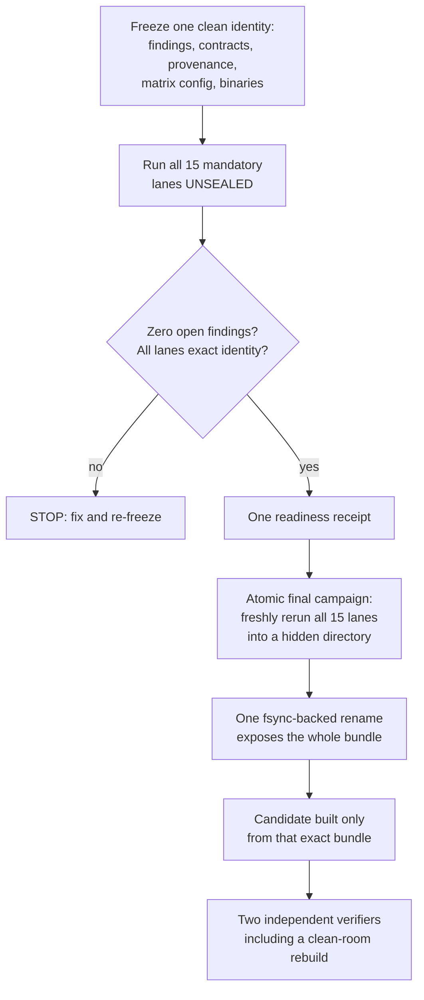

# Chapter 39 — The evidence culture
> **status:** polished  ·  **path:** Muse Glimmer, pinned Muser tree
>
> *Prerequisites: Chapter 38 (the measurement protocol this culture wraps)
> and passing familiarity with [Ch 30](30-handoff-v2-transport.md) and
> [Ch 32](32-precision-across-the-handoff.md), where exactness policies
> first appeared as contracts rather than hopes.*

---

## 39.1 The chapter that makes the other chapters cheap to trust

Chapter 38 gave you the instrument: interleaved ratios, exact-token gates,
five-rep means, receipts on an append-only volume. This chapter is about
everything wrapped *around* that instrument — the locks, registers,
contracts, and tags that decide when a measurement becomes a claim, who is
allowed to say it, and what happens when the two disagree. Muser calls the
whole assembly the **evidence culture**, and its constitution is one sentence
from the working agreements:

> "Never weaken a fail-closed check to make a run pass. If a gate rejects
> your evidence, the evidence is wrong until proven otherwise."
> `[AGENTS.md, "Hard rules"]`

That sentence inverts the ordinary debugging instinct. The ordinary instinct,
when a gate rejects your run, is that the gate is too strict. Here the
default is the opposite: the gate is presumed right, your evidence is
presumed wrong, and the burden sits exactly there until an audit moves it.
Every mechanism in this chapter is that sentence rendered in JSON.

## 39.2 Fail-closed, defined and mechanized

**Fail-closed** means: when a check cannot prove the good state, the system
stops, and it stops *before* the unproven state can be mistaken for a proven
one. A fail-*open* system degrades to permissive under uncertainty; a
fail-closed system degrades to refusal. You have already met a dozen
instances without the word:

- The producer exits with status 75 on any engine-touched error, and a bare
  `docker restart` is not enough — stale startup receipts, RoPE caches, and
  sockets must be cleared by the restart ritual `[AGENTS.md, "The GX10 lane"]`
  ([Ch 28](28-the-gx10-and-vllm-nvfp4-prefill.md)).
- Serving refuses to load `producer_mode: native` together with DFlash, with
  the error stating the remedy, at
  `[crates/muser-server/src/state.rs:1666-1675]`:
  "native NVFP4 fast-lane speculative decode is unqualified; omit --dflash
  and use plain NVFP4 decode, or route speculative serving to the kquant
  lane". The qualifier wrapper carries the same refusal for its variant
  (`target-plus-dflash`) at `[scripts/qualify_nvfp4_fast.py:333-336]`.
- Model identity at startup: configured vs verified SHA-256, and "mismatch
  refuses" `[crates/muser-server/src/state.rs:1168-1175]`.
- The accelerator wrapper's lease refusals, receipt-immutability refusals,
  and forbidden-command refusals ([Ch 38 §38.8]).

The design pattern in every case: the *operator sees the failure* — an exit
code, an error string naming the remedy, a latch — and the system never
silently proceeds on an unverified state. This is why the culture can be a
*subject* of this book rather than an obstacle to it: each refusal is a
documented, testable boundary, not a mysterious crash.

## 39.3 The release lock — one file that outruns everyone

At the center of the culture sits a single small file,
`release/release-lock.json`. As of the pinned tree its actual state is
(Figure 39.1):

```json
{
  "schema": "muser.release-lock.v1",
  "state": "containment",
  "sealing_enabled": false,
  "candidate_creation_enabled": false,
  "tagging_enabled": true,
  "tagging_policy": {
    "class": "non-release-marker",
    "allowed_tags": ["v0.1.0-beta.1"],
    "operator_go_required": true,
    "creates_seal": false,
    "creates_candidate": false,
    "creates_publication": false
  },
  "publishing_enabled": false,
  "blocked_commits": ["11119bd"],
  "unlock_requires": "the exact beta marker requires a separate operator go; sealing, candidate creation, and publication require a new lock amendment"
}
```
*Figure 39.1: `release/release-lock.json` at the pinned tree, quoted in full
— `sealing_enabled: false`, `candidate_creation_enabled: false`,
`publishing_enabled: false`; the only permitted tag is the non-release beta
marker, and only after an explicit operator go.*

What "authoritative" means here is literal: **while the lock is in
containment, no seals, tags, or release candidates may be created, no matter
how strong the evidence is** `[AGENTS.md]`. Every ledger entry from the
2026-08 campaigns carries the reminder — "no entry is a readiness receipt,
seal, tag, candidate, or publication" `[ledger, preamble]` — and every
chapter of this book inherits the constraint: the numbers you have read are
*unsealed engineering evidence*, every one `seal_eligible: false`
`[ledger "Synthetic spec matrix deep-cell restatement"]`. In this campaign's
vocabulary that is the distinction between **notarial** evidence (a sealed,
independently reproducible release artifact) and **non-notarial** evidence
(everything retained so far). "Measured," in this program, means measured on
Muser, on this hardware, under a retained receipt — never "measured once, on
any hardware, ever" `[docs/launch-claims.md §Ground rules]`.

The lock is tracked, not advisory: commit `11119bd` is listed in
`blocked_commits`, and the feature contract independently declares it the
non-releasable source baseline `[release/feature-contract-v1.json,
"source_baseline"]`. Deleting or editing the lock to make a release happen is
not a move anyone has; the only permitted unlock is "a narrowly scoped,
reviewed change setting `sealing_enabled` true for this exact
readiness-authorized campaign" `[docs/private-release.md §3]`.

## 39.4 Findings and the feature contract — the campaign's identity

Two more files complete the constitutional set, and the working agreements
warn explicitly: "changes to them change the campaign identity"
`[AGENTS.md]`.

**`release/findings-v1.json`** is the defect register. Its policy line
forbids the two classic escapes: `{"waivers_allowed": false,
"release_requires_zero_open": true}` `[release/findings-v1.json]`. Each
finding has id, severity, area, title, status, and resolution; the register
spans 44 rows from REL-001 (the blocked commit) through security
(`SEC-001`–`SEC-005`: TLS, CORS, CSRF, WebSocket tickets, CA workflow),
enrollment, replay-ledger durability (`REP-001`: "generation reservation
ordering and durable fsync protocol incomplete"), scheduling (`SCH-001`:
the global session mutex replaced by the four-slot pool of
[Ch 34](34-scheduler-and-slots.md)), to the performance finding `PERF-001`.
PERF-001 is the instructive one: it was closed not by a wave of the hand but
by enumerating the retained verdict-grade evidence — the six-depth plain
matrix, the fixed-window spec ratios, the funded-fix 131,008 wall parity,
the disaggregated TTFT/link/determinism/soak gates — and its closure text
still bounds the claim: "Scope remains exactly the measured synthetic and
single-producer lanes" `[release/findings-v1.json, PERF-001]`.

**`release/feature-contract-v1.json`** fixes what the release *is*: the
hardware contract (one M3 Ultra 96 GB decode host, four slots at 131,072
context, GX10 as prefill/storage node and never a decode destination), the
in-scope list (single model, llama-pinned parity, vision, DFlash, GX10,
dashboard, sessions, migration), the out-of-scope list (LoRA, hot-swap,
infill, Responses/Anthropic APIs, "public-CoreML ANE DFlash routing
(experimental post-release)"), and a release policy that reads like the
ledger's ethics compressed into six booleans (Figure 39.2):

```json
"release_policy": {
  "waivers_allowed": false,
  "open_findings_allowed": false,
  "qualification_skips_allowed": false,
  "owner_tags_or_publishes": true,
  "seal_requires_release_readiness_receipt": true,
  "post_seal_change_invalidates_campaign": true
}
```
*Figure 39.2: `[release/feature-contract-v1.json]` — no waivers, no open
findings, no skipped lanes, owner-only publication, and any post-seal change
invalidates the campaign.*

That last clause is the sharpest: after a seal exists, *any* change — source,
artifact, documentation — does not get patched in; it restarts the stage
`[docs/private-release.md §3]`. A sealed campaign is a photograph, not a
living document.

## 39.5 The release path — freeze, run, readiness, seal

The one permitted path from "lots of evidence" to "a release" is a fixed
sequence (Figure 39.3) `[docs/private-release.md]`:


*Figure 39.3: The freeze→run→readiness→seal flow `[docs/private-release.md]`.
Failure at any stage exposes nothing; the seal bundle appears atomically or
not at all.*

The fifteen mandatory lanes are enumerated by name — `correctness`,
`sampled`, `greedy`, `kvpack`, `session`, `vision`, `baseline`, `dflash`,
`remote`, `serving`, `onboarding`, `api-parity`, `continuous-batching`,
`migration`, `security` — and "a skipped, unstable, malformed, cross-lane,
wrong-identity, or unsealed=false report is a failure. There are no waivers"
`[docs/private-release.md §2]`. The final campaign reruns *fresh* — the
sealed matrix is measured after readiness, not assembled from remembered
numbers — into a hidden sibling directory, fsyncing everything, exposing the
bundle with one rename; "failure exposes nothing" `[docs/private-release.md
§4]`. Even the candidate verifiers are structural: a second clean-room
verifier "must extract the source archive, perform the offline locked build,
re-hash the resulting binary … and run the loopback smoke request on an
externally offline host" `[docs/private-release.md §5]`, under the
accelerator lease.

None of this has run to completion: the lock is still in containment, and
every number in this book is pre-seal. The machinery's purpose is precisely
that this fact is *checkable from one file* rather than folklore.

## 39.6 The launch-claims register — copy never outruns the receipt

`docs/launch-claims.md` is the interface between measurements and words.
It is a table — seventeen numbered rows at the pin — where every row carries
its current evidence (with receipt paths), its conditionally approved
wording, and, where wording exists but the owner has not approved it, the
banner **OPERATOR REVIEW REQUIRED**. The register's ground rules are the
culture's most quotable sentences; four verbatim:

> "The release lock (`release/release-lock.json`) is authoritative: while
> the feature contract is in containment, no row above goes live regardless
> of how strong its evidence is. Conditional wordings activate only when the
> contract leaves containment and the row's stated reproduction gate
> passes." `[docs/launch-claims.md §Ground rules]`

> "A number with no row above does not ship. Add a row (with its evidence
> citation) before using it." `[docs/launch-claims.md §Ground rules]`

> "`[precedent-7B-ferrite]` numbers (e.g. 34.9/308 t/s, 21.9–30.1x restore,
> 24.6 GB/s fabric, 1.42x ANE+GPU concurrency) describe the historical
> Ferrite research lineage on a 7B model, never this Muser program. They may
> appear in engineering docs as context but never as a Muser product
> claim." `[docs/launch-claims.md §Ground rules]`

> "When evidence and wording conflict, evidence wins and the wording row
> gets corrected — copy is never allowed to outrun the receipt."
> `[docs/launch-claims.md §Ground rules]`

The **OPERATOR REVIEW tier** is the register's subtlest device. Rows #2, #6,
#11, #12, #15, #16, and #17 carry evidence-backed *proposed* wording that
the owner has not approved; the register states the rule outright — such
rows "remain unavailable to launch copy even if its reproduction gate later
passes, until the operator approves it" `[docs/launch-claims.md, preamble]`.
Evidence quality and wording approval are orthogonal axes: a perfect
five-rep matrix still cannot speak until a human owner signs the sentence.
The review package for those rows exists
(`docs/launch-claims-review-20260824.md`), states each row's exact proposed
wording, receipts, and *risk* ("removing 'synthetic,' 'mean,' or the
tested-depth scope would turn a controlled fixture result into an
unsupported workload-general claim" `[docs/launch-claims-review-20260824.md,
claim #2]`), and closes with the discipline that "this review package
remains the pre-decision record" — it prepares decisions, it does not make
them `[docs/launch-claims-review-20260824.md, preamble]`.

The register also carries the negative space: an "Explicitly post-launch"
list of things that do not exist (node discovery, multi-node scheduling,
revocation, full-depth reuse coverage, remote multimodal, send-during-
prefill) with the instruction that "they simply do not exist yet and must
not be implied" `[docs/launch-claims.md §Explicitly post-launch]`. A claims
register that only lists what you have is half a register; the other half is
listing what a reader might reasonably assume you have.

## 39.7 Honesty tags — the metrics schema

The same discipline reaches into the live server payload. Every field in the
telemetry snapshot carries an honesty tag, and the legend is enforced in
prose and code `[docs/metrics-schema.md]`:

- **`measured`** — "a live counter, duration, or verified loaded-model
  fact";
- **`target`** — "a threshold or modeled goal, never an observed result";
- **`mock`** — "no backing measurement is available; the dashboard renders
  the value unavailable."

The register's copy legend extends the same idea with five tags for claims —
`[measured]` / `[precedent-7B-ferrite]` / `[target]` / `[roadmap]` /
`[mock]` `[docs/launch-claims.md, preamble]`. (The two legends serve two
surfaces: three tags for live telemetry, five for launch copy; the
`[precedent-7B-ferrite]` tag exists specifically to keep ancestor-lab
numbers quarantined.)

The mock rule has one canonical application. The dashboard's `nodes[]`
array — M3/GX10 utilization, memory, power, temperature — "is currently
empty and tagged `mock`: … collection are not wired to this payload. The
separate node-management API and registry do not manufacture telemetry node
cards" `[docs/metrics-schema.md §Cluster and nodes]`. And the optimization
card list is empty *on purpose*: "`tricks[]` is intentionally empty. No
optimization card appears until its independent correctness and performance
qualification passes for the release identity. Historical Ferrite results
are provenance, not live Muser metrics" `[docs/metrics-schema.md §DFlash and
optimization claims]`. That last sentence is the dashboard-mock-tagging rule
in its general form: **fields without measurement render unavailable, and
historical Ferrite results are never inserted as live Muser measurements.**
An idle counter may legitimately read a measured zero; a modeled threshold
may never dress up as an observation `[docs/metrics-schema.md, preamble]`.

## 39.8 Evidence volume discipline — where truth is allowed to live

Retained evidence lives on `muser-receipt://` and is
**append-only** `[AGENTS.md]`. The wrapper's mechanics make the append-only
property physical: receipts are created through exclusive temp-file +
fsync + rename + directory-fsync, and the publish function's first act is to
refuse if the target exists — "refusing to replace result receipt"
`[scripts/accelerator_safe.py:202-203]`; the run journal is opened
`O_APPEND` and fsynced per record `[scripts/accelerator_safe.py:190-197]`.

The 2026-08-18 durability lesson (fully told in
[Ch 31](31-the-wire-discipline.md)) is the volume discipline's other half:
**operational state — replay ledgers, sockets, locks — belongs on the
internal disk**, because the evidence volume's directory-fsync tail produced
bimodal ~1 s stalls in the commit path `[AGENTS.md]`. The receiver now
*probes* for this: `check_ledger_volume` measures the reserve-pattern tail
latency and refuses a slow volume before any handoff
`[crates/muser-cluster/src/receiver.rs:108-150]`, with
`scripts/gx10/durable_fsync_probe.py` as the standalone probe (exit 1 past
`--max-tail-ms`) `[scripts/gx10/durable_fsync_probe.py:19-22]`. Evidence and
operations are separated not by convention but by measured failure mode.

## 39.9 The documentation truth pass — auditing claims against receipts

Documents drift; code moves; receipts stay. A **documentation truth pass**
is the genre of audit that re-reads every claim-bearing document against
implementation and retained evidence. Muser's 2026-08-15 pass checked README
and CLI help against `cli.rs`, security text against the Axum authorization
policy, architecture against the slot pool and GGUF geometry, dashboard
copy against `MetricsSnapshot`, performance claims against the retained
representative artifact — result columns recorded surface by surface
`[docs/documentation-truth-pass-20260815.md §Sources checked]`. Its
performance wording ruling is a model of the form: the one-sample 3.6 %
prefill / 22 % decode figures are "engineering-only" and may appear only
"always with the single-run/non-notarial limitation"; the register
"expressly authorizes no product throughput wording" `[docs/documentation-
truth-pass-20260815.md §Performance evidence wording]`.

The same genre runs continuously in the ledger as CORRECTION / RETRACTION /
AMENDMENT / SUPERSEDED entries, and in the claims register when evidence
moves faster than wording. One worked example, dissected.

> **The evidence box: a stale claim, handled correctly**
>
> **The claim.** On 2026-08-20 the campaign close-out brief reported, for
> the external reviewer: "Spec decode vs llama spec: 107.91 vs 81.30 tok/s
> = 1.327×. PASS," plus a full spec context matrix "decode means 1.305 /
> 1.278 / 1.282 / 1.250 / 1.232 at 2k–65k" `[docs/campaign-review-brief-
> 20260820.md §The campaign]`. Every number recomputed exactly from
> receipts; the red-team review verified "there is no fabrication and no
> result-shopping" `[docs/redteam-review-campaign-brief-20260820.md §Verdict]`.
>
> **The staleness.** On 2026-08-21 the half-window root cause landed
> ([Ch 38 §38.7]): every one of those figures was measured while the DFlash
> draft ran on half its trained sliding window. The measurements were real;
> the *lane they measured* was broken. Synthetic speed ~5 % optimistic,
> natural-text acceptance catastrophically pessimistic.
>
> **The handling.** Nothing was deleted. The brief now opens with a
> supersession banner: "**SUPERSEDED — 2026-08-21.** Every
> speculative-decode figure below was measured while the DFlash draft was
> conditioned on half its trained sliding window … All spec claims here are
> pending re-measurement at the fixed sha. The non-spec content (Phase 2
> plain matrix, Phase 4 disaggregated payoff …) is unaffected"
> `[docs/campaign-review-brief-20260820.md, banner]` — the identical banner
> sits on the red-team brief `[docs/redteam-review-campaign-brief-
> 20260820.md, banner]`. The ledger restated the numbers in new entries
> (1.23692 @2,048 and sisters); the claims register rows #15/#16 now cite
> only the fixed-window packets; and the old 1.3273/1.3012 figures survive
> in exactly one role — as the superseded numbers this book tells you not
> to cite `[docs/launch-claims.md #15]`.
>
> **What the example teaches.** A stale claim is not a scandal; leaving one
> standing is. The culture's answer has three moves — the evidence is
> preserved, the supersession is written *on the artifact itself* where the
> next reader cannot miss it, and the replacement claim is scoped tighter
> than the one it replaces.

The register shows the same move in miniature: claim #6's wording rule
still instructs "Do not cite the historical 5.83× exact-mirror comparison"
`[docs/launch-claims.md #6]` — a retired number whose tombstone is kept
inside the very row that replaced it.

## 39.10 Red-teaming the record

The truth pass audits documents against implementation. One step further
out, the campaign **red-teamed itself before asking an external reviewer
anything**: a review document produced by "seven independent auditors
(ledger forensics, raw-receipt recompute, Phase-4 packet forensics,
engine-code attribution audit, statistics, framing/honesty,
completeness), plus direct spot-verification of every load-bearing claim.
No measurements were run; nothing in the repo or evidence store was
modified" `[docs/redteam-review-campaign-brief-20260820.md, header]`. Its
verdict is the culture's certificate: "The measurements are real. Every
headline number in the ledger recomputes exactly from the retained
receipts; the fail-closed machinery demonstrably worked; discarded runs
were kept and are statistically indistinguishable from counted ones —
there is no fabrication and no result-shopping" `[docs/redteam-review-
campaign-brief-20260820.md §Verdict]`.

Note what the red-team pass did *not* conclude: it did not say the
campaign's *decision* was right — its ranked findings argue the decision
was mis-posed, the attribution wrong "four different ways," and the
statistics inverted `[docs/redteam-review-campaign-brief-20260820.md
§Findings, ranked]`. Honest evidence and a defensible decision are
separate claims; the culture's machinery certifies the first so the
argument can be about the second. That separation is the whole point:
when the receipts are beyond suspicion, disagreeing well becomes
possible.

## 39.11 What the culture costs and what it buys

- **Cost: latency on every claim.** An OPERATOR REVIEW row cannot ship even
  with perfect evidence; a release cannot seal while the lock says
  containment; a finding closure needs enumerated receipts, not a
  narrative. Measured consequence: the 2026-08-24 wizard PASS (exact
  logits, 9.812/8.887/8.690 Gbps) still "remains the operator-review
  draft" for public wording `[docs/launch-claims-review-20260824.md,
  "Draft new row"]`.
- **Cost: negative space must be maintained.** The post-launch list, the
  `mock` tags, the "not measured at every depth" caveats — publishing the
  sensitivity is part of the claim `[docs/launch-claims.md §Explicitly
  post-launch]`.
- **Buys: auditability in one hop.** Any number in this book resolves to a
  receipt path; any word resolves to a claims row or is barred; any release
  question resolves to one lock file. The red-team review could verify
  "no fabrication and no result-shopping" because the evidence chain never
  breaks `[docs/redteam-review-campaign-brief-20260820.md §Verdict]`.
- **Buys: safety under error.** Fail-closed meant the 65536 warm-hit
  `outputs_match: false` cell was *retracted as an infrastructure timeout*
  after investigation rather than argued with — "the 65,536 warm-hit
  result was an infrastructure timeout, not a cache-correctness failure"
  `[ledger "CORRECTION — the 65536 warm-hit result", 2026-08-21]` — and the
  valid cell is the one that then passed its gate.

There is one more register the culture keeps, and it is the grimmest one:
the list of things measured carefully and then *rejected*. That is the last
chapter of this book.

---

## References

- `[release/release-lock.json]` — quoted in full at Figure 39.1; state
  `containment`, all release machinery disabled, beta-marker-only tagging.
- `[release/feature-contract-v1.json]` — hardware contract, scope lists,
  the six-boolean release policy (Figure 39.2).
- `[release/findings-v1.json]` — zero-waiver policy; the 44-row register;
  PERF-001's evidence-enumerated closure.
- `[docs/private-release.md]` — the freeze→run→readiness→seal flow
  (Figure 39.3), the 15 mandatory lanes, atomic bundle semantics,
  clean-room verification.
- `[docs/launch-claims.md]` — the register; preamble (OPERATOR REVIEW
  semantics, five-tag legend); ground rules (four quoted verbatim in
  §39.6); rows #2, #6, #15, #16; §Explicitly post-launch.
- `[docs/launch-claims-review-20260824.md]` — the pre-decision review
  package with per-row risk statements.
- `[docs/metrics-schema.md]` — honesty-tag legend; `nodes[]` mock;
  `tricks[]` intentionally empty; measured-zero vs modeled-target rule.
- `[docs/documentation-truth-pass-20260815.md]` — the audit table;
  single-run performance wording limits.
- `[docs/campaign-review-brief-20260820.md]`,
  `[docs/redteam-review-campaign-brief-20260820.md]` — the SUPERSEDED
  banner pair, the seven-auditor method (§39.10), and the no-fabrication
  verdict (the evidence box).
- `[AGENTS.md]` — hard rules (fail-closed sentence quoted §39.1), evidence
  volume rules, operational-state-on-internal-disk.
- `[scripts/accelerator_safe.py:190-197, 202-203]` — append-only journal,
  immutable receipts.
- `[crates/muser-cluster/src/receiver.rs:108-150]` — ledger-volume gate.
- `[scripts/gx10/durable_fsync_probe.py:19-22]` — the standalone tail
  probe and its exit contract.
- `[crates/muser-server/src/state.rs:1666-1675]` — the native+DFlash
  fail-closed serving refusal (quoted).
- `[scripts/qualify_nvfp4_fast.py:333-336]` — the qualifier's matching
  variant refusal.
- `[ledger …]` — preamble; "Synthetic spec matrix deep-cell restatement"
  (seal_eligible); "CORRECTION — the 65536 warm-hit result"; the J0/J3
  entries cited for the notarial/non-notarial distinction.
- [glossary](../glossary.md) — terms introduced this chapter: fail-closed,
  release lock, findings register, feature contract, readiness receipt,
  atomic seal bundle, launch-claims register, OPERATOR REVIEW, honesty
  tags, documentation truth pass, notarial evidence, append-only evidence
  volume.
